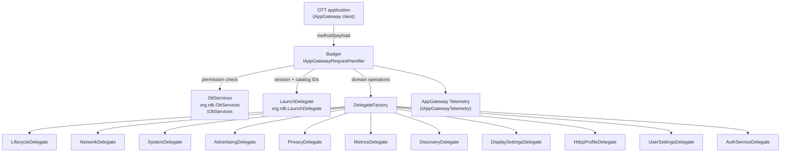
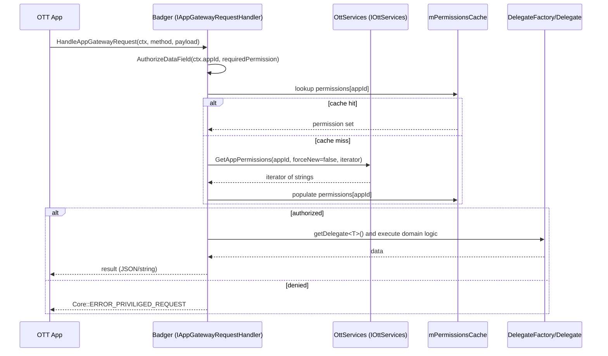
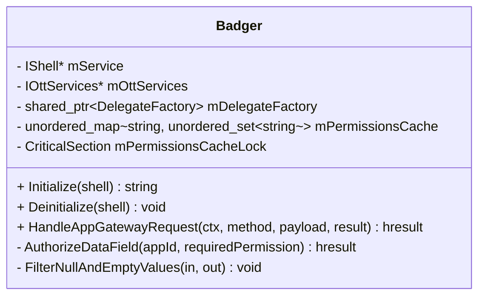

## Badger plugin (`Badger/`)

This document describes the `Badger` Thunder plugin **as implemented in this repository**. `Badger` is the **App Gateway request handler** that exposes a broad set of device/system/OTT-facing operations via `Exchange::IAppGatewayRequestHandler`.

Primary code locations:

- `Badger/Badger.h`
- `Badger/Badger.cpp`
- `Badger/Delegate/*` (delegate factory + per-domain delegates)
- `Badger/CMakeLists.txt`

---

## 1. High-Level Purpose & Architecture

### Role in ENT / RDK infrastructure

`Badger` is a **gateway plugin** for OTT applications running in an RDK/Thunder environment. It implements `Exchange::IAppGatewayRequestHandler` and acts as a single ingress point for many “capability” and “device info” operations. It relies on:

- `OttServices` (`org.rdk.OttServices`) for **permission decisions** (`GetAppPermissions`).
- `LaunchDelegate` (`org.rdk.LaunchDelegate`) for app lifecycle/session identity (session IDs, catalog IDs) and other gateway-adjacent context.
- A local `DelegateFactory` that constructs “domain delegates” (system, network, lifecycle, advertising, discovery, metrics, privacy, etc.) against the Thunder `IShell`.

### Responsibilities

Based on the code present in `Badger/Badger.h` and `Badger/Badger.cpp`:

- Handle AppGateway requests:
  - `HandleAppGatewayRequest(context, method, payload, result)`
- Authorize methods and/or data fields by checking the app’s permissions through `OttServices`.
  - Caches permissions per `appId` to avoid repeated calls.
- Provide a large set of “gateway methods” that produce JSON outputs for device info and capabilities.
- Filter JSON responses to drop null/empty fields, while preserving required schema fields in specific cases.
- Emit telemetry via AppGateway telemetry helper macros.

### Interacting subsystems and what it does not do

**Interacts with**:

- `org.rdk.OttServices` (`Exchange::IOttServices`) for permission enumeration.
- `org.rdk.LaunchDelegate` (`Exchange::ILaunchDelegate`, `Exchange::IAppGatewayAuthenticator`, `Exchange::IAppGatewayRequestHandler`), for session IDs and catalog IDs.
- Delegate classes under `Badger/Delegate/` (constructed with `PluginHost::IShell*`).
- AppGateway telemetry (`Exchange::IAppGatewayTelemetry`) via `helpers/UtilsAppGatewayTelemetry.h`.

**Does not do** (as far as present code shows):

- It does not implement the `IOttServices` or `LaunchDelegate` services; it consumes them.
- It does not define the Firebolt/Exchange interface schemas; those are external headers under `interfaces/*` (not in this repo).
- It does not provide persistent storage; it queries other plugins or uses delegates.

---

## 2. Architectural Overview

### Major components and interactions

- `Badger` plugin entry:
  - Implements `PluginHost::IPlugin`
  - Implements `Exchange::IAppGatewayRequestHandler`
- Delegate layer:
  - `DelegateFactory` (in `Badger/Delegate/DelegateFactory.h`) is a registry/factory that lazily instantiates delegates like `LifecycleDelegate`, `NetworkDelegate`, etc. using the shell pointer.
- Permissions layer:
  - `AuthorizeDataField(appId, requiredPermission)` calls `OttServices->GetAppPermissions(appId, forceNew=false, iterator)` and builds a cached set.
- Response post-processing:
  - `FilterNullAndEmptyValues` removes empty fields, with a required field exception set.

### High-level diagram



---

## 3. Code Organization (Folder & File-Level)

### Repository structure walkthrough for the subsystem

- `Badger/Badger.h`: public plugin class, method declarations for gateway operations, permission cache, lazy interface getters.
- `Badger/Badger.cpp`: plugin lifecycle, permission cache logic, JSON filtering, and many gateway method implementations.
- `Badger/Delegate/*.h`: delegate definitions for specific functional domains (system, network, advertising, etc.).
- `Badger/Module.h` / `Badger/Module.cpp`: WPEFramework module glue (present in repo; not exhaustively analyzed here).
- `Badger/CMakeLists.txt`: build target, dependencies (OpenSSL, curl), installation.

### File-by-file breakdown

#### `Badger/CMakeLists.txt`

- Builds `Badger.cpp` and `Module.cpp` into a shared library.
- Links against OpenSSL and curl (if found).
- Adds `-Wall -Werror` and `-Wl,-z,defs`.

#### `Badger/Badger.h`

- Declares `class Badger : public PluginHost::IPlugin, public Exchange::IAppGatewayRequestHandler`.
- Declares many helper APIs (e.g., `DeviceInfo`, `DeviceCapabilities`, `GetDeviceId`, `GetPartnerId`, etc.) and internal helpers:
  - Permission cache: `AuthorizeDataField`, `ClearPermissionsCache`, `ClearAllPermissionsCache`
  - Interfaces: `GetLaunchDelegate()`, `GetOttServices()`
  - JSON filtering: `FilterNullAndEmptyValues(...)`

#### `Badger/Badger.cpp`

Contains:

- Plugin registration (`SERVICE_REGISTRATION`).
- Telemetry client instance via macro:
  - `AGW_DEFINE_TELEMETRY_CLIENT(AGW_PLUGIN_BADGER)`
- `Initialize` / `Deinitialize` lifecycle.
- Permission cache implementation (`AuthorizeDataField`).
- Numerous gateway methods and their authorization patterns.
- JSON output cleanup (`FilterNullAndEmptyValues`).

#### `Badger/Delegate/DelegateFactory.h`

Defines `WPEFramework::DelegateFactory` (note: not under `WPEFramework::Plugin` namespace in this file) that:

- Stores `PluginHost::IShell* _shell`.
- Uses `typeid(T).name()` as registry key.
- Creates delegates lazily with `std::make_shared<T>(_shell)`.

What is missing:

- Delegate `.cpp` implementations were not found by globbing (only headers exist under `Badger/Delegate/` in this repo snapshot), meaning actual delegate behavior is defined inline in headers or in other files not present/read here. If a delegate’s logic is not inline, it is missing from this workspace.

---

## 4. Class & Interface Documentation

### `WPEFramework::Plugin::Badger` (`Badger/Badger.h`, `Badger/Badger.cpp`)

#### Responsibilities

- Plugin lifecycle integration with Thunder (`Initialize`, `Deinitialize`, `Information`).
- Handle app gateway requests via `HandleAppGatewayRequest`.
- Perform per-app permission checks via `AuthorizeDataField`.
- Coordinate with delegates for domain-specific implementations.
- Emit telemetry.

#### Key members (from `Badger/Badger.h`)

- `PluginHost::IShell* mService`
- `uint32_t mConnectionId`
- `Exchange::IOttServices* mOttServices` (lazy)
- `std::shared_ptr<DelegateFactory> mDelegateFactory`
- `std::unordered_map<std::string, std::unordered_set<std::string>> mPermissionsCache`
- `mutable Core::CriticalSection mPermissionsCacheLock`

#### Lifecycle

From `Badger/Badger.cpp`:

```cpp
const string Badger::Initialize(PluginHost::IShell* service) {
    mService = service;
    mService->AddRef();
    AGW_TELEMETRY_INIT(mService);
    AGW_RECORD_BOOTSTRAP_TIME();
    mDelegateFactory = std::make_shared<DelegateFactory>();
    mDelegateFactory->setShell(mService);
    return EMPTY_STRING;
}

void Badger::Deinitialize(PluginHost::IShell* service) {
    Exchange::IOttServices* ottServices = GetOttServices();
    if (ottServices) {
        ottServices->Release();
        mOttServices = nullptr;
    }
    AGW_TELEMETRY_DEINIT();
    ClearAllPermissionsCache();
    if (mDelegateFactory) {
        mDelegateFactory->Cleanup();
        mDelegateFactory.reset();
    }
    if (mService) {
        mService->Release();
        mService = nullptr;
    }
}
```

#### Permission caching and authorization

`AuthorizeDataField(appId, permission)`:

- Checks cache under `mPermissionsCacheLock`.
- On miss:
  - Calls `GetOttServices()` and then `ottServices->GetAppPermissions(appId, false, permissionsIterator)`.
  - Collects iterator strings into a local set.
  - Writes them into cache.
  - Checks for `requiredDataField` in the set.
- Returns:
  - `Core::ERROR_NONE` if allowed
  - `Core::ERROR_PRIVILIGED_REQUEST` if denied
  - `Core::ERROR_UNAVAILABLE` if OttServices unavailable

Excerpt (from `Badger/Badger.cpp` around `AuthorizeDataField`):

```cpp
// Cache miss - need to fetch from OttServices
Exchange::IOttServices* ottServices = GetOttServices();
if (ottServices == nullptr) { return Core::ERROR_UNAVAILABLE; }

RPC::IStringIterator* permissionsIterator = nullptr;
if (ottServices->GetAppPermissions(appId, false, permissionsIterator) != Core::ERROR_NONE) {
    return Core::ERROR_PRIVILIGED_REQUEST;
}

std::unordered_set<std::string> collectedPermissions;
while (permissionsIterator->Next(permissions)) {
    collectedPermissions.insert(permissions);
}

{
    Core::SafeSyncType<Core::CriticalSection> lock(mPermissionsCacheLock);
    auto& permissionSet = mPermissionsCache[appId];
    permissionSet.insert(collectedPermissions.begin(), collectedPermissions.end());
    hasPermission = (permissionSet.find(requiredDataField) != permissionSet.end());
}
```

#### JSON filtering

`FilterNullAndEmptyValues(input, output)`:

- Removes empty/null values, empty strings, and empty arrays/objects.
- Preserves a fixed set of `requiredFields` even if empty:
  - `currentAudioMode`, `supportedAudioModes`

Excerpt:

```cpp
static const std::unordered_set<std::string> requiredFields = {
  "currentAudioMode",
  "supportedAudioModes"
};
```

### `WPEFramework::DelegateFactory` (`Badger/Delegate/DelegateFactory.h`)

#### Responsibilities

- Hold a shared `IShell` pointer (not ref-counted here; pointer stored).
- Lazily create and cache domain delegates.

#### Key methods

- `setShell(PluginHost::IShell* shell)`
- `getDelegate<T>()` returns `shared_ptr<T>` and constructs `T(_shell)` on first access.
- `Cleanup()` clears registry and sets `_shell=nullptr`.

Excerpt:

```cpp
template <typename T> std::shared_ptr<T> getDelegate() {
    if (_shell == nullptr) { return nullptr; }
    const std::string typeName = typeid(T).name();
    auto it = _delegates.find(typeName);
    if (it == _delegates.end()) {
        auto delegate = std::make_shared<T>(_shell);
        _delegates[typeName] = delegate;
        return delegate;
    }
    return std::static_pointer_cast<T>(it->second);
}
```

---

## 5. Configuration & Build Integration

### Configuration files and parameters

No `Badger`-specific JSON config file is compiled into the plugin from its `CMakeLists.txt` (unlike `LaunchDelegate`/`XvpClient`). However, it depends on the presence of other plugins (by callsign) at runtime.

### Build system info and flags

From `Badger/CMakeLists.txt`:

- Links: `OpenSSL::SSL`, `OpenSSL::Crypto`, optionally `CURL_LIBRARIES`.
- Defines version macros:
  - `BADGER_MAJOR_VERSION`, `BADGER_MINOR_VERSION`, `BADGER_PATCH_VERSION`
- Adds strict link option:
  - `target_link_options(... -Wl,-z,defs)`

---

## 6. Internal Workflows & Execution Flow

### Initialization / startup

1. `Initialize(service)` stores `mService` and `AddRef()`.
2. Initializes telemetry client and starts bootstrap timer.
3. Constructs `DelegateFactory` and sets shell for delegate creation.

### Request flow (AppGateway)

1. Caller invokes `HandleAppGatewayRequest(context, method, payload, result)`.
2. Implementation (in `Badger.cpp`, not fully excerpted in reads) dispatches to internal handlers for specific operations.
3. Many operations call `AuthorizeDataField(context.appId, "DATA_*" or "API_*")` before retrieving values via delegates or other plugin interfaces.
4. JSON responses are often filtered via `FilterNullAndEmptyValues` to reduce payload noise.

**What is missing**:

- The full `HandleAppGatewayRequest` dispatch table and exact method-name routing were not included in the snippets read (the file is large). The existence of many method helpers in `Badger.h` implies a broad method surface, but the exact mapping from `method` string to helper function must be taken from the full `Badger.cpp` function body (present in repo but not fully reproduced in this doc excerpt).

### Shutdown

- `Deinitialize`:
  - Releases cached `mOttServices` (if acquired).
  - Deinitializes telemetry.
  - Clears permissions cache.
  - Cleans up delegate factory.
  - Releases `mService`.

### Error handling patterns

- Uses `Core::hresult` codes (e.g., `Core::ERROR_NONE`, `Core::ERROR_UNAVAILABLE`, `Core::ERROR_PRIVILIGED_REQUEST`).
- Telemetry timers call `SetFailed(...)` with standardized error markers (from `helpers/AppGatewayTelemetryMarkers.h`, not exhaustively analyzed here).

---

## 7. Diagrams & Visual Aids

### Sequence diagram: permission-guarded gateway method



### Class diagram: core Badger structure



---

## 8. Testing & Quality Analysis

### Existing tests

- No `Badger`-specific test file was observed in the read files. L1 tests exist for `LaunchDelegate` and `FbPrivacy` per `Tests/L1Tests/CMakeLists.txt`, but not explicitly for `Badger` in the excerpts read.

### Missing coverage / risks

- Permission caching correctness:
  - Cache invalidation strategy is minimal (explicit clear methods exist, but no automatic invalidation shown).
- Delegate correctness:
  - Delegate implementations are not visible in this repo snapshot beyond headers; behavior coverage is unknown.
- Method dispatch coverage:
  - Without tests, changes to method strings in `HandleAppGatewayRequest` may regress clients silently.

### Test suggestions (based on code)

- Add a unit test for `AuthorizeDataField` with a fake `IOttServices` implementation returning a controlled iterator.
- Add tests for `FilterNullAndEmptyValues` (required fields preserved, nested objects/arrays filtered).
- Add an integration-style test for a small set of gateway methods (e.g., ones that only depend on permission + simple JSON formatting).

---

## 9. Beginner-to-Expert Teaching Mode

### Must know first

- `Badger` is **method-string driven** (`HandleAppGatewayRequest`), so understanding the mapping between `method` strings and internal handlers is essential.
- Almost all non-trivial methods are **permission gated** via `OttServices->GetAppPermissions` and `AuthorizeDataField`.
- Domain logic is pushed into delegates created by `DelegateFactory`, which are constructed with `PluginHost::IShell*`.

### Advanced learning path

- Trace a “device info” call end-to-end:
  - `HandleAppGatewayRequest` → `AuthorizeDataField` → delegate calls → JSON filtering → result.
- Study how `Badger` reuses `LaunchDelegate` session/catalog helpers (`GetAppSessionId`, `GetAppCatalogId`) for token/identity-related flows.
- Extend telemetry coverage:
  - `AuthorizeDataField` already uses `AGW_TRACK_API_CALL`; ensure other high-value methods use timers and set failure markers consistently.

