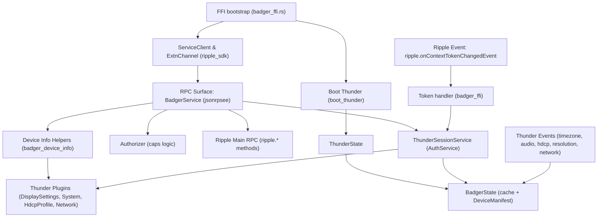
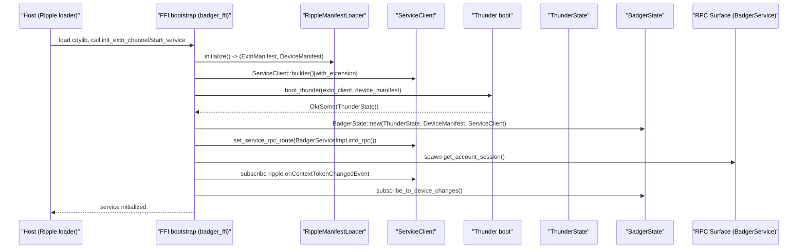
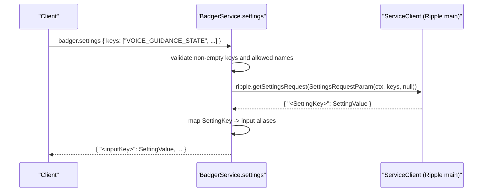
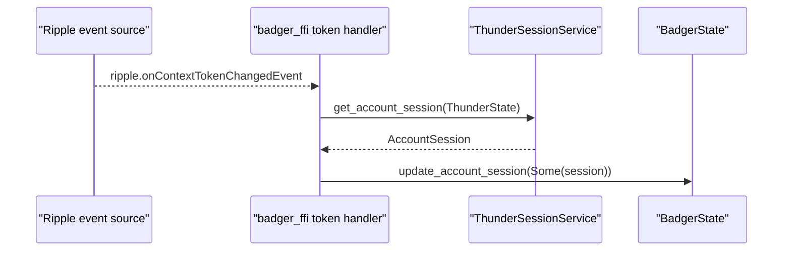
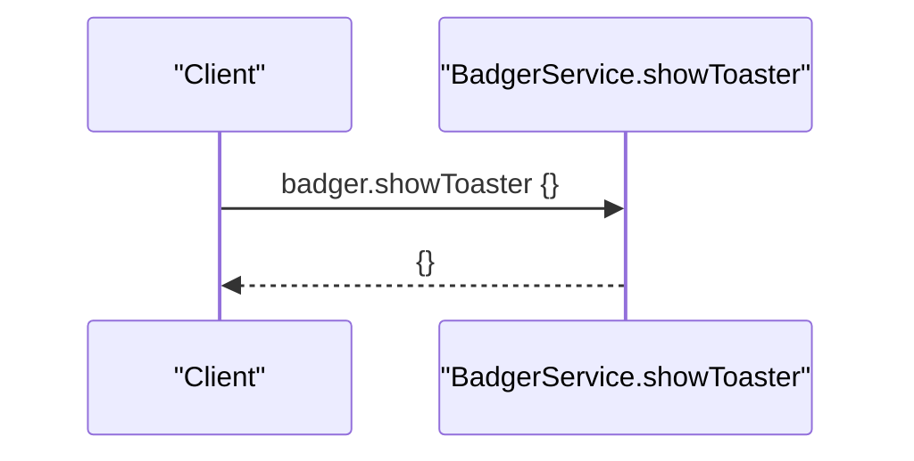

# Ripple_Badger_Extn Architecture and Detailed Design

## Table of Contents
- [Overview](#overview)
- [Component Architecture](#component-architecture)
  - [FFI bootstrap and service startup](#ffi-bootstrap-and-service-startup)
  - [RPC surface (badger.* and legacy.*)](#rpc-surface-badger-and-legacy)
  - [Authorization and capability checks](#authorization-and-capability-checks)
  - [Thunder integration](#thunder-integration)
  - [State and caching](#state-and-caching)
  - [Configuration and manifest interaction](#configuration-and-manifest-interaction)
- [Architecture Diagram](#architecture-diagram)
- [Request/Response and Error Handling Conventions](#requestresponse-and-error-handling-conventions)
- [Detailed Method Documentation](#detailed-method-documentation)
  - [Init and Lifecycle](#init-and-lifecycle)
  - [Device and Network](#device-and-network)
  - [Identity, Tokens and Legacy IDs](#identity-tokens-and-legacy-ids)
  - [Settings and Subscriptions](#settings-and-subscriptions)
  - [Second Screen and Navigation](#second-screen-and-navigation)
  - [Keyboard and PIN Overlay](#keyboard-and-pin-overlay)
  - [Toaster](#toaster)
- [Representative Sequence Flows](#representative-sequence-flows)
  - [Bootstrap/Init](#bootstrapinit)
  - [Settings Get](#settings-get)
  - [Token Refresh Handling](#token-refresh-handling)
  - [Toaster](#toaster-sequence)
- [Notes on Extensibility and Testing](#notes-on-extensibility-and-testing)

## Overview
Ripple_Badger_Extn is a Rust cdylib extension for Ripple that exposes a JSON-RPC surface for “badger.*” and “legacy.*” methods. It integrates with:
- ripple_sdk for manifest loading, service client wiring, FFI channel export, context, and JSON-RPC wiring.
- thunder_ripple_sdk for Thunder client bootstrapping, device/system calls, and event subscriptions.

The extension provides device and network information, localized and account-derived identifiers, capability summaries, settings retrieval and subscription, prompt-email flows, PIN overlay flows, and second-screen helpers. It maintains a cached state to reduce the cost of repeated device and Thunder calls, and listens to both Ripple and Thunder events to keep the cache fresh.

## Component Architecture

### FFI bootstrap and service startup
Source: src/badger_ffi.rs

- init_extn_channel() returns an ExtnChannel used by Ripple to host the extension (exported via export_extn_channel!).
- start_service() configures logging, loads manifests (RippleManifestLoader), and builds a ServiceClient. It then calls init().
- init() performs:
  - Thunder bootstrap via boot_thunder() (thunder_ripple_sdk). On success, it constructs BadgerState with ThunderState, DeviceManifest, and the ServiceClient.
  - Merges the jsonrpsee RPC module from BadgerServiceImpl into the service RPC route.
  - Immediately fetches account session once on boot (get_account_session) to prime the cache.
  - Registers a Ripple event subscription for ripple.onContextTokenChangedEvent to update the account session on token changes.
  - Subscribes to Thunder events for changes in timezone, audio format, HDCP/display connection, resolution and network connectivity (via subscribe_to_device_changes).

### RPC surface (badger.* and legacy.*)
Source: handlers/badger_info_rpc.rs

- Uses jsonrpsee proc macros to declare the BadgerService RPC trait and exposes methods under “badger.*” and “legacy.*”.
- BadgerServiceImpl wraps BadgerState and implements all RPC methods. It relies on:
  - ServiceClient for Ripple main RPC calls such as “ripple.checkCapsRequest”, “lifecycle.close”, “device.id”, “device.name”, “parameters.initialization”, “ripple.getSecondScreenPayload”, “ripple.sendAppEventRequest”, “ripple.promptEmailRequest”, “ripple.showPinOverlay”, “ripple.getSettingsRequest”, and “ripple.subscribeSettings”.
  - ThunderSessionService (thunder/thunder_session.rs) to retrieve AccountSession from Thunder’s AuthService.
  - Device capability helpers (handlers/badger_device_info.rs) for dimensions, HDR/HDCP/audio, make/model and platform version via Thunder plugins.

### Authorization and capability checks
Source: src/authorizer.rs

- Encodes Firebolt capability checks using RoleInfo/FireboltCap:
  - get_device_caps() returns the required capabilities to calculate device capability payloads.
  - get_info_caps() expands the set for badger.info (includes IDs, distributor, postal, profile flags).
- Helpers (e.g., is_device_info_authorized, is_session_required) interpret the “ripple.checkCapsRequest” result to decide what data may be returned or needs to be computed.
- Methods gate expensive calls based on these checks and return partially populated responses where appropriate.

### Thunder integration
Sources: thunder/thunder_session.rs, handlers/badger_device_info.rs

- ThunderSessionService fetches AccountSession by calling Thunder AuthService methods:
  - org.rdk.AuthService.getXDeviceId → xDeviceId
  - org.rdk.AuthService.getServiceAccountId → serviceAccountId
  - org.rdk.AuthService.getDeviceId → partnerId
  - org.rdk.AuthService.getServiceAccessToken → token
- Device capability helpers call Thunder plugins:
  - DisplaySettings: getCurrentResolution, getDefaultResolution, getAudioFormat, getTVHDRCapabilities
  - System: getDeviceInfo, getSystemVersions
  - HdcpProfile: getHDCPStatus
  - Network: onConnectionStatusChanged (events)
- Subscriptions register on a set of Thunder events and update cached state when events fire.

### State and caching
Source: src/badger_state.rs

- BadgerState holds:
  - Arc<ThunderState> for device calls and Ripple extn client.
  - DeviceManifest (Arc<RwLock<...>>) for defaults and form factor.
  - ServiceClient for Ripple RPC.
  - CachedBadgerInfo: postal code, AccountSession, IDs, receiver platform/version, web browser defaults, HDCP/HDR/audio, video/native dimensions, wifi flag.
- Exposes getters and setters to keep local caches consistent with the latest values from Ripple or Thunder.

### Configuration and manifest interaction
Source: src/badger_ffi.rs

- Manifests are loaded via RippleManifestLoader::initialize():
  - ExtnManifest: used to derive the extension symbol ExtnId and configure ServiceClient with the extension identity.
  - DeviceManifest: used for defaults (e.g., default video dimensions) and configuration like distributor_experience_id and device form factor.

## Architecture Diagram


## Request/Response and Error Handling Conventions
- Transport: JSON-RPC 2.0 method names under “badger.*” and “legacy.*”.
- Context: Methods receive a CallContext (injected by the gateway). The code uses it when forwarding to Ripple main RPCs and for per-app scoping (e.g., salted UIDs).
- Authorization: Before returning sensitive fields, the service calls “ripple.checkCapsRequest” with the relevant capability set. Returned data is scoped to what is permitted.
- Timeouts: Most Ripple calls use explicit timeouts (commonly 5000ms; PIN overlay up to 180000ms).
- Errors:
  - Many methods transform downstream failures into jsonrpsee::core::Error::Custom with human-readable messages.
  - Some methods return Ok with partially filled payloads when certain sources are unavailable; others propagate errors from ServiceClient calls via ?.
  - A downstream service unavailability error code constant is defined as -50200 (not currently emitted).

## Detailed Method Documentation

This section documents all implemented badger.* and legacy.* methods found in the codebase. Where aliases exist, both names are listed.

### Init and Lifecycle

#### badger.dismissLoadingScreen
- Purpose: Mark the app as ready by forwarding to Ripple lifecycle.ready.
- Request schema:
  - params: {}
- Response schema:
  - {} (BadgerEmptyResult)
- Behavior:
  - Calls ripple main RPC “lifecycle.ready”.
- Errors:
  - If the main RPC fails, returns Custom("Error: Could not put app in ready state").
- Example:
  ```
  {
    "jsonrpc": "2.0",
    "id": 1,
    "method": "badger.dismissLoadingScreen",
    "params": {}
  }
  ```

#### badger.shutdown
- Purpose: Request app closure with CloseReason::UserExit.
- Request schema:
  - params: {}
- Response schema:
  - {} (BadgerEmptyResult)
- Behavior:
  - Calls ripple main RPC “lifecycle.close”.
- Errors:
  - Custom("Error: Could not close app") on downstream failure.
- Example:
  ```
  {
    "jsonrpc": "2.0",
    "id": 2,
    "method": "badger.shutdown",
    "params": {}
  }
  ```

### Device and Network

#### badger.info
- Purpose: Aggregated device information including TZ, optional postal code, device capabilities, account/device/partner IDs, privacy settings, and profile flags, governed by capabilities.
- Request schema: params: {}
- Response schema (BadgerDeviceInfo, all fields optional unless noted):
  - zipCode: string
  - timeZone: string
  - timezone: string (offset, e.g., "+5:30" or "-7:00")
  - receiverId: string
  - deviceHash: string
  - deviceId: string
  - accountId: string
  - deviceCapabilities: object (see badger.deviceCapabilities)
  - householdId: string
  - privacySettings: map<string, string> (e.g., us_privacy, lmt)
  - partnerId: string
  - userExperience: string
- Behavior:
  - Retrieves TZ from ExtnClient context.
  - Uses ripple.checkCapsRequest with Authorizer::get_info_caps() to determine which fields to populate:
    - Postal code via localization.countryCode and device_manifest defaults (fallback map for US/CA).
    - Device capabilities (see below) only if at least one device capability is permitted.
    - Account session (device/account/partner IDs) if session is required and available via Thunder.
    - Profile flags and distributor experience ID as allowed.
  - Adds privacy settings from parameters.initialization (us_privacy, lmt) when available.
- Errors:
  - Method returns Ok with whatever could be assembled. Failures are logged but do not cause a hard error.
- Example response (illustrative):
  ```
  {
    "zipCode": "12345",
    "timeZone": "America/Los_Angeles",
    "timezone": "-7:00",
    "receiverId": "dev123",
    "deviceHash": "dev123",
    "deviceId": "dev123",
    "accountId": "acc123",
    "deviceCapabilities": { "...": "..." },
    "householdId": "acc123",
    "privacySettings": { "us_privacy": "1---", "lmt": "1" },
    "partnerId": "sess123",
    "userExperience": ""
  }
  ```

#### badger.deviceCapabilities
- Purpose: Summarize device capabilities and attributes.
- Request schema: params: {}
- Response schema (BadgerDeviceCapabilities, optional fields):
  - deviceType: string (from DeviceManifest form_factor)
  - isWifiDevice: boolean (from capability check + network)
  - videoDimensions: [int, int]
  - nativeDimensions: [int, int]
  - model: string
  - receiverPlatform: string
  - receiverVersion: string
  - hdr: { settopHdrSupport: [string], tvHdrSupport: [string] } from DisplaySettings HDR capabilities
  - hdcp: { supportedHDCPVersion, receiverHDCPVersion, currentHDCPVersion, connected, hdcpcompliant, hdcpenabled, hdcpReason }
  - webBrowser: { userAgent, version, browserType } (defaults from BadgerState)
  - supportsTrueSD: true
  - deviceMakeModel: string (e.g., "SerComm_SCXI11BEI")
  - audioModes: { currentAudioMode: [], supportedAudioModes: [string] }
- Behavior:
  - Permits based on ripple.checkCapsRequest with Authorizer::get_device_caps().
  - Uses cached or fetched:
    - DisplaySettings resolutions (current/default), audio format, HDR capabilities.
    - HdcpProfile getHDCPStatus.
    - System getDeviceInfo/getSystemVersions for make/model/platform/version.
    - DeviceManifest defaults as fallbacks.
- Errors:
  - If not authorized, returns jsonrpsee::core::Error::Custom("badger.devicecapabilities not available").
  - Otherwise returns payload with any fields successfully derived.

#### badger.networkConnectivity
- Purpose: Provide network interface and connectivity status.
- Request schema: params: {}
- Response schema:
  - { "networkInterface": "WIFI" | "ETHERNET", "status": "SUCCESS" }
- Behavior:
  - Calls ripple main RPC “device.network” and maps NetworkType to interface name.
- Errors:
  - Propagates ServiceClient errors via ?.

#### badger.dial.getDeviceId (alias: badger.getDeviceId)
- Purpose: Return the device id used for DIAL flows.
- Request schema: params: {}
- Response schema:
  - { "deviceId": string }
- Behavior:
  - Prefer cached AccountSession; else call ripple main RPC “device.id”.
- Errors:
  - On ripple failure, returns Custom("Error: Device Id not available").

#### badger.dial.getDeviceName (alias: badger.getDeviceName)
- Purpose: Return a human-friendly device name.
- Request schema: params: {}
- Response schema:
  - { "deviceName": string }
- Errors:
  - On ripple failure, returns Custom("Error: Device Name not available").

### Identity, Tokens and Legacy IDs

#### legacy.device.uid
- Purpose: Return a salted, app-scoped device UID derived from AccountSession.
- Request schema: params: {}
- Response schema: string
- Behavior:
  - Requires “magic” configuration string to be present in the ExtnClient config; otherwise returns Custom("Error: missing magic").
  - From AccountSession choose device_id; compute salt_using_app_scope(appId, device_id, magic) using SHA1.
- Errors:
  - Missing magic or missing session → Custom("Error: failed to get account session").

#### legacy.account.uid
- Purpose: Return a salted, app-scoped account UID.
- Behavior and errors: as above, using account_id as the reference.

#### Token management
- Purpose: Keep AccountSession cached/fresh.
- Behavior:
  - On startup, get_account_session via Thunder Session (AuthService).
  - Subscribe to ripple.onContextTokenChangedEvent; when updateType == TokenChanged and activationStatus contains AccountToken, re-fetch AccountSession via Thunder and update cache.
- Errors:
  - Failures are logged; no direct RPC method.

### Settings and Subscriptions

#### badger.settings
- Purpose: Retrieve settings by key set.
- Request schema:
  ```
  {
    "keys": [ "VOICE_GUIDANCE_STATE", "CC_STATE", "friendly_name", ... ]
  }
  ```
  Valid keys (mapped internally to SettingKey):
  - VOICE_GUIDANCE_STATE, TextToSpeechEnabled2
  - CC_STATE, ShowClosedCapture
  - DisplayPersonalizedRecommendations
  - RememberWatchedPrograms
  - ShareWatchHistoryStatus
  - friendly_name
  - power_save_status
  - legacyMiniGuide
- Response schema:
  ```
  {
    "<inputKey>": { "value": <any|nullable>, "enabled": <bool|nullable> },
    ...
  }
  ```
- Behavior:
  - Validates that keys is non-empty and every key is recognized. If OK, forwards to “ripple.getSettingsRequest”.
  - Maps returned SettingValue map back to input aliases.
- Errors:
  - If keys is empty or contains an unrecognized key → Custom("Error: Couldnt retrieve settings").
  - Downstream failures from ServiceClient also map to Custom("Error: Couldnt retrieve settings").

#### badger.subscribeToSettings
- Purpose: Subscribe for change notifications for a set of settings keys.
- Request schema:
  ```
  {
    "keys": [ "<same keys as badger.settings>" ]
  }
  ```
- Response schema: none (void)
- Behavior:
  - Validates keys as above, forwards to “ripple.subscribeSettings” with alias mapping to preserve input key names on notifications.
- Errors:
  - Same validations as badger.settings.

### Second Screen and Navigation

#### badger.dial.getPayload (alias: badger.getPayload)
- Purpose: Fetch second-screen payload if present.
- Request schema: params: {}
- Response schema:
  ```
  { "payload": "<string|absent>" }
  ```
- Behavior:
  - Calls “ripple.getSecondScreenPayload” and returns the string if non-empty; else returns an object with no payload field.
- Errors:
  - Returns Ok with default if the downstream returns empty; otherwise downstream parse errors propagate via Result.

#### badger.dial.onLaunch (alias: badger.onLaunch)
- Purpose: Register/unregister for second-screen onLaunch events.
- Request schema:
  ```
  { "onLaunchCallback": true|false }
  ```
- Response schema:
  ```
  { "listening": true|false, "event": "discovery.onLaunchRequest" }
  ```
- Behavior:
  - Wraps ListenRequest and forwards AppEventRequest::Register to “ripple.sendAppEventRequest”.
- Errors:
  - Registration failures are ignored by design (best-effort); returns current listening flag.

#### badger.navigateToCompanyPage
- Purpose: Trigger navigation to a company page by emitting a discovery intent event to the system UI app.
- Request schema:
  ```
  { "companyId": "<string>" }
  ```
- Response schema:
  - {} (BadgerEmptyResult)
- Behavior:
  - Reads default UI app_id from DeviceManifest.
  - Builds NavigationIntentStrict::Section with section "company:<companyId>" and emits via “ripple.sendAppEventRequest”.
- Errors:
  - Best-effort; errors are not surfaced to caller.

### Keyboard and PIN Overlay

#### badger.promptEmail
- Purpose: Prompt for email using the platform keyboard.
- Request schema:
  ```
  { "prefillType": "SignIn" | "SignUp" }
  ```
- Response schema:
  ```
  {
    "status": "SUCCESS" | "DISMISS",
    "data": { "email": "<string>" }
  }
  ```
- Behavior:
  - Builds KeyboardSessionRequest { type: Email, message: "Sign in" or "Sign up", ctx } and calls “ripple.promptEmailRequest”.
  - Status is derived from KeyboardSessionResponse.canceled.
- Errors:
  - Custom("Error: Keyboard not available") when downstream fails.

#### badger.showPinOverlay
- Purpose: Display a PIN overlay for content or purchase flows and return the outcome.
- Request schema:
  ```
  { "pinType": "purchase_pin" | "<content_pin>", "suppressSnooze": "True" | "False" | null }
  ```
- Response schema:
  ```
  {
    "status": "SUCCESS" | "PIN_NOT_REQUIRED" | "LOCKED" | "USER_DISMISSED_OVERLAY",
    "message": "<human readable text>"
  }
  ```
- Behavior:
  - Converts pinType into Firebolt PinSpace.
  - Calls “ripple.showPinOverlay” (180s timeout).
  - Maps PinChallengeResultReason into BadgerPinStatus and message.
- Errors:
  - Custom("Error: Pin not available") if downstream fails or result indicates an error.

### Toaster

#### badger.showToaster
- Purpose: Placeholder for showing a toaster notification.
- Request schema: params: {}
- Response schema:
  - { } (DefaultResponse)
- Behavior:
  - Currently a stub returning success with no side-effects.

## Representative Sequence Flows

### Bootstrap/Init


### Settings Get


### Token Refresh Handling


### Toaster (sequence)


## Notes on Extensibility and Testing
- Adding a new method:
  - Define it on the BadgerService trait with #[method(name = "...")] (and aliases as needed).
  - Implement it in BadgerServiceImpl, favoring Authorizer gates and cached lookups to avoid redundant calls.
  - For main RPC interactions, use ServiceClient’s call_and_parse_ripple_main_rpc or request_with_timeout_main helpers with explicit timeouts.
- Caching and events:
  - Prefer BadgerState getters; when computing a value from Thunder, write it back into the cache for subsequent calls.
  - Subscribe to relevant Thunder events if a cached value should stay fresh as the platform changes.
- Test strategy:
  - The crate contains extensive unit tests with mocks that exercise success and failure paths (see handlers/badger_device_info.rs tests and authorizer.rs tests).
  - Use test_utils.rs fixtures to set up mocked Thunder state and ExtnClient context when extending functionality.

