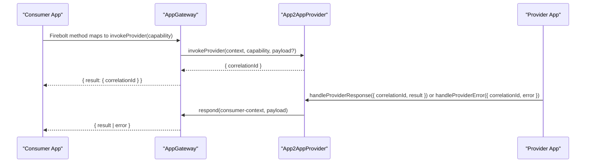
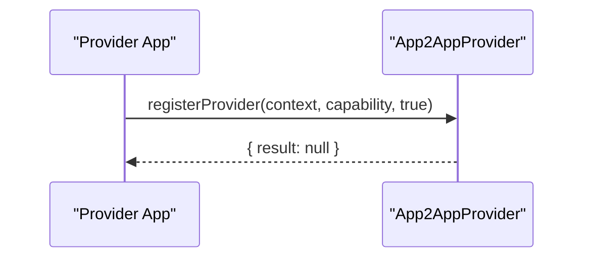
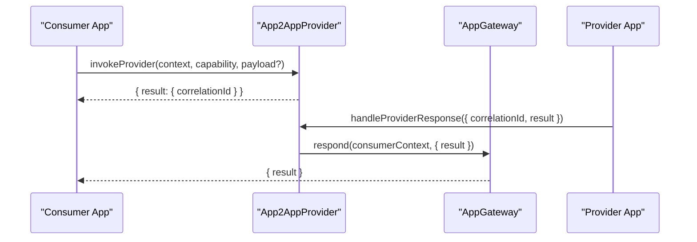
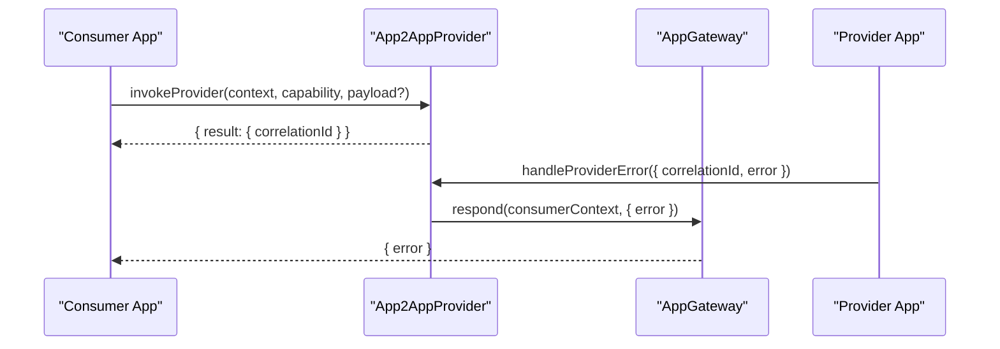

# App2AppProvider Thunder Plugin Design Specification

## Introduction

### Background
App2AppProvider enables provider/consumer interactions between applications, replacing equivalent patterns in Ripple by leveraging Thunder (WPEFramework). It allows an application to register capabilities as a provider, lets other applications invoke those capabilities, and ensures responses are routed back to the requesting consumer via AppGateway. App2AppProvider manages registration, request correlation, and delivery semantics while following JSON-RPC patterns and Thunder plugin best practices.

This document aligns with:
- thunder-plugins-architecture.md
- appgateway-design.md

It details the required JSON-RPC interface, message schemas, folder layout, classes and responsibilities, initialization, error handling, extensibility, and implementation guidance that follows entservices-infra and Thunder conventions.

### Scope
- Define methods and data models for provider registration and invocation flows.
- Specify the internal structure and concurrency model to handle multiple apps and capabilities.
- Provide examples and sequence diagrams for registration and invocation.
- Reference Thunder and entservices-infra patterns for layout, registration, JSON-RPC dispatch, and security token usage.

Out of scope:
- Full OpenRPC ingestion/capability expansion beyond current parity.
- Provider discovery indexing beyond capability strings.
- Phase 2 Firebolt 2.0 specific message compatibility (planned in roadmap).

## Interfaces

### Overview
App2AppProvider exposes four JSON-RPC methods. It does not emit plugin-originated events; instead, it uses AppGateway.respond to deliver responses back to the correct consumer application context.

Recommended versioned call sign at implementation: org.rdk.App2AppProvider.1.<method>.

Common structures:
- Context object: { requestId: number, connectionId: string, appId: string }
- Error codes:
  - -32602 INVALID_PARAMS
  - -32699 INVALID_REQUEST
  - -32700 PARSE_ERROR (for payload parsing issues in request bodies where applicable)

### Method: registerProvider
- Call sign: org.rdk.App2AppProvider.registerProvider
- Description: Register or unregister a provider for a capability (e.g., AcknowledgeChallenge.challenge, IntegratedPlayer.create).

Parameters
| Name       | Type    | Description                                                         | Required |
|------------|---------|---------------------------------------------------------------------|----------|
| context    | object  | { "requestId": number, "connectionId": string, "appId": string }   | Yes      |
| register   | boolean | true to register; false to unregister                               | Yes      |
| capability | string  | Provider capability identifier                                      | Yes      |

Success Response
- result: null

Error Response
| Field | Type   | Description                                        |
|-------|--------|----------------------------------------------------|
| code  | number | -32602 INVALID_PARAMS; -32699 INVALID_REQUEST      |
| message | string | Optional detail                                 |

Sample
- Request: {"jsonrpc":"2.0","id":"3","method":"org.rdk.App2AppProvider.registerProvider","params":{"context":{"requestId":0,"connectionId":"guid","appId":"providerApp"},"register":true,"capability":"AcknowledgeChallenge.challenge"}}
- Response: {"jsonrpc":"2.0","id":3,"result":null}

### Method: invokeProvider
- Call sign: org.rdk.App2AppProvider.invokeProvider
- Description: Invoke a capability on a registered provider on behalf of a consumer. Returns a correlationId that the provider must use when responding.

Parameters
| Name       | Type               | Description                                                                 | Required |
|------------|--------------------|-----------------------------------------------------------------------------|----------|
| context    | object             | { "requestId": number, "connectionId": string, "appId": string } (consumer) | Yes      |
| capability | string             | Provider capability to invoke                                               | Yes      |
| payload    | object (opaque)    | Optional capability input                                                   | No       |

Success Result
| Name          | Type   | Description                      |
|---------------|--------|----------------------------------|
| correlationId | string | UUID to correlate async response |

Error Response
| Field | Type   | Description                                        |
|-------|--------|----------------------------------------------------|
| code  | number | -32602 INVALID_PARAMS; -32699 INVALID_REQUEST      |
| message | string | Optional detail                                 |

Sample
- Request: {"jsonrpc":"2.0","id":"3","method":"org.rdk.App2AppProvider.invokeProvider","params":{"context":{"requestId":10,"connectionId":"guid-consumer","appId":"consumerApp"},"capability":"IntegratedPlayer.create","payload":{"options":{"stream":"url"}}}}
- Response: {"jsonrpc":"2.0","id":3,"result":{"correlationId":"uuid-1234"}}

### Method: handleProviderResponse
- Call sign: org.rdk.App2AppProvider.handleProviderResponse
- Description: Provider sends a successful response for a prior invocation.

Parameters
| Name       | Type               | Description                                                                                          | Required |
|------------|--------------------|------------------------------------------------------------------------------------------------------|----------|
| payload    | object (opaque)    | { "correlationId": "uuid", "result": { /* provider-defined result */ } }                            | Yes      |
| capability | string             | Capability associated with this response                                                             | Yes      |

Success Response
- result: null

Error Response
| Field | Type   | Description                                        |
|-------|--------|----------------------------------------------------|
| code  | number | -32602 INVALID_PARAMS; -32699 INVALID_REQUEST      |
| message | string | Optional detail                                 |

Sample
- Request: {"jsonrpc":"2.0","id":"3","method":"org.rdk.App2AppProvider.handleProviderResponse","params":{"payload":{"correlationId":"uuid-123","result":{"data":"ok"}},"capability":"AcknowledgeChallenge.challenge"}}
- Response: {"jsonrpc":"2.0","id":3,"result":null}

### Method: handleProviderError
- Call sign: org.rdk.App2AppProvider.handleProviderError
- Description: Provider sends an error result for a prior invocation.

Parameters
| Name       | Type               | Description                                                                                          | Required |
|------------|--------------------|------------------------------------------------------------------------------------------------------|----------|
| payload    | object (opaque)    | { "correlationId": "uuid", "error": { "code": number, "message": string } }                         | Yes      |
| capability | string             | Capability associated with this error                                                                | Yes      |

Success Response
- result: null

Error Response
| Field | Type   | Description                                        |
|-------|--------|----------------------------------------------------|
| code  | number | -32602 INVALID_PARAMS; -32699 INVALID_REQUEST      |
| message | string | Optional detail                                 |

Sample
- Request: {"jsonrpc":"2.0","id":"3","method":"org.rdk.App2AppProvider.handleProviderError","params":{"payload":{"correlationId":"uuid-123","error":{"code":-1200,"message":"error msg"}},"capability":"AcknowledgeChallenge.challenge"}}
- Response: {"jsonrpc":"2.0","id":3,"result":null}

### Notes on Events
The plugin does not raise Thunder events. Instead, it uses AppGateway.respond to deliver payloads back to the original consumer app. This design keeps all application-directed messaging flowing through AppGateway to the correct WebSocket connection and requestId.

## Interaction Model

### Provider Registration and Invocation

### Context Handling
- Consumer context is stored at invoke time (connectionId, appId, requestId) and associated with the generated correlationId.
- When the provider responds, the correlationId is used to look up the consumer context and return the response via AppGateway.respond.

## File and Folder Structure

Proposed structure consistent with entservices-infra patterns:

- entservices-infra/App2AppProvider/
  - CMakeLists.txt
  - Module.h
  - Module.cpp
  - App2AppProvider.h
  - App2AppProvider.cpp
  - ProviderRegistry.h
  - ProviderRegistry.cpp
  - CorrelationMap.h
  - CorrelationMap.cpp
  - GatewayClient.h
  - GatewayClient.cpp
  - PermissionManager.h
  - PermissionManager.cpp
  - App2AppProvider.conf.in
  - App2AppProvider.config

Optional test and assets dirs as needed:
- Tests/L1, Tests/L2 following repo conventions
- assets/provider-samples/*.json

Rationale:
- Module.*: module naming and build references (see ResourceManager/StorageManager/Monitor).
- App2AppProvider.*: IPlugin and JSONRPC implementation class; registration and lifecycle.
- ProviderRegistry.*: capability→provider registration mapping with app connection metadata.
- CorrelationMap.*: correlationId→consumer context tracking for async responses.
- GatewayClient.*: uses a pattern similar to ResourceManager::JSONRPCDirectLink for calling AppGateway.respond with local dispatcher and SecurityAgent token.
- PermissionManager.*: enforcement hooks for permission groups as needed (enhanced in Phase 2 with JWT scopes).

## Classes and Responsibilities

### class App2AppProvider : public PluginHost::IPlugin, public PluginHost::JSONRPC
Responsibilities:
- Register JSON-RPC endpoints (registerProvider, invokeProvider, handleProviderResponse, handleProviderError).
- Maintain instances of ProviderRegistry, CorrelationMap, GatewayClient, PermissionManager.
- Initialize and load configuration; obtain SecurityAgent token for local JSON-RPC dispatch to AppGateway (if needed).

Key fields:
- PluginHost::IShell* _service
- std::unique_ptr<ProviderRegistry> _providers
- std::unique_ptr<CorrelationMap> _correlations
- std::unique_ptr<GatewayClient> _gateway
- std::unique_ptr<PermissionManager> _perms
- string _gatewayCallsign (default "org.rdk.AppGateway")

Key methods:
- const string Initialize(PluginHost::IShell* service)
- void Deinitialize(PluginHost::IShell* service)
- string Information() const
- uint32_t RegisterProviderWrapper(const JsonObject& params, JsonObject& response)
- uint32_t InvokeProviderWrapper(const JsonObject& params, JsonObject& response)
- uint32_t HandleProviderResponseWrapper(const JsonObject& params, JsonObject& response)
- uint32_t HandleProviderErrorWrapper(const JsonObject& params, JsonObject& response)

### class ProviderRegistry
Responsibilities:
- Track capability→provider mapping with provider app context (connectionId, appId).
- Support registration/unregistration; handle last-wins for the same capability or reject duplicates based on policy.

Fields:
- std::unordered_map<string, ProviderContext> _byCapability
- Core::CriticalSection _lock

Methods:
- bool Register(const string& capability, const ProviderContext& ctx)
- bool Unregister(const string& capability, const string& appId)  // only owner can unregister
- bool Resolve(const string& capability, ProviderContext& out) const

ProviderContext:
- string appId
- string connectionId

### class CorrelationMap
Responsibilities:
- Maintain correlationId→ConsumerContext for each in-flight invocation.

Fields:
- struct ConsumerContext { string appId; string connectionId; uint32_t requestId; }
- std::unordered_map<string, ConsumerContext> _pending
- Core::CriticalSection _lock

Methods:
- string Create(const ConsumerContext& ctx) // returns uuid
- bool Take(const string& correlationId, ConsumerContext& out) // remove on read
- bool Peek(const string& correlationId, ConsumerContext& out) // optionally read-only

### class GatewayClient
Responsibilities:
- Invoke AppGateway.respond locally via JSON-RPC using SecurityAgent token and local dispatcher.
- Encapsulate retry/backoff policy if needed.

Fields:
- PluginHost::IShell* _service
- string _gatewayCallsign
- string _securityToken

Methods:
- uint32_t Respond(const ConsumerContext& ctx, const JsonObject& payload)

Implementation Note:
- Use a local dispatcher approach as in ResourceManager::JSONRPCDirectLink with token fetched in Initialize via SecurityAgent.

### class PermissionManager
Responsibilities:
- Optional enforcement for invokeProvider/registerProvider based on permission group.
- Phase 2: integrate JWT validation if enabled globally.

Fields:
- bool _jwtEnabled

Methods:
- bool IsAllowed(const string& appId, const string& requiredGroup) const

## Initialization

1. App2AppProvider Initialize:
   - Capture PluginHost::IShell* service.
   - Obtain SecurityAgent token via IAuthenticate to enable local JSON-RPC invocations to AppGateway.respond.
   - Construct ProviderRegistry, CorrelationMap, GatewayClient, PermissionManager.
   - Register JSON-RPC methods with PluginHost::JSONRPC::Register similar to ResourceManager.

2. Configuration (App2AppProvider.config):
   - gatewayCallsign: string (default "org.rdk.AppGateway")
   - jwtEnabled: boolean (default false)
   - policy: enum/string (e.g., singleProviderPerCapability="lastWins" or "rejectDuplicates")

3. Deinitialize:
   - Unregister JSON-RPC methods.
   - Clear registries and release resources.

## Error Handling

- INVALID_PARAMS (-32602): returned when context or required parameters are missing or invalid.
- INVALID_REQUEST (-32699): returned when required fields are absent or an unsupported operation is requested (e.g., unregistering a non-existent capability).
- PARSE_ERROR (-32700): used if a payload (opaque JSON) cannot be deserialized by the plugin when needed.

Internal checks:
- registerProvider: must have capability, context, register flag. If unregister, verify ownership by appId.
- invokeProvider: must have capability and consumer context. Ensure provider exists; on absence, return INVALID_REQUEST with message "PROVIDER_NOT_FOUND".
- handleProviderResponse/handleProviderError: must include correlationId; unknown correlationId should return INVALID_REQUEST "UNKNOWN_CORRELATION".

## Concurrency and Performance

- Use Core::CriticalSection to protect ProviderRegistry and CorrelationMap.
- Limit held locks to minimal critical sections; use immutable local copies for long operations.
- Create short-lived jobs to call AppGateway.respond and avoid blocking JSON-RPC thread handlers.
- Avoid heavy per-request allocations; reuse JSON objects where possible (Thunder factories).

## Extensibility

- Capability naming is string-based; no schema coupling to OpenRPC in Phase 1.
- Policy can be extended for multi-provider selection (e.g., by appId or priority).
- Add auxiliary methods in future (e.g., listProviders, getProviderInfo, cancelInvocation) using the same patterns.

## Implementation Guidance and References

### Thunder/entservices-infra Patterns
- Registration and metadata:
  - Use Plugin::Metadata and SERVICE_REGISTRATION macros (see StorageManager.cpp, Monitor.cpp).
- JSON-RPC registration:
  - Use PluginHost::JSONRPC::Register and Unregister in constructor/destructor (see ResourceManager.cpp).
- Local JSON-RPC invocation with SecurityAgent token:
  - Use pattern similar to ResourceManager::JSONRPCDirectLink to call AppGateway.respond.
- IWeb not required for App2AppProvider; JSON-RPC is sufficient.

### Directory and Build
- Follow entservices-infra structure (Module.cpp with MODULE_NAME_DECLARATION, App2AppProvider.h/.cpp implementing IPlugin/JSONRPC).
- Include config templates (App2AppProvider.conf.in, App2AppProvider.config) similar to other plugins.

### Call Sign Versioning
- Implement org.rdk.App2AppProvider.1.<method>; keep unversioned examples in documentation for readability, but code should use versioned names.

## Example Flows

### Registration

### Invocation and Response

### Invocation and Error

## Testing Strategy

- Unit tests for ProviderRegistry (register/unregister, conflict policies).
- Unit tests for CorrelationMap (create, take/peek correctness under concurrency).
- Integration tests calling JSON-RPC endpoints and verifying AppGateway.respond invocation (mock via local dispatcher).
- Negative tests for error codes: missing params, unknown capability, unknown correlation, parse errors.

## Assumptions and Roadmap

- Phase 1 relies on AppGateway for transport and response delivery; permission enforcement initially driven by LaunchDelegate’s permissionGroup.
- Phase 2: JWT validation and capability-based routing with scopes; consider versioned provider endpoints and stricter JSON-RPC 2.0 compliance.

## Appendix

### Context Object
- { "requestId": number, "connectionId": string, "appId": string }

### Sample Datasets
- capability: "AcknowledgeChallenge.challenge"
- capability: "IntegratedPlayer.create"

### Suggested Config Keys (App2AppProvider.config)
- gatewayCallsign: "org.rdk.AppGateway"
- jwtEnabled: false
- providerConflictPolicy: "lastWins" | "rejectDuplicates"
