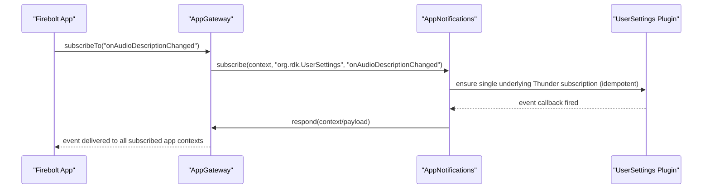
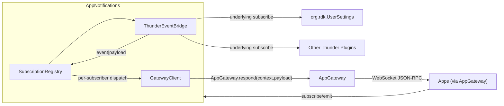
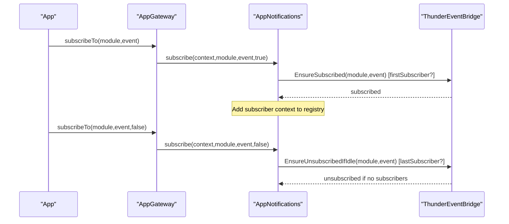
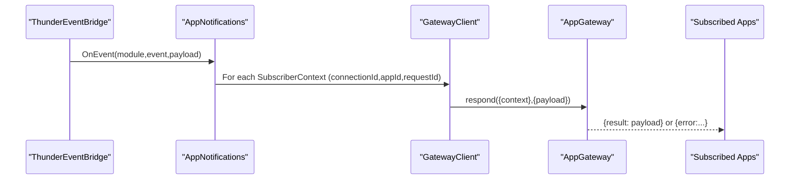

# AppNotifications Thunder Plugin Design Specification

## Introduction

### Background
AppNotifications centralizes and optimizes Thunder event subscriptions across applications. In the legacy environment, each app often subscribes independently to the same device-level notifications (for example, audio description, closed captions, locale/timezone changes). This creates redundant subscriptions, additional processing overhead, and higher memory usage. AppNotifications solves this by maintaining a single underlying Thunder subscription per module+event and multiplexing event delivery to all interested applications.

This document aligns with:
- thunder-plugins-architecture.md
- appgateway-design.md
- app2appprovider-design.md

It follows Thunder (WPEFramework) plugin patterns already present in entservices-infra (for example, ResourceManager and SharedStorage) and adheres to standard JSON-RPC behavior. Where relevant, it references standard Thunder registration, metadata, and local JSON-RPC invocation patterns.

### Scope
- Define the JSON-RPC interface for subscription management and event emission.
- Specify the internal data structures, classes, fields, and methods required to implement optimized subscription-sharing.
- Provide sequence flows and examples illustrating subscribe/unsubscribe and event propagation to applications via AppGateway.
- Detail concurrency, error handling, configuration, and testing guidance, consistent with entservices-infra and Thunder best practices.

Out of scope:
- Phase 2 changes required to fully standardize on JSON-RPC 2.0-compliant Firebolt RPC. These are captured as future work in the roadmap.

## Interfaces

### Overview
AppNotifications provides two JSON-RPC methods. It does not emit plugin-originated Thunder events in Phase 1. Instead, application-directed event payloads are delivered back to apps using AppGateway.respond.

- subscribe
- emit

Recommended call sign in implementation: org.rdk.AppNotifications.1.<method>

### Common Structures

#### Context Object
For any call that correlates to an application session, a context object is used:

- requestId: number — Unique within the app connection to correlate calls and callbacks.
- connectionId: string — Unique identifier for the WebSocket connection (GUID-like).
- appId: string — Application identifier.

Example:
{
  "requestId": 0,
  "connectionId": "guid",
  "appId": "com.example.app"
}

#### Error Codes (consistent with architecture)
- -32700 PARSE_ERROR — Payload could not be deserialized (when opaque JSON payloads are parsed).
- -32602 INVALID_PARAMS — Invalid or missing context or parameters.
- -32699 INVALID_REQUEST — Missing method and/or required parameters.

### Method: subscribe

#### Description
Register or unregister an application’s interest in a Thunder module event. Internally, AppNotifications ensures a single underlying Thunder subscription exists for each (module, event) and maintains a list of subscribed app contexts. When an event occurs, it is dispatched to all subscribed app contexts using AppGateway.respond.

#### Call sign
org.rdk.AppNotifications.subscribe

#### Parameters
| Name     | Type    | Description                                                                                   | Required |
|----------|---------|-----------------------------------------------------------------------------------------------|----------|
| context  | object  | { "requestId": number, "connectionId": string, "appId": string }                               | Yes      |
| subscribe| boolean | true to subscribe; false to unsubscribe                                                        | Yes      |
| module   | string  | Thunder module (for example, "org.rdk.UserSettings")                                          | Yes      |
| event    | string  | Thunder event name (for example, "onAudioDescriptionChanged")                                 | Yes      |

Notes:
- The pair (module, event) defines the underlying Thunder subscription key that AppNotifications manages.
- Unsubscribe removes the app’s context from the internal list and tears down the underlying Thunder subscription only when there are no remaining subscribers for that key.

#### Success Response
- result: null

#### Error Response
| Field   | Type   | Description                         |
|---------|--------|-------------------------------------|
| code    | number | -32602 INVALID_PARAMS; -32699 INVALID_REQUEST |
| message | string | Optional details                    |

#### Example
Request:
{"jsonrpc":"2.0","id":"3","method":"org.rdk.AppNotifications.1.subscribe","params":{"context":{"requestId":0,"connectionId":"guid","appId":"someAppId"},"subscribe":true,"module":"org.rdk.UserSettings","event":"onAudioDescriptionChanged"}}

Response:
{"jsonrpc":"2.0","id":3,"result":null}

### Method: emit

#### Description
Dispatch an event payload to registered app(s). If appId is specified, the event is dispatched only to that app. If appId is not specified, the event is dispatched to all apps currently registered for the corresponding Firebolt event name. This method is typically used by internal components (for example, LaunchDelegate) to propagate lifecycle or other events through the gateway to target apps.

#### Call sign
org.rdk.AppNotifications.emit

#### Parameters
| Name    | Type             | Description                                                            | Required |
|---------|------------------|------------------------------------------------------------------------|----------|
| event   | string           | Firebolt event identifier                                              | Yes      |
| payload | object (opaque)  | Event payload (opaque JSON)                                            | Yes      |
| appId   | string           | If present, event is dispatched only to the specified app              | No       |

Notes:
- The event field represents the Firebolt-facing event identifier that app code expects (for example, "lifecycle.onBackground"). Internally, AppNotifications maps this to specific app contexts currently subscribed to that event (via subscribe) and then uses AppGateway.respond to deliver the payload.

#### Success Response
- result: null

#### Error Response
| Field   | Type   | Description                         |
|---------|--------|-------------------------------------|
| code    | number | -32602 INVALID_PARAMS; -32699 INVALID_REQUEST |
| message | string | Optional details                    |

#### Example
Request:
{"jsonrpc":"2.0","id":"3","method":"org.rdk.AppNotifications.1.emit","params":{"event":"lifecycle.onBackground","payload":{"previousState":"INITIALIZING","state":"FOREGROUND"},"appId":"someAppId"}}

Response:
{"jsonrpc":"2.0","id":3,"result":null}

### Events
No plugin-originated events are defined for Phase 1. AppNotifications uses AppGateway.respond to deliver event payloads to the correct application connection and requestId as required.

## Usage Flows

### Subscription and Event Delivery Flow
The example below shows an app subscribing to a UserSettings event and AppNotifications delivering the event via AppGateway.

### Internal Components View

## File and Folder Structure

### Proposed Directory Layout
Following entservices-infra conventions:

- entservices-infra/AppNotifications/
  - CMakeLists.txt
  - Module.h
  - Module.cpp
  - AppNotifications.h
  - AppNotifications.cpp
  - SubscriptionRegistry.h
  - SubscriptionRegistry.cpp
  - ThunderEventBridge.h
  - ThunderEventBridge.cpp
  - GatewayClient.h
  - GatewayClient.cpp
  - AppNotifications.conf.in
  - AppNotifications.config

Optional tests and assets:
- Tests/L1, Tests/L2 per repository convention
- assets/appnotifications/subscription.samples.json (optional examples)

### Rationale
- Module.*: Thunder metadata and module name declaration (see ResourceManager/SharedStorage).
- AppNotifications.*: IPlugin + JSONRPC implementation; registers methods, handles lifecycle.
- SubscriptionRegistry.*: Maintains many-to-one mapping for (module,event) → underlying subscription; tracks all subscriber contexts.
- ThunderEventBridge.*: Establishes and manages underlying Thunder subscriptions; receives events and forwards them to SubscriptionRegistry.
- GatewayClient.*: Uses a local JSON-RPC dispatcher with a SecurityAgent token to invoke AppGateway.respond, following ResourceManager patterns.
- AppNotifications.conf.in/AppNotifications.config: Plugin configuration, including allowed modules and event settings (optional), and feature flags.

## Key Classes and Responsibilities

### class AppNotifications : public PluginHost::IPlugin, public PluginHost::JSONRPC

#### Responsibilities
- Register JSON-RPC methods: subscribe, emit.
- Load configuration and initialize helper components.
- Retrieve SecurityAgent token to authorize local JSON-RPC invocations to AppGateway.respond (if required by platform policy).
- Coordinate ThunderEventBridge and SubscriptionRegistry.
- Manage teardown and unregistration during deinitialization.

#### Key Fields
- PluginHost::IShell* _service
- std::unique_ptr<SubscriptionRegistry> _subscriptions
- std::unique_ptr<ThunderEventBridge> _bridge
- std::unique_ptr<GatewayClient> _gateway
- std::atomic<bool> _running
- string _gatewayCallsign (default "org.rdk.AppGateway")

#### Key Methods
- const string Initialize(PluginHost::IShell* service)
- void Deinitialize(PluginHost::IShell* service)
- string Information() const
- uint32_t SubscribeWrapper(const JsonObject& params, JsonObject& response)
- uint32_t EmitWrapper(const JsonObject& params, JsonObject& response)

Implementation Notes:
- Register/Unregister JSON-RPC endpoints in constructor/destructor using PluginHost::JSONRPC::Register / Unregister (see ResourceManager).
- Use Plugin::Metadata and SERVICE_REGISTRATION macros for plugin versioning and registration.

### class SubscriptionRegistry

#### Responsibilities
- Maintain a reference-counted underlying subscription per (module,event).
- Track all subscriber contexts for each key and notify GatewayClient to respond to the correct app contexts on event arrival.
- Provide idempotent subscribe/unsubscribe semantics and tear down underlying subscription when the last subscriber leaves.

#### Data Model
- Key: pair<string module, string event>
- Underlying subscription handle: implementation-defined token or state
- Subscribers: vector/list of SubscriberContext
- SubscriberContext: { string appId, string connectionId, uint32_t requestId, string fireboltEvent }

#### Fields
- std::unordered_map<Key, Entry> _entries
- Core::CriticalSection _lock

Entry:
- uint32_t refCount
- std::vector<SubscriberContext> subscribers
- Optional: bool active; handle for underlying event

#### Methods
- bool AddSubscriber(const string& module, const string& event, const SubscriberContext& ctx, bool& firstSubscriber)
- bool RemoveSubscriber(const string& module, const string& event, const SubscriberContext& ctx, bool& lastSubscriber)
- void ForEachSubscriber(const string& module, const string& event, std::function<void(const SubscriberContext&)> fn) const
- bool Empty(const string& module, const string& event) const

### class ThunderEventBridge

#### Responsibilities
- Manage the lifecycle of underlying Thunder subscriptions for (module,event) keys.
- Support two strategies:
  1) Type-safe Exchange interfaces where available (like SharedStorage registers Exchange::ISharedStorage::INotification).
  2) JSON-RPC event subscription via local dispatcher for plugins that expose JSON-RPC events (requires SecurityAgent token if enforced).

- Receive incoming Thunder events and forward them to SubscriptionRegistry, which then dispatches to app contexts via GatewayClient.

#### Fields
- PluginHost::IShell* _service
- string _securityToken
- Core::CriticalSection _lock
- Map of (module,event) → underlying subscription state

#### Methods
- bool EnsureSubscribed(const string& module, const string& event)
- void EnsureUnsubscribedIfIdle(const string& module, const string& event)
- void OnEvent(const string& module, const string& event, const JsonObject& payload) // called by callback glue

Implementation Pattern:
- For JSON-RPC local invocation and event hook-up, follow the local dispatcher pattern from ResourceManager (JSONRPCDirectLink-like helper). For type-safe Exchange interfaces, use service->Root<Exchange::I...> and register notifications (see SharedStorage for patterns).

### class GatewayClient

#### Responsibilities
- Deliver event payloads to applications via AppGateway.respond using local JSON-RPC dispatch.

#### Fields
- PluginHost::IShell* _service
- string _gatewayCallsign ("org.rdk.AppGateway")
- string _securityToken

#### Methods
- uint32_t Respond(const SubscriberContext& ctx, const JsonObject& payload)

Implementation Pattern:
- Use a local dispatcher with SecurityAgent token (see ResourceManager JSONRPCDirectLink) to call org.rdk.AppGateway.1.respond with params { context, payload }.

## Initialization and Registration

### Plugin Registration
- Use Metadata and SERVICE_REGISTRATION macros:
  - Versioning: (Major, Minor, Patch).
  - SERVICE_REGISTRATION(AppNotifications, MAJOR, MINOR, PATCH).

### JSON-RPC Registration
Register methods in constructor or Initialize, and unregister in destructor or Deinitialize:
- Register<JsonObject, JsonObject>(_T("subscribe"), &AppNotifications::SubscribeWrapper, this)
- Register<JsonObject, JsonObject>(_T("emit"), &AppNotifications::EmitWrapper, this)

### Security Agent Token
In Initialize:
- Query SecurityAgent via IAuthenticate to obtain a token that authorizes local JSON-RPC invocations (pattern identical to ResourceManager::Initialize). This token is used by GatewayClient and, if needed, ThunderEventBridge when interacting with other local plugins.

## Configuration

### Suggested AppNotifications.config keys
- gatewayCallsign: string (default "org.rdk.AppGateway")
- allowedModules: array<string> — Optional whitelist for underlying modules that can be subscribed to.
- logVerbosity: string ("info" | "debug" | "trace") — Optional for diagnostics.

Behavior:
- If allowedModules is configured, reject subscriptions for modules not listed with INVALID_REQUEST.

## Notification Multiplexing Strategy

- For each (module,event), SubscriptionRegistry maintains:
  - A refCount of subscribers.
  - A list of SubscriberContext structures.
- ThunderEventBridge:
  - On first subscriber, sets up the underlying Thunder subscription (idempotent).
  - On last subscriber removed, tears down the underlying subscription to free resources.
- Event handling:
  - Event arrives at ThunderEventBridge → OnEvent(...) → SubscriptionRegistry.ForEachSubscriber(...) → GatewayClient.Respond(context, payload).
- Failure handling:
  - If GatewayClient.Respond fails for a specific context (e.g., invalid connectionId), log and continue delivering to other subscribers.

## Error Handling

### General Mapping
- -32700 PARSE_ERROR — Returned when opaque JSON payloads (for example, emit.payload) cannot be parsed (if parsing is required).
- -32602 INVALID_PARAMS — Returned when required fields are missing or invalid (for example, subscribe without context/module/event).
- -32699 INVALID_REQUEST — Returned for semantically invalid operations (for example, module not allowed by policy).

### Considerations
- Subscribe should return INVALID_PARAMS if the context object is malformed.
- Subscribe should return INVALID_REQUEST if module/event are empty strings or not supported per policy.
- Emit should return INVALID_PARAMS if payload or event are missing.
- Emit should not fail when some subscribers are no longer valid; it should log and continue.

## Concurrency and Performance

- Use Core::CriticalSection in SubscriptionRegistry and ThunderEventBridge to guard shared state. Minimize lock scope.
- Execute event handling as short-lived jobs using Thunder’s worker pool.
- Avoid heavy allocations on hot paths; reuse JSON objects where possible (Core factories).
- Tear down underlying subscriptions when idle to reduce memory footprint.

## Versioning and Compliance

- Recommended call sign: org.rdk.AppNotifications.1
- JSON-RPC behavior adheres to the patterns used by AppGateway and App2AppProvider for consistency.
- Phase 2 roadmap: Align all event formats with strictly JSON-RPC 2.0-compliant Firebolt RPC while maintaining backward compatibility at the gateway layer.

## Testing and Diagnostics

### Basic Tests
- Subscribe/Unsubscribe idempotency:
  - Subscribe with same context and (module,event) multiple times returns success; internal refCount increases only once per context-policy.
  - Unsubscribe reduces internal counts and tears down underlying subscription when last subscriber is removed.
- Emit to single appId vs broadcast:
  - With appId → only that app context receives event via AppGateway.respond.
  - Without appId → all subscribers for that Firebolt event identifier receive it.

### Negative Tests
- Missing or malformed context in subscribe → INVALID_PARAMS.
- module not allowed by allowedModules → INVALID_REQUEST.
- emit missing payload or event → INVALID_PARAMS.

### Diagnostics
- Optional logVerbosity in config to increase tracing of subscription changes, underlying subscription lifecycle, and event dispatches.
- Use Thunder Controller to verify plugin activation and method availability.

## Example Sequences

### Subscribe/Unsubscribe Life Cycle

### Event Dispatch via AppGateway.respond

## Appendix

### Example curl commands

- Subscribe:
curl --header "Content-Type: application/json" --request POST --data '{"jsonrpc":"2.0","id":"3","method":"org.rdk.AppNotifications.1.subscribe","params":{"context":{"requestId":0,"connectionId":"guid","appId":"someAppId"},"subscribe":true,"module":"org.rdk.UserSettings","event":"onAudioDescriptionChanged"}}' http://127.0.0.1:9998/jsonrpc

- Emit to a specific app:
curl --header "Content-Type: application/json" --request POST --data '{"jsonrpc":"2.0","id":"3","method":"org.rdk.AppNotifications.1.emit","params":{"event":"lifecycle.onBackground","payload":{"previousState":"INITIALIZING","state":"FOREGROUND"},"appId":"someAppId"}}' http://127.0.0.1:9998/jsonrpc

- Emit to all subscribers:
curl --header "Content-Type: application/json" --request POST --data '{"jsonrpc":"2.0","id":"3","method":"org.rdk.AppNotifications.1.emit","params":{"event":"lifecycle.onForeground","payload":{"previousState":"BACKGROUND","state":"FOREGROUND"}}}' http://127.0.0.1:9998/jsonrpc

### Implementation Guidance References
- Metadata and plugin registration: see patterns in entservices-infra/SharedStorage/SharedStorage.cpp and entservices-infra/ResourceManager/ResourceManager.cpp.
- JSON-RPC registration/unregistration: see ResourceManager constructor and destructor.
- Local JSON-RPC invocation with SecurityAgent token: see ResourceManager JSONRPCDirectLink pattern and Initialize() token retrieval.
- Type-safe event notifications with Exchange interfaces: see SharedStorage notification registration and event raising (JSharedStorage::Event::OnValueChanged).

## Conclusion

### Summary
AppNotifications provides optimized, shared Thunder event subscription management across multiple applications. It minimizes redundant subscriptions, centralizes dispatch, and integrates tightly with AppGateway for application-directed event delivery. The design adheres to existing architectural documents, follows entservices-infra plugin patterns, defines clear interfaces and error mapping, and outlines a detailed class/file structure sufficient for implementation.

The approach ensures:
- Minimal memory footprint through single underlying subscriptions per (module,event).
- Clear concurrency and lifecycle handling.
- Consistent JSON-RPC behavior and Thunder registration standards.
- Straightforward extensibility and diagnostics suitable for production environments.
