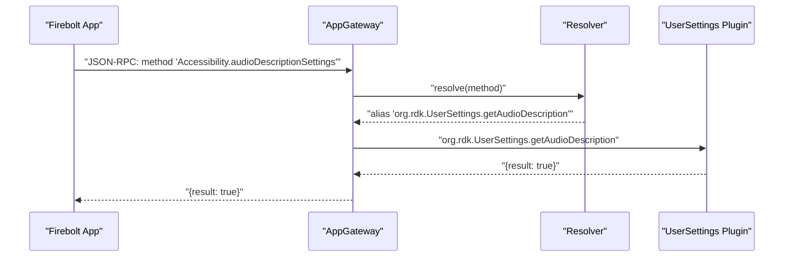
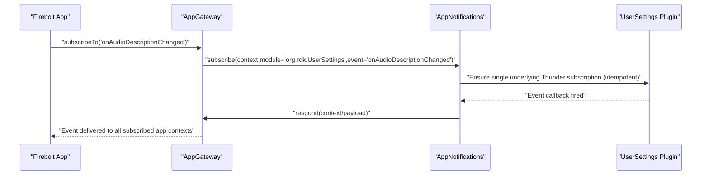
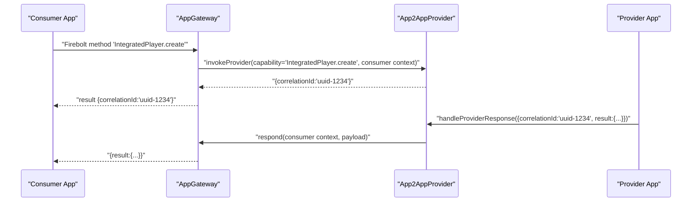
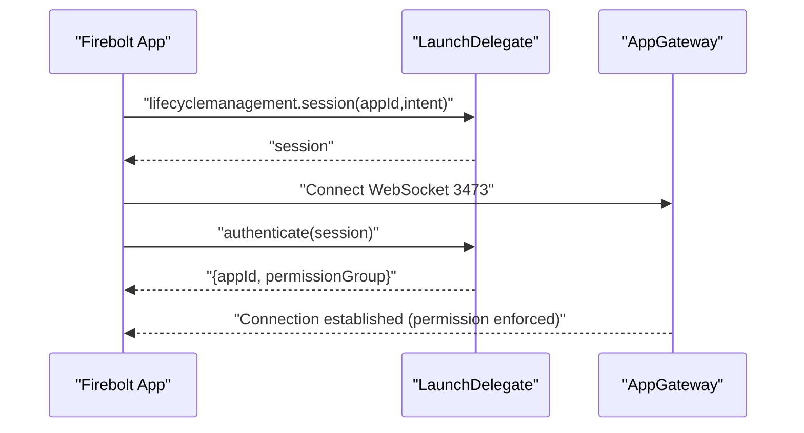

# Thunder Plugins Architecture

## Introduction

### Background
This document describes the planned Thunder plugins that collectively replace the existing Ripple Firebolt API Gateway and standardize the middleware layer by leveraging Thunder (WPEFramework). The four plugins are:
- AppGateway
- LaunchDelegate
- App2AppProvider
- AppNotifications

The architecture focuses on:
- Providing a WebSocket gateway for Firebolt/Badger app interactions with Thunder via JSON-RPC
- Optimizing subscription and provider patterns across multiple applications
- Maintaining light-weight, short-lived request handling using Thunder’s worker pool
- Enforcing permissions and establishing application context for each request

The document captures responsibilities, interfaces, message patterns, parameter definitions, example flows, and forward-looking assumptions. The content is based on the currently available project definitions and intended behavior. Where details are not yet specified, assumptions and design recommendations are noted explicitly.

### Scope
This specification covers:
- Plugin purposes and responsibilities
- JSON-RPC methods with request/response formats and parameter tables
- Resolution aliasing examples for Firebolt methods
- Initialization, authentication, and interaction flows between components
- Error codes and context object schema
- Forward roadmap for security and compliance (JWT in Phase 2)

Out of scope:
- Full ingestion of OpenRPC specifications
- Capabilities-to-method mapping beyond the minimal parity required
- Deprecated or not-in-use providers and SDKs

## Overall Architecture

### Components and Roles
- AppGateway
  - WebSocket gateway (planned on port 3473) accepting JSON-RPC messages
  - Resolves Firebolt methods to Thunder method aliases
  - Adds context and forwards to Thunder plugins and methods
  - Sends responses back to applications for a given connection/context
  - Identifies Notification and Provider patterns and forwards them to the appropriate plugins
- LaunchDelegate
  - Supports AI 1.0 flows for lifecycle and session management
  - Issues session IDs and authenticates incoming application connections
  - Emits lifecycle events via AppNotifications and coordinates “ready/close/finished”
- App2AppProvider
  - Registers provider capabilities for applications
  - Invokes provider methods on behalf of consumers
  - Handles provider responses and errors and redirects them back to the original consumer via AppGateway
- AppNotifications
  - Optimizes Thunder event subscriptions by sharing one underlying subscription across multiple apps
  - Manages subscription contexts and emits events back to subscribing apps

### Key Principles
- Use short-lived jobs executed on Thunder worker pools
- Store minimal state with proper synchronization to support concurrency
- Enforce permissions based on application “permissionGroup” as determined during authentication
- Maintain explicit “context” objects (requestId, connectionId, appId) to correlate requests, events, and responses

### Core Context Object
All calls that carry per-app correlation should include a “context”:

- Field: requestId
  - Type: number
  - Description: An identifier that uniquely correlates this request with a future response for the given app connection
  - Required: Yes
- Field: connectionId
  - Type: string (GUID)
  - Description: A unique identifier for the WebSocket connection
  - Required: Yes
- Field: appId
  - Type: string
  - Description: Identifier for the application
  - Required: Yes

## AppGateway

### Purpose
The AppGateway provides the central ingress/egress for application JSON-RPC messages over WebSocket. It resolves Firebolt method names to underlying Thunder methods, forwards calls (enriching them with context where required), and returns responses to the correct application connection. It also identifies and forwards Notification and Provider patterns to dedicated plugins.

### Responsibilities
- Open WebSocket server on port 3473 and accept JSON-RPC after authentication via LaunchDelegate
- Resolve Firebolt methods using resolution configuration files and forward to Thunder methods
- Provide methods for configuring resolution paths (aliasing rules)
- Provide a mechanism to send JSON-RPC responses back to an app given a specific context
- Include context as configured and enforce permissions from authentication results
- Route Notifications and Provider requests to AppNotifications and App2AppProvider

### Resolution Configuration
An alias resolution maps Firebolt methods and events to Thunder methods and events. Example entries:

- Accessibility.audioDescriptionSettings
  - alias: org.rdk.UserSettings.getAudioDescription
- Accessibility.onAudioDescriptionSettingsChanged
  - alias: org.rdk.UserSettings
  - event: onAudioDescriptionChanged
- Privacy.setAllowWatchHistory
  - alias: org.rdk.Privacy.setWatchHistory
  - permissionGroup: org.rdk.permission.group.unrestricted
- device.uid
  - alias: org.rdk.FBDevice.uid
  - includeContext: true
- Account.id
  - alias: com.comcast.AuthService.getServiceAccountId
- AcknowledgeChallenge.onRequestChallenge
  - alias: org.rdk.App2AppProvider.registerProvider
  - providerCapability: AcknowledgeChallenge.challenge
  - permissionGroup: org.rdk.permission.group.enhanced
- IntegratedPlayer.onRequestCreate
  - alias: org.rdk.App2AppProvider.registerProvider
  - providerCapability: IntegratedPlayer.create
  - permissionGroup: org.rdk.permission.group.enhanced
- IntegratedPlayer.create
  - alias: org.rdk.App2AppProvider.invokeProvider
  - providerCapability: IntegratedPlayer.create
  - permissionGroup: org.rdk.permission.group.enhanced
- IntegratedPlayer.createResponse
  - alias: org.rdk.App2AppProvider.invokeProviderResponse
  - providerCapability: IntegratedPlayer.create
  - permissionGroup: org.rdk.permission.group.enhanced
- IntegratedPlayer.createError
  - alias: org.rdk.App2AppProvider.invokeProviderError
  - providerCapability: IntegratedPlayer.create
  - permissionGroup: org.rdk.permission.group.enhanced

### Interfaces

#### configure
- Call sign: org.rdk.AppGateway.configure
- Description: Adds resolution file paths (in order) to update resolver aliases.

Parameters
| Name  | Type              | Description                                                                                                                                       | Required |
|-------|-------------------|---------------------------------------------------------------------------------------------------------------------------------------------------|----------|
| paths | Array of strings  | File paths in order of override; last entry wins on conflicts.                                                                                   | Yes      |

Sample Request
- {"jsonrpc":"2.0","id":"3","method":"org.rdk.AppGateway.configure","params":{"paths":["/etc/gateway/gateway.config.json","/etc/gateway/override.gateway.config.json"]}}

Success Response
- {"jsonrpc":"2.0","id":3,"result":null}

Error Response
| Code | Name          | Description     |
|------|---------------|-----------------|
| 2    | INVALID_PATH  | Invalid path(s) |

#### respond
- Call sign: org.rdk.AppGateway.respond
- Description: Responds to a given app context with an arbitrary JSON-RPC payload (result or error) that should be forwarded to the app.

Parameters
| Name    | Type               | Description                                                                                              | Required |
|---------|--------------------|----------------------------------------------------------------------------------------------------------|----------|
| context | Object             | { "requestId": number, "connectionId": string, "appId": string }                                         | Yes      |
| payload | String (opaque)    | JSON fragment to forward to the app. Typically includes a "result" or "error" object per JSON-RPC rules. | Yes      |

Sample Request
- {"jsonrpc":"2.0","id":"3","method":"org.rdk.AppGateway.respond","params":{"context":{"requestId":0,"connectionId":"guid","appId":"someAppId"},"result":{"someResponse":true}}}

Success Response
- {"jsonrpc":"2.0","id":3,"result":null}

Error Response
| Code   | Name           | Description                           |
|--------|----------------|---------------------------------------|
| -32700 | PARSE_ERROR    | Payload could not be deserialized     |
| -32602 | INVALID_PARAMS | Invalid request context object        |

#### resolve
- Call sign: org.rdk.AppGateway.resolve
- Description: Resolves a Firebolt method into a Thunder call (or event) and returns the computed resolution.

Parameters
| Name    | Type               | Description                                                                                 | Required |
|---------|--------------------|---------------------------------------------------------------------------------------------|----------|
| context | Object             | { "appId": string }                                                                          | Yes      |
| method  | String             | Firebolt method to resolve (e.g., "Privacy.setAllowWatchHistory")                            | Yes      |
| params  | String (opaque)    | Optional parameters to influence resolution (opaque JSON)                                    | No       |

Success Result
| Name       | Type               | Description                                       |
|------------|--------------------|---------------------------------------------------|
| resolution | String (opaque)    | JSON object describing resolved alias/event/etc.  |

Error Response
| Code   | Name           | Description                           |
|--------|----------------|---------------------------------------|
| -32700 | PARSE_ERROR    | Payload could not be deserialized     |
| -32602 | INVALID_PARAMS | Invalid request context object        |

### Example Request Flow (Simple Resolution)

## AppNotifications

### Purpose
AppNotifications centralizes and optimizes Thunder event subscriptions. Many applications often require the same device-level notifications (e.g., audio description, closed captions, locale changes). Instead of each app creating an independent Thunder subscription, AppNotifications maintains one underlying subscription and multiplexes events to all subscribers.

### Responsibilities
- Register/unregister underlying Thunder subscriptions for a given module+event
- Maintain many-to-one mapping from multiple app subscribers to a single Thunder subscription
- Dispatch events back to specific apps (or all subscribers) using AppGateway.respond
- Provide compatibility with Firebolt 1.x notification patterns

### Interfaces

#### subscribe
- Call sign: org.rdk.AppNotifications.subscribe
- Description: Register or unregister an app’s interest in a specific Thunder module event.

Parameters
| Name    | Type    | Description                                              | Required |
|---------|---------|----------------------------------------------------------|----------|
| context | Object  | { "requestId": number, "connectionId": string, "appId": string } | Yes      |
| subscribe | Boolean | true to subscribe; false to unsubscribe                 | Yes      |
| module  | String  | Thunder module (e.g., "org.rdk.UserSettings")           | Yes      |
| event   | String  | Event name (e.g., "onAudioDescriptionChanged")          | Yes      |

Sample Request
- {"jsonrpc":"2.0","id":"3","method":"org.rdk.AppNotifications.subscribe","params":{"context":{"requestId":0,"connectionId":"guid","appId":"someAppId"},"subscribe":true,"module":"org.rdk.UserSettings","event":"onAudioDescriptionChanged"}}

Success Response
- {"jsonrpc":"2.0","id":3,"result":null}

Error Response
| Code   | Name             | Description                                     |
|--------|------------------|-------------------------------------------------|
| -32602 | INVALID_PARAMS   | Invalid context object                          |
| -32699 | INVALID_REQUEST  | Missing method or params                        |

#### emit
- Call sign: org.rdk.AppNotifications.emit
- Description: Dispatch an event to registered app(s). If appId is provided, dispatch only to that app.

Parameters
| Name    | Type               | Description                                     | Required |
|---------|--------------------|-------------------------------------------------|
| event   | String             | Firebolt event identifier                       | Yes      |
| payload | String (opaque)    | Event payload (opaque JSON)                     | Yes      |
| appId   | String             | If set, only dispatch to the specified app      | No       |

Sample Request
- {"jsonrpc":"2.0","id":"3","method":"org.rdk.AppNotifications.emit","params":{"event":"lifecycle.onBackground","payload":{"previousState":"INITIALIZING","state":"FOREGROUND"},"appId":"someAppId"}}

Success Response
- {"jsonrpc":"2.0","id":3,"result":null}

Error Response
| Code   | Name             | Description                                     |
|--------|------------------|-------------------------------------------------|
| -32602 | INVALID_PARAMS   | Invalid params                                  |
| -32699 | INVALID_REQUEST  | Missing method or params                        |

### Example Subscription Flow

## App2AppProvider

### Purpose
App2AppProvider enables the provider/consumer pattern between applications. Providers register capabilities; consumers invoke provider capabilities; providers then respond (or error). App2AppProvider maintains request/response correlation and uses AppGateway to deliver results back to the original consumer context.

### Responsibilities
- Register application providers for specified capabilities
- Maintain provider registry and per-request consumer context
- Invoke provider methods on behalf of consumers
- Accept provider responses and errors and route them to the original consumer via AppGateway.respond

### Interfaces
Note: Some call-signs in draft materials vary (e.g., “ApptoAppProvider”). For consistency, the recommended call sign is “org.rdk.App2AppProvider”.

#### registerProvider
- Call sign: org.rdk.App2AppProvider.registerProvider
- Description: Register or unregister a provider for a capability.

Parameters
| Name       | Type    | Description                                                                        | Required |
|------------|---------|------------------------------------------------------------------------------------|----------|
| context    | Object  | { "requestId": number, "connectionId": string, "appId": string }                  | Yes      |
| register   | Boolean | true to register; false to unregister                                              | Yes      |
| capability | String  | Firebolt provider capability (e.g., "AcknowledgeChallenge.challenge")              | Yes      |

Sample Request
- {"jsonrpc":"2.0","id":"3","method":"org.rdk.App2AppProvider.registerProvider","params":{"context":{"requestId":0,"connectionId":"guid","appId":"someAppId"},"register":true,"capability":"AcknowledgeChallenge.challenge"}}

Success Response
- {"jsonrpc":"2.0","id":3,"result":null}

Error Response
| Code   | Name             | Description                                     |
|--------|------------------|-------------------------------------------------|
| -32602 | INVALID_PARAMS   | Invalid params or context                       |
| -32699 | INVALID_REQUEST  | Missing method or params                        |

#### invokeProvider
- Call sign: org.rdk.App2AppProvider.invokeProvider
- Description: Invoke a registered provider capability on behalf of a consumer. A correlationId is generated to match the provider’s asynchronous response.

Parameters
| Name       | Type               | Description                                                                                  | Required |
|------------|--------------------|----------------------------------------------------------------------------------------------|----------|
| context    | Object             | { "requestId": number, "connectionId": string, "appId": string } (consumer context)         | Yes      |
| capability | String             | Provider capability to invoke (e.g., "IntegratedPlayer.create")                              | Yes      |
| payload    | String (opaque)    | Optional provider input payload (opaque JSON, if applicable for the capability)              | No       |

Sample Request
- {"jsonrpc":"2.0","id":"3","method":"org.rdk.App2AppProvider.invokeProvider","params":{"context":{"requestId":10,"connectionId":"guid-consumer","appId":"consumerApp"},"capability":"IntegratedPlayer.create","payload":{"options":{"stream":"url"}}}}

Success Response
- {"jsonrpc":"2.0","id":3,"result":{"correlationId":"uuid-1234"}}

Error Response
| Code   | Name             | Description                                     |
|--------|------------------|-------------------------------------------------|
| -32602 | INVALID_PARAMS   | Invalid params or context                       |
| -32699 | INVALID_REQUEST  | Missing method or params                        |

#### handleProviderResponse
- Call sign: org.rdk.App2AppProvider.handleProviderResponse
- Description: Provider submits a successful result for a prior invocation.

Parameters
| Name       | Type               | Description                                                                                          | Required |
|------------|--------------------|------------------------------------------------------------------------------------------------------|----------|
| payload    | String (opaque)    | { "correlationId": "uuid", "result": { /* provider-defined result */ } }                            | Yes      |
| capability | String             | Capability associated with the response (e.g., "AcknowledgeChallenge.challenge")                    | Yes      |

Sample Request
- {"jsonrpc":"2.0","id":"3","method":"org.rdk.App2AppProvider.handleProviderResponse","params":{"payload":{"correlationId":"uuid-123","result":{"data":"ok"}},"capability":"AcknowledgeChallenge.challenge"}}

Success Response
- {"jsonrpc":"2.0","id":3,"result":null}

Error Response
| Code   | Name             | Description                                     |
|--------|------------------|-------------------------------------------------|
| -32602 | INVALID_PARAMS   | Invalid params                                  |
| -32699 | INVALID_REQUEST  | Missing method or params                        |

#### handleProviderError
- Call sign: org.rdk.App2AppProvider.handleProviderError
- Description: Provider submits an error for a prior invocation.

Parameters
| Name       | Type               | Description                                                                                          | Required |
|------------|--------------------|------------------------------------------------------------------------------------------------------|----------|
| payload    | String (opaque)    | { "correlationId": "uuid", "error": { "code": number, "message": string } }                         | Yes      |
| capability | String             | Capability associated with the error (e.g., "AcknowledgeChallenge.challenge")                       | Yes      |

Sample Request
- {"jsonrpc":"2.0","id":"3","method":"org.rdk.App2AppProvider.handleProviderError","params":{"payload":{"correlationId":"uuid-123","error":{"code":-1200,"message":"error msg"}},"capability":"AcknowledgeChallenge.challenge"}}

Success Response
- {"jsonrpc":"2.0","id":3,"result":null}

Error Response
| Code   | Name             | Description                                     |
|--------|------------------|-------------------------------------------------|
| -32602 | INVALID_PARAMS   | Invalid params                                  |
| -32699 | INVALID_REQUEST  | Missing method or params                        |

### Example Provider Registration/Invocation Flow

## LaunchDelegate

### Purpose
LaunchDelegate supports AI 1.0 lifecycle/session management and authentication. It creates session IDs for app launches, authenticates incoming app connections (returning appId and permissionGroup), and emits lifecycle events via AppNotifications.

### Responsibilities
- Expose a WebSocket endpoint for AI 1.0 lifecycle/session operations
- Maintain session state consisting of appId, connectionId, session, and intent
- Authenticate application connections using session IDs and return permissionGroup
- Emit lifecycle events (e.g., onForeground, onUnloading) via AppNotifications
- Coordinate “ready”, “close”, and “finished” flows

Note on ports: Some references show LaunchDelegate on port 3474 whereas a line item states 3473. To avoid collision with AppGateway (3473), recommended assignment is 3474 for LaunchDelegate.

### Interfaces

#### ready
- Call sign: org.rdk.LaunchDelegate.ready
- Description: App signals it is ready. LaunchDelegate updates lifecycle to FOREGROUND and emits lifecycle event(s). It may trigger provider onRequestReady patterns if required by AI 1.0.

Parameters
| Name    | Type   | Description                                              | Required |
|---------|--------|----------------------------------------------------------|----------|
| context | Object | { "requestId": number, "connectionId": string, "appId": string } | Yes      |

Sample Request
- {"jsonrpc":"2.0","id":"3","method":"org.rdk.LaunchDelegate.ready","params":{"context":{"requestId":0,"connectionId":"guid","appId":"someAppId"}}}

Success Response
- {"jsonrpc":"2.0","id":3,"result":null}

Error Response
| Code   | Name             | Description                                     |
|--------|------------------|-------------------------------------------------|
| -32602 | INVALID_PARAMS   | Invalid params or context                       |
| -32699 | INVALID_REQUEST  | Missing method or params                        |

#### close
- Call sign: org.rdk.LaunchDelegate.close
- Description: App requests to close. LaunchDelegate updates lifecycle to UNLOADING and emits lifecycle events; may trigger provider onRequestClose patterns if required by AI 1.0.

Parameters
| Name    | Type          | Description                                                                                          | Required |
|---------|---------------|------------------------------------------------------------------------------------------------------|----------|
| context | Object        | { "requestId": number, "connectionId": string, "appId": string }                                     | Yes      |
| reason  | CloseReason   | One of: "remoteButton", "userExit", "done", "error"                                                  | Yes      |

Sample Request
- {"jsonrpc":"2.0","id":"3","method":"org.rdk.LaunchDelegate.close","params":{"context":{"requestId":0,"connectionId":"guid","appId":"someAppId"},"reason":"done"}}

Success Response
- {"jsonrpc":"2.0","id":3,"result":null}

Error Response
| Code   | Name             | Description                                     |
|--------|------------------|-------------------------------------------------|
| -32602 | INVALID_PARAMS   | Invalid params or context                       |
| -32699 | INVALID_REQUEST  | Missing method or params                        |

#### finished
- Call sign: org.rdk.LaunchDelegate.finished
- Description: App indicates it has finished; LaunchDelegate may trigger provider onRequestFinished flows if required.

Parameters
| Name    | Type   | Description                                              | Required |
|---------|--------|----------------------------------------------------------|----------|
| context | Object | { "requestId": number, "connectionId": string, "appId": string } | Yes      |

Sample Request
- {"jsonrpc":"2.0","id":"3","method":"org.rdk.LaunchDelegate.finished","params":{"context":{"requestId":0,"connectionId":"guid","appId":"someAppId"}}}

Success Response
- {"jsonrpc":"2.0","id":3,"result":null}

Error Response
| Code   | Name             | Description                                     |
|--------|------------------|-------------------------------------------------|
| -32602 | INVALID_PARAMS   | Invalid params or context                       |
| -32699 | INVALID_REQUEST  | Missing method or params                        |

#### authenticate
- Call sign: org.rdk.LaunchDelegate.authenticate
- Description: Authenticate an incoming connection using a provided session ID. Returns appId and optionally permissionGroup.

Parameters
| Name    | Type   | Description               | Required |
|---------|--------|---------------------------|----------|
| session | String | Session ID                | Yes      |

Success Result
| Name            | Type   | Description                           |
|-----------------|--------|---------------------------------------|
| appId           | String | Application ID for the session        |
| permissionGroup | String | Permission group (optional)           |

Sample Request
- {"jsonrpc":"2.0","id":"3","method":"org.rdk.LaunchDelegate.authenticate","params":{"session":"session-guid"}}

Success Response
- {"jsonrpc":"2.0","id":3,"result":{"appId":"someAppId","permissionGroup":"org.rdk.permission.group.enhanced"}}

Error Response
| Code   | Name             | Description                                     |
|--------|------------------|-------------------------------------------------|
| -32602 | INVALID_PARAMS   | Invalid params                                  |
| -32699 | INVALID_REQUEST  | Missing method or params                        |

#### getIntent
- Call sign: org.rdk.LaunchDelegate.getIntent
- Description: Get the last known intent associated with an app.

Parameters
| Name  | Type   | Description          | Required |
|-------|--------|----------------------|----------|
| appId | String | Application ID       | Yes      |

Success Result
| Name   | Type               | Description                     |
|--------|--------------------|---------------------------------|
| intent | String (opaque)    | JSON object describing intent   |

Sample Request
- {"jsonrpc":"2.0","id":"3","method":"org.rdk.LaunchDelegate.getIntent","params":{"appId":"someAppId"}}

Success Response
- {"jsonrpc":"2.0","id":3,"result":{"action":"home","context":{"source":"epg"}}}

Error Response
| Code   | Name             | Description                                     |
|--------|------------------|-------------------------------------------------|
| -32602 | INVALID_PARAMS   | Invalid params                                  |
| -32699 | INVALID_REQUEST  | Missing method or params                        |

### Example Initialization and Authentication Flow

## Error Codes (Summary)

| Code   | Name             | Typical Meaning                                        |
|--------|------------------|--------------------------------------------------------|
| 2      | INVALID_PATH     | Invalid configuration path(s) for AppGateway.configure |
| -32700 | PARSE_ERROR      | Payload could not be parsed/deserialized               |
| -32602 | INVALID_PARAMS   | Invalid or missing context/parameters                  |
| -32699 | INVALID_REQUEST  | Missing method or required parameters                  |

## Design Considerations and Assumptions

### Port Assignments
- AppGateway WebSocket: 3473
- LaunchDelegate WebSocket: 3474 (recommended to avoid conflicts with AppGateway)

### Versioned Call Signs
RDK Thunder typically uses versioned call signs (e.g., org.rdk.PluginName.1). Some draft references are unversioned (e.g., org.rdk.AppGateway.method). It is recommended to adopt versioned namespaces in the final implementation (e.g., org.rdk.AppGateway.1.configure) for forward compatibility.

### Provider Capability Mapping
Resolution entries can specify “providerCapability” that binds a Firebolt method or request type to a provider capability. The AppGateway resolver should set correlation and context so App2AppProvider can route invocations and responses appropriately.

### Notification Optimization
AppNotifications should maintain a registry keyed by (module, event) with a reference-counted underlying Thunder subscription and a list of subscriber contexts. This avoids redundant subscriptions and improves memory utilization.

### Security Roadmap (Phase 2)
- JWT validation via Security Agent for AppGateway WebSocket upgrades and requests
- Standardize Firebolt message patterns to JSON-RPC 2.0 compliance
- Route to plugin versions based on validated JWT scopes
- Enforce permissionGroup from LaunchDelegate authentication or JWT claims

## Example End-to-End Scenarios

### Simple Request/Response via Resolution (Accessibility)
1. App sends JSON-RPC to AppGateway: method "Accessibility.audioDescriptionSettings"
2. AppGateway resolves alias to "org.rdk.UserSettings.getAudioDescription"
3. AppGateway forwards to UserSettings plugin
4. UserSettings returns a value; AppGateway responds to app context with the result

### Subscription and Event Delivery (Audio Description Changed)
1. App calls AppNotifications.subscribe with context, module "org.rdk.UserSettings" and event "onAudioDescriptionChanged"
2. AppNotifications ensures a single underlying Thunder subscription
3. When event fires, AppNotifications builds the payload and calls AppGateway.respond for each subscribed context

### Provider Invocation (IntegratedPlayer.create)
1. Consumer app’s Firebolt method triggers a resolution that aliases to App2AppProvider.invokeProvider
2. App2AppProvider generates a correlationId and returns it to the consumer (via AppGateway)
3. Provider app computes the result and calls App2AppProvider.handleProviderResponse with the same correlationId
4. App2AppProvider uses AppGateway.respond to return the original consumer’s result

## Appendix

### Context Object Schema
- context: { "requestId": number, "connectionId": string, "appId": string }

### Resolution Entry Example
- "IntegratedPlayer.create"
  - alias: "org.rdk.App2AppProvider.invokeProvider"
  - providerCapability: "IntegratedPlayer.create"
  - permissionGroup: "org.rdk.permission.group.enhanced"

### Launch Lifecycle Events (Illustrative)
- onForeground, onBackground, onUnloading, onSuspended
- Emitted by LaunchDelegate via AppNotifications using AppGateway.respond to apps

## Assumptions and Recommendations

### Assumptions
- LaunchDelegate returns permissionGroup during authentication; AppGateway enforces this for subsequent requests
- Provider invocation accepts an optional payload as opaque JSON for capability-specific data
- LaunchDelegate close transitions lifecycle to UNLOADING before teardown
- Versioning for call signs will be adopted at implementation time (e.g., .1 suffix)

### Recommendations
- Establish a shared definition of the context object and enforce validation in all plugin entry points
- Maintain strict separation of concerns:
  - AppGateway: transport, resolution, response dispatch
  - AppNotifications: subscription optimization
  - App2AppProvider: provider registry and correlation
  - LaunchDelegate: lifecycle/session and authentication
- Adopt JSON-RPC 2.0-compliant patterns for all v2 APIs and migrate Firebolt 1.x legacy notifications via compatibility shims in the gateway
