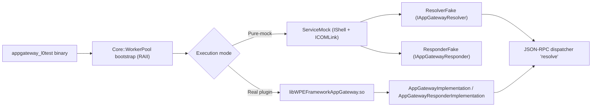

# AppGateway l0tests: Overview, Mocking Strategy, and Running With the Real Plugin

## Quick start

- Option A: Standalone CMake from l0test
  - Configure:
    ```sh
    cmake -S app-gateway2/app-gateway/AppGateway/l0test -B build/l0test -DCMAKE_BUILD_TYPE=Debug -DCMAKE_PREFIX_PATH=$PWD/dependencies/install
    ```
  - Build:
    ```sh
    cmake --build build/l0test -j
    ```
  - Run:
    ```sh
    export LD_LIBRARY_PATH=$PWD/dependencies/install/lib:$PWD/build/l0test/AppGateway:$LD_LIBRARY_PATH
    export APPGATEWAY_RESOLUTIONS_PATH="/home/kavia/workspace/code-generation/app-gateway2/app-gateway/AppGateway/resolutions/resolution.base.json"
    ./build/l0test/AppGateway/appgateway_l0test
    ```

- Option B: Makefile from l0test
  - Build/Run:
    ```sh
    cd app-gateway2/app-gateway/AppGateway/l0test
    make build
    export LD_LIBRARY_PATH=$PWD/../../../../dependencies/install/lib:$PWD/../..:$LD_LIBRARY_PATH
    export APPGATEWAY_RESOLUTIONS_PATH="/home/kavia/workspace/code-generation/app-gateway2/app-gateway/AppGateway/resolutions/resolution.base.json"
    make run
    ```

- Coverage (lcov):
  ```sh
  lcov -c -o coverage.info -d build/l0test --ignore-errors empty
  genhtml -o coverage coverage.info
  # Report entry point:
  #   /home/kavia/workspace/code-generation/coverage/index.html   (if run from repo root)
  #   app-gateway2/app-gateway/AppGateway/l0test/coverage/index.html   (if run from l0test folder)
  ```

## 1) Purpose of l0tests for AppGateway

AppGateway l0tests validate the plugin logic entirely in-process with no external processes or network I/O. This yields fast, deterministic tests focused on:
- Plugin lifecycle (Initialize/Deinitialize)
- JSON-RPC registration and request routing for the “resolve” method
- Resolver configuration and alias resolution paths
- Responder semantics (respond/emit/request/notifications)
- Context conversions and JSON boundary handling

The approach aligns with CloudStore-style l0tests: use a local ServiceMock implementing PluginHost::IShell and IShell::ICOMLink, inject deterministic fakes, and run tests in-proc without Thunder spawning or remote connections.

## 2) Directory structure and key files

- l0test/.cpp test files:
  - AppGateway_Init_DeinitTests.cpp
  - AppGateway_JsonRpcResolveTests.cpp
  - Resolver_Configure_And_ResolveTests.cpp
  - Responder_BehaviorTests.cpp
  - ContextUtils_ConversionTests.cpp
  - AppGatewayTest.cpp (main with WorkerPool RAII bootstrap and test execution)
- l0test/ServiceMock.h:
  - Implements PluginHost::IShell and IShell::ICOMLink
  - Provides ResolverFake and ResponderFake
  - Exposes toggles for transport availability and for simulating missing dependencies
- AppGateway sources touched by tests and/or real-plugin mode:
  - AppGateway/AppGateway.cpp, AppGateway/AppGateway.h
  - AppGateway/AppGatewayImplementation.cpp, AppGateway/AppGatewayImplementation.h
  - AppGateway/AppGatewayResponderImplementation.cpp, AppGateway/AppGatewayResponderImplementation.h
  - AppGateway/Resolver.cpp, AppGateway/Resolver.h
- Config assets:
  - AppGateway/resolutions/resolution.base.json (base resolution mappings)
  - l0test/config/test.resolutions.override.json (created at runtime by tests when needed to validate override precedence)

## 3) Mocking strategy

The l0test harness uses ServiceMock to emulate the Thunder host environment inside the same process:
- IShell lifecycle
  - Initialize() and Deinitialize() paths are exercised using a real plugin object while the shell is faked.
- ICOMLink non-null
  - IShell::COMLink() returns ServiceMock itself, so Root<T>() calls inside the plugin translate into in-proc Instantiate() calls.
- Deterministic fakes
  - ResolverFake implements Exchange::IAppGatewayResolver and IConfiguration with deterministic behavior:
    - Methods “l0.notPermitted”, “l0.notSupported”, “l0.notAvailable” return Core::ERROR_PRIVILIGED_REQUEST, Core::ERROR_NOT_SUPPORTED, and Core::ERROR_UNAVAILABLE respectively with minimal payload. Default returns “null”.
  - ResponderFake implements Exchange::IAppGatewayResponder and IConfiguration with transport availability toggles:
    - Respond/Emit/Request return ERROR_NONE if transport enabled, ERROR_UNAVAILABLE if disabled.
    - Provides simple connection context storage and a notification fan-out for INotification.
- JSONRPC dispatcher availability
  - The plugin registers “resolve” on a JSONRPC dispatcher only if a resolver instance is available. Missing the resolver means “resolve” remains unregistered and Invoke() returns ERROR_UNKNOWN_METHOD.
- No networking/IO
  - WsManager/WebSocketLink logic is not exercised; ResponderFake and ResolverFake are pure in-proc stand-ins without sockets or external processes.

Error injection covered by tests:
- Resolver “not configured” or “unknown method” returns a non-OK error from the implementation
- Malformed JSON parameters lead to ERROR_BAD_REQUEST
- Transport unavailable -> ERROR_UNAVAILABLE via ResponderFake::SetTransportEnabled(false)
- Missing resolver/responder -> Initialize may fail and JSON-RPC “resolve” remains unknown

## 4) Running with the actual appgateway plugin

Two supported execution modes:

a) Pure-mock mode
- The test binary links only against Thunder libraries and exercises logic entirely with ServiceMock + ResolverFake/ResponderFake.
- Fastest and most deterministic; requires no plugin .so.

b) Real plugin mode
- The l0test build attempts to link the real plugin shared object if found. This allows testing AppGatewayImplementation and AppGatewayResponderImplementation paths.
- Where the plugin is expected:
  - Preferred from main build: build/appgatewayl0test/AppGateway/libWPEFrameworkAppGateway.so
  - Installed: dependencies/install/lib/plugins/libWPEFrameworkAppGateway.so
  - Standalone l0test CMake also probes ${CMAKE_BINARY_DIR}/../AppGateway/libWPEFrameworkAppGateway.so (e.g., build/l0test/../AppGateway -> build/AppGateway).
- If the real plugin .so is missing, tests still run in pure-mock mode. Real plugin mode is optional.

## 5) Thunder/WPEFramework bootstrap in tests

- Core::WorkerPool
  - Some Thunder code paths assume a global WorkerPool exists. The harness (AppGatewayTest.cpp) creates and assigns a WorkerPool at startup and stops/detaches it on shutdown using an RAII helper. This prevents aborts and ensures clean teardown.
- MODULE_NAME compile definition
  - Required by Thunder headers for module naming. For the CMake target, `MODULE_NAME=AppGateway_L0Test` is set; the Makefile sets `MODULE_NAME=Plugin_AppGateway`.
- Runtime libraries and loader configuration
  - LD_LIBRARY_PATH best practice:
    ```sh
    export LD_LIBRARY_PATH=$PWD/dependencies/install/lib:$PWD/build/l0test/AppGateway:$LD_LIBRARY_PATH
    ```
  - Optional RPATH
    - The CMakeLists for l0test sets BUILD_RPATH to $ORIGIN and ${PREFIX}/lib, so the test can run without LD_LIBRARY_PATH in some environments.

## 6) Configuration for resolutions

- APPGATEWAY_RESOLUTIONS_PATH environment variable
  - Point to the base file for real implementation runs:
    ```
    /home/kavia/workspace/code-generation/app-gateway2/app-gateway/AppGateway/resolutions/resolution.base.json
    ```
- Resolver Configure() behavior
  - Configure accepts an iterator of paths; each path is read in order. Last loaded entries override previous ones (“last-wins” precedence).
  - Tests simulate overrides by writing l0test/config/test.resolutions.override.json and loading it after the base file to ensure precedence.
  - Tests also simulate invalid JSON (expect non-OK return) and unknown methods (expect non-OK resolve).

## 7) Build and run options

Option A: Standalone l0test CMake
- Configure:
  ```sh
  cmake -S app-gateway2/app-gateway/AppGateway/l0test -B build/l0test -DCMAKE_BUILD_TYPE=Debug -DCMAKE_PREFIX_PATH=$PWD/dependencies/install
  ```
- Build:
  ```sh
  cmake --build build/l0test -j
  ```
- Run:
  ```sh
  export LD_LIBRARY_PATH=$PWD/dependencies/install/lib:$PWD/build/l0test/AppGateway:$LD_LIBRARY_PATH
  export APPGATEWAY_RESOLUTIONS_PATH="/home/kavia/workspace/code-generation/app-gateway2/app-gateway/AppGateway/resolutions/resolution.base.json"
  ./build/l0test/AppGateway/appgateway_l0test
  ```

Option B: Makefile in l0test
- Build/Run:
  ```sh
  cd app-gateway2/app-gateway/AppGateway/l0test
  make build
  export LD_LIBRARY_PATH=$PWD/../../../../dependencies/install/lib:$PWD/../..:$LD_LIBRARY_PATH
  export APPGATEWAY_RESOLUTIONS_PATH="/home/kavia/workspace/code-generation/app-gateway2/app-gateway/AppGateway/resolutions/resolution.base.json"
  make run
  ```

Notes:
- CMake l0test target adds coverage flags (`--coverage`) and RPATH.
- The Makefile autodetects Thunder libs from `PREFIX` (defaults to dependencies/install) and tries to link the plugin .so if found.

## 8) Coverage

- Both CMake and Makefile builds compile with coverage flags.
- Generate coverage:
  ```sh
  lcov -c -o coverage.info -d build/l0test --ignore-errors empty
  genhtml -o coverage coverage.info
  ```
- Final report entry:
  - /home/kavia/workspace/code-generation/coverage/index.html (repo root execution)
  - app-gateway2/app-gateway/AppGateway/l0test/coverage/index.html (l0test folder)

## 9) Troubleshooting

- Missing WPEFramework libs (e.g., libWPEFrameworkMessaging.so.1)
  - Ensure Thunder/ThunderInterfaces are installed under dependencies/install and included via CMAKE_PREFIX_PATH or PREFIX.
  - Export LD_LIBRARY_PATH to include dependencies/install/lib.
- Missing interfaces/IAppGateway.h
  - Confirm include path covers app-gateway2/app-gateway/interfaces or an installed interfaces tree under PREFIX/include/WPEFramework/interfaces.
- MODULE_NAME compile issues
  - Ensure the l0test target defines MODULE_NAME. CMake sets `MODULE_NAME=AppGateway_L0Test`; Makefile defines `MODULE_NAME=Plugin_AppGateway`.
- WorkerPool assertion/abort
  - The harness bootstrap in AppGatewayTest.cpp must run before invoking Resolve or JSON-RPC. Do not bypass main() or the L0TestBootstrap.
- JSON-RPC “resolve” returns ERROR_UNKNOWN_METHOD
  - The resolver must be available during plugin Initialize(). If missing (e.g., ServiceMock::Config(false, false)), the plugin cannot register “resolve”.
- Real plugin .so is ignored
  - Verify the .so path matches one of the probed locations (see section 4). Adjust LD_LIBRARY_PATH or set CMake `PREFIX` if needed.

## 10) Future expansion

- Add parameterized tests covering specific error codes:
  - Core::ERROR_BAD_REQUEST, Core::ERROR_UNAVAILABLE, Core::ERROR_NOT_SUPPORTED
- Extend responder tests:
  - Notification fan-out, unregister edge paths, and context hydration for additional keys.
- Add test override JSON:
  - Commit an override under l0test/config to validate precedence in CI without writing at runtime.

## Execution diagram



## Useful code snippets

- Toggle availability of resolver/responder in Initialize:
  ```cpp
  // Missing both -> Initialize() fails, "resolve" not registered
  PluginAndService ps{ L0Test::ServiceMock::Config(false, false) };
  const std::string rc = ps.plugin->Initialize(ps.service);
  // rc is non-empty; dispatcher->Invoke(..., "resolve", ...) -> ERROR_UNKNOWN_METHOD
  ```

- Toggle responder transport to inject ERROR_UNAVAILABLE:
  ```cpp
  auto* responder = static_cast<WPEFramework::Exchange::IAppGatewayResponder*>(
      ps.plugin->QueryInterface(WPEFramework::Exchange::IAppGatewayResponder::ID));
  auto* fake = dynamic_cast<L0Test::ResponderFake*>(responder);
  fake->SetTransportEnabled(false);
  uint32_t rc = responder->Respond(ctx, "{\"ok\":true}"); // rc == Core::ERROR_UNAVAILABLE
  ```

- Configure resolver with base + override (last wins):
  ```cpp
  std::vector<string> paths{ basePath, overridePath };
  SimpleStringIterator it(paths);   // implements IAppGatewayResolver::IStringIterator
  uint32_t cfgRc = resolver->Configure(&it);
  ```

- Required environment:
  ```sh
  export LD_LIBRARY_PATH=$PWD/dependencies/install/lib:$PWD/build/l0test/AppGateway:$LD_LIBRARY_PATH
  export APPGATEWAY_RESOLUTIONS_PATH="/home/kavia/workspace/code-generation/app-gateway2/app-gateway/AppGateway/resolutions/resolution.base.json"
  ```
