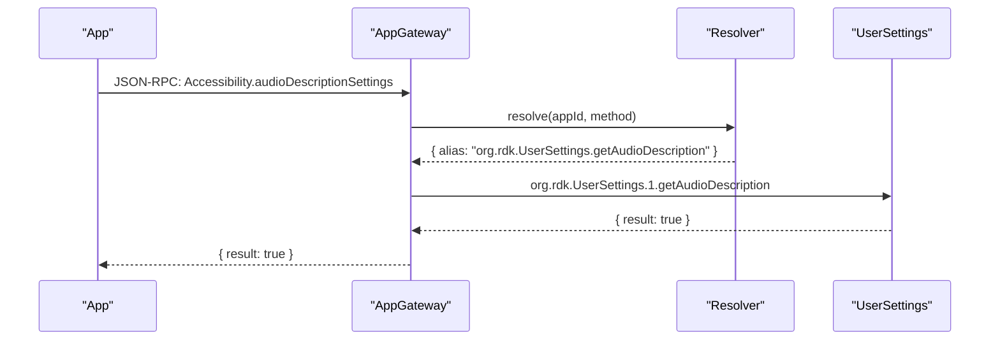
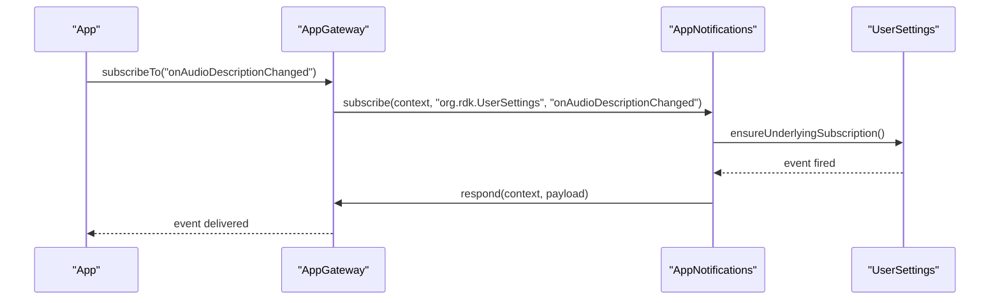
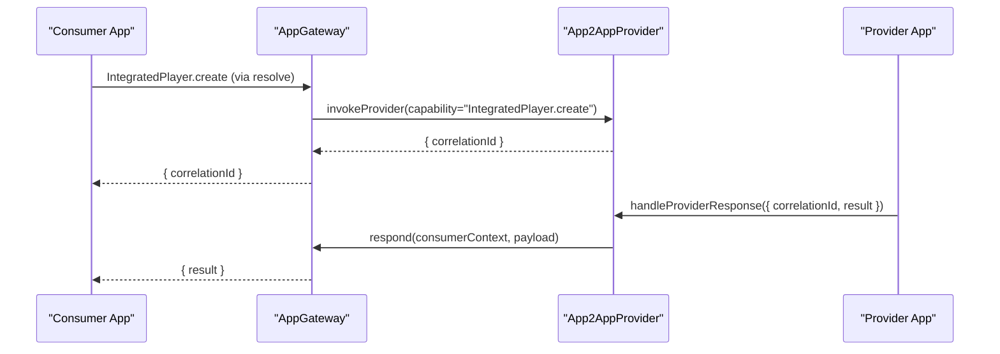

# AppGateway Thunder Plugin Design Specification

## Introduction

### Background
AppGateway is the central ingress/egress gateway for application JSON-RPC interactions over WebSocket in the planned Thunder-based architecture. It replaces transport aspects of the current Ripple Firebolt API Gateway by:
- Accepting JSON-RPC messages from applications over WebSocket on a dedicated port (Phase 1 target: 3473).
- Resolving Firebolt-style methods into Thunder plugin methods or events.
- Forwarding routed requests to Thunder plugins and returning the response back to the correct application connection.
- Detecting and routing notification and provider patterns to specialized plugins (AppNotifications and App2AppProvider).
- Enforcing permissions based on authentication results (from LaunchDelegate in Phase 1; JWT validation via Security Agent in Phase 2).

This document provides a detailed design that aligns with thunder-plugins-architecture.md and follows Thunder (WPEFramework) plugin best practices demonstrated in entservices-infra plugins (e.g., ResourceManager, StorageManager, Monitor, NativeJS) and Thunder core (Channel/WebSocket).

### Scope
This specification covers:
- Interface methods and their parameters, results, and error codes.
- Runtime behavior: initialization, message routing, permission enforcement, and concurrency.
- File and folder structure for the AppGateway plugin implementation.
- Key classes, fields, and responsibilities.
- Sequence flows and operational diagrams.
- Guidance for plugin registration, extensibility, and error handling with references to entservices-infra and Thunder patterns.

Out of scope:
- Full OpenRPC ingestion and capability mapping (explicitly deferred).
- Phase 2 JWT enforcement details (documented as forward-looking design).

## Interfaces

### Overview
AppGateway exposes three JSON-RPC methods. No plugin-originated events are defined for Phase 1. Event delivery to apps is coordinated via AppNotifications using AppGateway.respond for application-directed payloads.

- configure
- respond
- resolve

All examples assume unversioned call signs in prose for readability; in implementation we recommend versioned call signs (e.g., org.rdk.AppGateway.1) to match Thunder best practices.

### Common Structures

#### Context Object
The context object correlates requests and responses for a given app connection.

- requestId: number — Unique per app connection to correlate request/response.
- connectionId: string — Unique identifier for the WebSocket connection (GUID-like).
- appId: string — Application identifier.

#### JSON-RPC Error Codes
- 2: INVALID_PATH — Invalid path(s) (configure).
- -32700: PARSE_ERROR — Payload could not be deserialized.
- -32602: INVALID_PARAMS — Invalid request context or parameters.
- -32699: INVALID_REQUEST — Missing method and/or required parameters.

### Method: configure
- Call sign: org.rdk.AppGateway.configure
- Description: Adds resolution file paths (in order), allowing later paths to override earlier ones.

Parameters
| Name  | Type               | Description                                                                                                        | Required |
|-------|--------------------|--------------------------------------------------------------------------------------------------------------------|----------|
| paths | array of strings   | Resolution files to load in order. The last occurrence of a key takes precedence across files (overlay semantics). | Yes      |

Success Response
- result: null

Error Response
| Field | Type   | Description                       |
|-------|--------|-----------------------------------|
| code  | number | 2 (INVALID_PATH)                  |
| message | string | Optional detail (e.g., filename) |

Example
- Request: {"jsonrpc":"2.0","id":3,"method":"org.rdk.AppGateway.configure","params":{"paths":["/etc/gateway/gateway.config.json","/etc/gateway/override.gateway.config.json"]}}
- Response: {"jsonrpc":"2.0","id":3,"result":null}

### Method: respond
- Call sign: org.rdk.AppGateway.respond
- Description: Responds to a given app context with a JSON-RPC payload (typically containing either result or error) to be delivered over the app’s WebSocket.

Parameters
| Name    | Type   | Description                                                                                                    | Required |
|---------|--------|----------------------------------------------------------------------------------------------------------------|----------|
| context | object | { "requestId": number, "connectionId": string, "appId": string }                                              | Yes      |
| payload | object | Opaque JSON fragment that should include either a result or an error object per JSON-RPC patterns.             | Yes      |

Notes
- For legacy parity, some examples use a top-level "result" property inside params instead of a "payload" wrapper. Implementation SHOULD accept either "payload" or top-level "result"/"error" keys for transitional compatibility, but SHOULD standardize on "payload" internally.

Success Response
- result: null

Error Response
| Field  | Type   | Description                                 |
|--------|--------|---------------------------------------------|
| code   | number | -32700 (PARSE_ERROR) or -32602 (INVALID_PARAMS) |
| message| string | Optional detail                              |

Example (recommended)
- Request: {"jsonrpc":"2.0","id":3,"method":"org.rdk.AppGateway.respond","params":{"context":{"requestId":42,"connectionId":"guid","appId":"com.example.app"},"payload":{"result":{"ok":true}}}}
- Response: {"jsonrpc":"2.0","id":3,"result":null}

Example (legacy-compatible)
- Request: {"jsonrpc":"2.0","id":3,"method":"org.rdk.AppGateway.respond","params":{"context":{"requestId":42,"connectionId":"guid","appId":"com.example.app"},"result":{"ok":true}}}

### Method: resolve
- Call sign: org.rdk.AppGateway.resolve
- Description: Returns the computed resolution for a Firebolt-style method, including alias target and metadata. Usable by other Thunder plugins (e.g., LaunchDelegate).

Parameters
| Name    | Type   | Description                                                                                 | Required |
|---------|--------|---------------------------------------------------------------------------------------------|
| context | object | { "appId": string }                                                                         | Yes      |
| method  | string | Firebolt method to resolve (e.g., "Privacy.setAllowWatchHistory")                           | Yes      |
| params  | object | Optional opaque JSON; may influence dynamic resolution (e.g., policy toggles)               | No       |

Success Result
| Name       | Type   | Description                                  |
|------------|--------|----------------------------------------------|
| resolution | object | Opaque JSON describing the resolution result |

Error Response
| Field  | Type   | Description                                 |
|--------|--------|---------------------------------------------|
| code   | number | -32700 (PARSE_ERROR) or -32602 (INVALID_PARAMS) |
| message| string | Optional detail                              |

Example
- Request: {"jsonrpc":"2.0","id":3,"method":"org.rdk.AppGateway.resolve","params":{"context":{"appId":"com.example.app"},"method":"Privacy.setAllowWatchHistory","params":{"enabled":true}}}
- Response: {"jsonrpc":"2.0","id":3,"result":{"resolution":{"enabled":true}}}

### Events
No AppGateway-originated events are defined for Phase 1. Notifications to applications are coordinated via AppNotifications which multiplexes underlying Thunder event subscriptions and uses AppGateway.respond to deliver payloads to the appropriate app contexts.

## Routing and Resolution

### Resolution Entries
Resolution overlays map Firebolt-style method identifiers to Thunder plugin methods and events. Example entries include:

- "Accessibility.audioDescriptionSettings" -> alias "org.rdk.UserSettings.getAudioDescription"
- "Accessibility.onAudioDescriptionSettingsChanged" -> alias "org.rdk.UserSettings", event "onAudioDescriptionChanged"
- "Privacy.setAllowWatchHistory" -> alias "org.rdk.Privacy.setWatchHistory", permissionGroup "org.rdk.permission.group.unrestricted"
- "device.uid" -> alias "org.rdk.FBDevice.uid", includeContext true
- Provider and AI 1.0 examples:
  - "AcknowledgeChallenge.onRequestChallenge" -> alias "org.rdk.App2AppProvider.registerProvider", providerCapability "AcknowledgeChallenge.challenge"
  - "IntegratedPlayer.onRequestCreate" -> alias "org.rdk.App2AppProvider.registerProvider", providerCapability "IntegratedPlayer.create"
  - "IntegratedPlayer.create" -> alias "org.rdk.App2AppProvider.invokeProvider", providerCapability "IntegratedPlayer.create"
  - "IntegratedPlayer.createResponse" -> alias "org.rdk.App2AppProvider.invokeProviderResponse"
  - "IntegratedPlayer.createError" -> alias "org.rdk.App2AppProvider.invokeProviderError"

### Permission Enforcement
- Phase 1: enforce permissionGroup returned by LaunchDelegate.authenticate during session association for a connection/app.
- Phase 2: enhance with SecurityAgent JWT validation; route to versioned plugin endpoints based on JWT scopes.

## File and Folder Structure

### Proposed Directory Layout
A structure aligned with entservices-infra plugin conventions:

- entservices-infra/AppGateway/
  - CMakeLists.txt
  - Module.h
  - Module.cpp
  - AppGateway.h
  - AppGateway.cpp
  - Resolver.h
  - Resolver.cpp
  - ResolutionStore.h
  - ResolutionStore.cpp
  - RequestRouter.h
  - RequestRouter.cpp
  - ConnectionRegistry.h
  - ConnectionRegistry.cpp
  - PermissionManager.h
  - PermissionManager.cpp
  - GatewayWebSocket.h
  - GatewayWebSocket.cpp
  - AppGateway.conf.in
  - AppGateway.config

Optional support assets:
- assets/appgateway/gateway.config.json
- assets/appgateway/override.gateway.config.json

### Rationale
- Module.*: macro metadata and module name declaration (see ResourceManager/StorageManager/Monitor patterns).
- AppGateway.*: IPlugin and JSONRPC implementation layer; registers methods; manages lifecycle.
- Resolver.* and ResolutionStore.*: load, validate, and overlay resolution files; provide query APIs.
- RequestRouter.*: take a resolution result and dispatch to target Thunder plugin via JSON-RPC; centralize error mapping.
- ConnectionRegistry.*: track connectionId → appId, requestId correlation and permissionGroup; ensure thread safety.
- PermissionManager.*: encapsulate permission gating; integrates with LaunchDelegate (Phase 1) and SecurityAgent (Phase 2).
- GatewayWebSocket.*: encapsulate WebSocket acceptor/producer. Recommended to use Thunder’s Web/Channel infrastructure for server-side WS handling rather than external stacks; configurable to bind port 3473 for app connections if required by product constraints.
- AppGateway.conf.in/AppGateway.config: plugin configuration (e.g., port, initial resolution paths, feature toggles).

## Key Classes and Responsibilities

### class AppGateway : public PluginHost::IPlugin, public PluginHost::JSONRPC
Responsibilities:
- Register JSON-RPC methods: configure, respond, resolve.
- Initialize plugin state, load initial resolution files from config, and start WebSocket endpoint if configured.
- Acquire SecurityAgent token for intra-host JSON-RPC (pattern in ResourceManager).
- Own instances of Resolver, RequestRouter, ConnectionRegistry, PermissionManager, GatewayWebSocket.

Key fields:
- PluginHost::IShell* _service
- std::unique_ptr<Resolver> _resolver
- std::unique_ptr<RequestRouter> _router
- std::unique_ptr<ConnectionRegistry> _connections
- std::unique_ptr<PermissionManager> _perms
- std::unique_ptr<GatewayWebSocket> _ws
- std::atomic<bool> _running

Key methods:
- const string Initialize(PluginHost::IShell* service)
- void Deinitialize(PluginHost::IShell* service)
- string Information() const
- uint32_t Configure(const JsonArray& paths)
- uint32_t Respond(const JsonObject& context, const JsonObject& payloadOrResult)
- uint32_t Resolve(const JsonObject& context, const string& method, const JsonObject& params, JsonObject& outResolution)

### class Resolver
Responsibilities:
- Load, parse, and merge multiple resolution JSON files with last-wins overlay.
- Provide query method resolve(appId, method, params) → Resolution object (alias, event, providerCapability, includeContext, permissionGroup, etc.).
- Validate resolution schema and report errors in a structured way for diagnostics.
- Thread-safe reads using immutable snapshot pattern or internal locking with version increments.

Key fields:
- std::vector<std::string> _paths
- std::shared_ptr<const ResolutionMap> _activeMap
- Core::CriticalSection _adminLock

Key methods:
- bool LoadPaths(const std::vector<std::string>& paths, string& error)
- bool Reload(string& error)
- bool Get(const string& appId, const string& method, const JsonObject& params, JsonObject& out) const

### class RequestRouter
Responsibilities:
- Transform a resolution result into an intra-host JSON-RPC invocation to a Thunder plugin method (or setup of event subscription via AppNotifications).
- Use a local JSON-RPC dispatcher pattern as seen in ResourceManager::JSONRPCDirectLink (with SecurityAgent token).
- Normalize responses (result or error) and return to AppGateway for delivery.

Key fields:
- PluginHost::IShell* _service
- string _securityToken

Key methods:
- uint32_t Invoke(const string& targetDesignator, const JsonObject& params, JsonObject& response)
- uint32_t DispatchResolved(const JsonObject& resolution, const JsonObject& callParams, JsonObject& response)

### class ConnectionRegistry
Responsibilities:
- Track connection contexts: connectionId, appId, permissionGroup, and per-connection requestId mapping.
- Provide lookup for respond() and permission enforcement hooks.
- Ensure thread-safe reads/writes.

Key fields:
- struct Context { string connectionId; string appId; string permissionGroup; }
- std::unordered_map<string, Context> _connectionsById
- Core::CriticalSection _lock

Key methods:
- bool Register(const Context& ctx)
- bool Unregister(const string& connectionId)
- bool Get(const string& connectionId, Context& out) const

### class PermissionManager
Responsibilities:
- Validate requests against permissionGroup from LaunchDelegate.authenticate.
- Provide Phase 2 path to JWT validation via SecurityAgent.

Key fields:
- std::unordered_map<string, string> _permissionByAppId
- bool _jwtEnabled

Key methods:
- bool SetGroup(const string& appId, const string& group)
- bool IsAllowed(const string& appId, const string& requiredGroup) const

### class GatewayWebSocket
Responsibilities:
- Provide WebSocket acceptor/producer for app connections, enabling JSON-RPC message receipt and delivery.
- Recommended to integrate with Thunder’s web server pipeline using PluginHost::Channel and related web components (see Thunder Channel.h) for server-side WS.
- Optionally support binding to a dedicated port (e.g., 3473) if required by product constraints.

Key fields:
- uint16_t _port
- std::atomic<bool> _running
- Connection hooks to ConnectionRegistry

Key methods:
- bool Start(uint16_t port, string& error)
- void Stop()
- bool SendTo(const string& connectionId, const string& json)

## Initialization and Registration

### Plugin Registration
- Use Metadata and SERVICE_REGISTRATION macros (see ResourceManager.cpp and StorageManager.cpp):
  - Versioning (Major, Minor, Patch).
  - SERVICE_REGISTRATION(AppGateway, MAJOR, MINOR, PATCH).

### JSON-RPC Registration
- In the AppGateway constructor (or Initialize), register methods using PluginHost::JSONRPC::Register:
  - Register<JsonObject, JsonObject>(_T("configure"), &AppGateway::ConfigureWrapper, this)
  - Register<JsonObject, JsonObject>(_T("respond"), &AppGateway::RespondWrapper, this)
  - Register<JsonObject, JsonObject>(_T("resolve"), &AppGateway::ResolveWrapper, this)

- Unregister methods in the destructor or Deinitialize.

### Security Agent Token
- Retrieve SecurityAgent token during Initialize, similar to ResourceManager::Initialize, for direct JSON-RPC local dispatch:
  - QueryInterfaceByCallsign<PluginHost::IAuthenticate>("SecurityAgent")
  - Token used in RequestRouter for invoking local plugin methods.

### Configuration
- AppGateway.config suggested fields:
  - serverPort: number (default 3473)
  - resolutionPaths: array<string> (default empty; may include /etc/gateway/gateway.config.json)
  - permissionEnforcement: boolean (default true)
  - jwtEnabled: boolean (default false; Phase 2)

The plugin should:
- Load serverPort and start GatewayWebSocket if non-zero.
- Load resolutionPaths into Resolver at startup.
- Respect permissionEnforcement and jwtEnabled toggles.

## Message Routing

### Simple Request/Response

### Notification Routing via AppNotifications

### Provider Invocation via App2AppProvider

## Error Handling

### Mapping and Behavior
- JSON parsing failure: return -32700 PARSE_ERROR.
- Missing or invalid context/params: return -32602 INVALID_PARAMS.
- Missing method/params (where applicable): return -32699 INVALID_REQUEST.
- Invalid path(s) during configure: return code 2 INVALID_PATH.

Guidelines:
- Do not crash on malformed payloads; respond with appropriate JSON-RPC error.
- Ensure respond() validates that the connection/context exist; if not, return INVALID_PARAMS and log.
- Enforce permissionGroup before routing to target plugin; return INVALID_PARAMS if the app lacks required permission.

## Concurrency and Performance

- Execute resolutions and routing as short-lived jobs using Thunder’s worker pool model.
- Maintain minimal shared state protected by Core::CriticalSection (or std::mutex) within ConnectionRegistry and Resolver.
- Use immutable snapshots or RW-lock patterns for resolution maps to minimize contention.
- Use Thunder’s Channel and serializer/deserializer to handle WebSocket backpressure efficiently.

## Extensibility

- Add new resolution overlays via configure(paths) without restarting the plugin.
- Support versioned call signs (e.g., org.rdk.AppGateway.1) for forward compatibility.
- Phase 2: enable jwtEnabled and leverage SecurityAgent JWT validation to select new plugin versions and enforce scopes.

## Implementation Guidance and References

### Thunder Best Practices
- Follow the JSONRPC base class registration pattern (ResourceManager.cpp).
- Use Plugin::Metadata and SERVICE_REGISTRATION macros (StorageManager.cpp, Monitor.cpp).
- For server-side WebSocket handling, integrate with Thunder’s web pipeline (PluginHost::Channel) to avoid external stacks and to leverage built-in serialization (Channel.h, websocket.h).

### Entservices-Infra References
- JSON-RPC local invocation pattern (security token, dispatcher): see ResourceManager.cpp class JSONRPCDirectLink.
- Plugin skeleton and registration: StorageManager.h/.cpp, Module.cpp.
- IWeb usage and request processing patterns: Monitor.h/.cpp.
- Additional plugin structure and interface mapping patterns: NativeJSPlugin.h.

## Example Initialization Sequence

1. AppGateway Initialize:
   - Acquire SecurityAgent token.
   - Load resolutionPaths into Resolver.
   - Start GatewayWebSocket on configured serverPort (e.g., 3473), binding acceptors and registering connection lifecycle hooks into ConnectionRegistry.

2. LaunchDelegate handles lifecycle/session and calls authenticate(session), returning {appId, permissionGroup}. AppGateway records permissionGroup for that app in ConnectionRegistry.

3. Application connects over WebSocket and begins sending JSON-RPC requests. AppGateway resolves, routes, and responds.

## Testing and Diagnostics

- Validate configure(paths) with nonexistent path ⇒ expect INVALID_PATH.
- Validate respond with missing context fields ⇒ expect INVALID_PARAMS.
- Validate resolve() returns a proper resolution structure for known methods and respects last-wins override.
- Use Thunder Controller to verify plugin activation and per-call errors.
- Log with consistent prefixes; consider adding a Config flag to increase verbosity for resolution tracing.

## Assumptions and Future Work

- Port 3473 is used for app WebSocket ingress in Phase 1; production deployments may choose to use Thunder’s main port with a distinct path or maintain a dedicated port for isolation.
- No AppGateway-originated events in Phase 1; all app-directed notifications are routed through AppNotifications.
- Phase 2 introduces JWT validation via Security Agent and supports fully JSON-RPC 2.0-compliant Firebolt RPC.

## Appendix

### Example Resolution Overlay Snippet
{
  "resolutions": {
    "Accessibility.audioDescriptionSettings": { "alias": "org.rdk.UserSettings.getAudioDescription" },
    "Accessibility.onAudioDescriptionSettingsChanged": { "alias": "org.rdk.UserSettings", "event": "onAudioDescriptionChanged" },
    "Privacy.setAllowWatchHistory": { "alias": "org.rdk.Privacy.setWatchHistory", "permissionGroup": "org.rdk.permission.group.unrestricted" },
    "device.uid": { "alias": "org.rdk.FBDevice.uid", "includeContext": true }
  }
}

### Example Local Dispatch (pattern)
- Use a local dispatcher with SecurityAgent token (ResourceManager JSONRPCDirectLink) to invoke org.rdk.<Plugin>.1.<method>.

### Versioning
- Recommended call sign: org.rdk.AppGateway.1
- Methods: configure, respond, resolve, as defined above.
