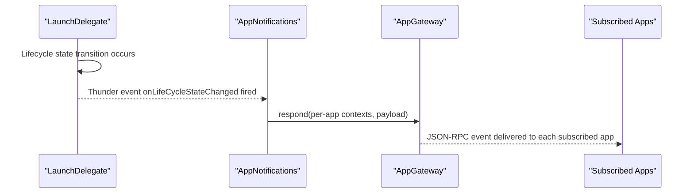
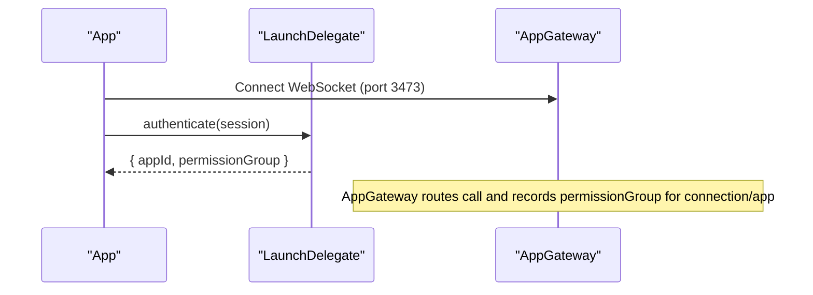
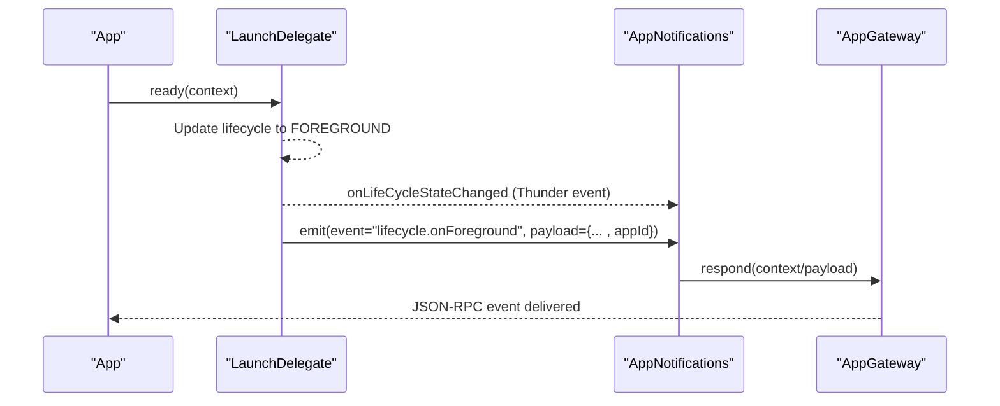
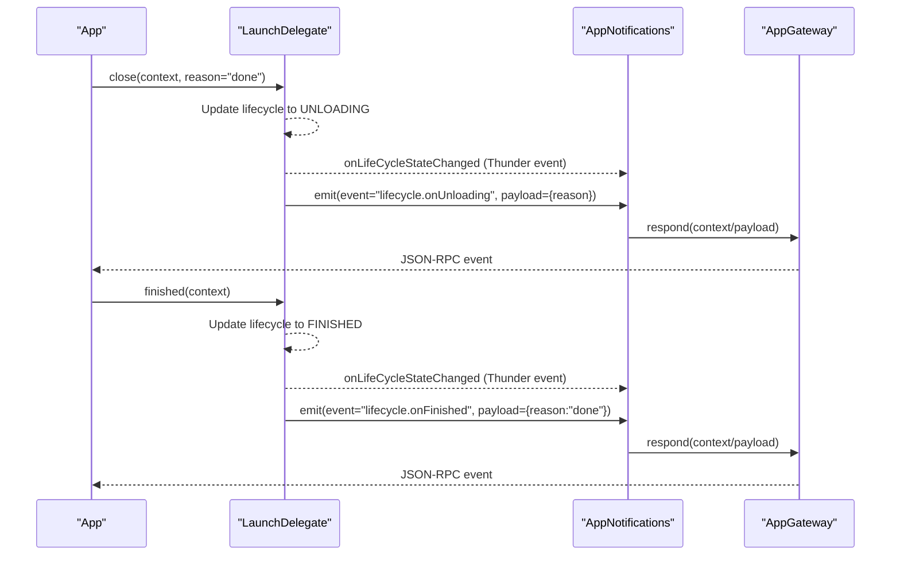

# LaunchDelegate Thunder Plugin Design Specification

## Introduction

### Background
LaunchDelegate provides AI 1.0-style application lifecycle/session authentication and lifecycle coordination in the Thunder-based architecture. It authenticates pre-provisioned session identifiers, establishes application identity and permission groups, and drives lifecycle transitions such as ready, close, and finished. LaunchDelegate integrates with AppGateway, AppNotifications, and App2AppProvider as defined in the architecture, and follows Thunder (WPEFramework) plugin best practices observed in entservices-infra plugins and the Thunder codebase.

The plugin’s core responsibilities are:
- Authenticate incoming application connections using pre-provisioned session IDs, returning app identity and permission groups.
- Emit lifecycle events via AppNotifications to subscribed apps.
- Expose a Thunder event (onLifeCycleStateChanged) for system components and for AppNotifications to consume.
- Coordinate ready, close, and finished flows and interact with platform lifecycle services when available.

In this architecture:
- AppGateway remains the single ingress/egress for app JSON-RPC over WebSocket (typically on port 3473).
- LaunchDelegate offers JSON-RPC methods invoked via AppGateway routing. Optionally, LaunchDelegate may host a secondary WebSocket endpoint for lifecycle operations on a separate port (recommended 3474) if product constraints require it.
- App2AppProvider manages provider/consumer patterns; LaunchDelegate does not overlap with provider responsibilities.
- AppNotifications multiplexes and delivers lifecycle events to applications.

### Scope
This document specifies:
- JSON-RPC interfaces (methods, parameters, return values, error codes) and the plugin event onLifeCycleStateChanged.
- Runtime behavior and usage flows.
- Internal file and class structure with fields and methods, sufficient for direct implementation.
- Concurrency, configuration, error handling, and testing guidance.
- Alignment with project documents and entservices-infra/Thunder best practices.

## Interfaces

### Overview
LaunchDelegate exposes the following JSON-RPC methods. Lifecycle events are emitted to applications using AppNotifications, and LaunchDelegate also provides a Thunder event to signal lifecycle state changes.

- authenticate
- ready
- close
- finished
- getIntent

Recommended implementation call sign: org.rdk.LaunchDelegate.1.<method>

Common objects and error codes are shared across the system to ensure consistent behavior.

### Common Structures

#### Context Object
The context object correlates requests and responses for a given app connection.

- requestId: number — Unique per app connection to correlate request/response.
- connectionId: string — Unique identifier for the WebSocket connection (GUID-like).
- appId: string — Application identifier.

Example:
{
  "requestId": 0,
  "connectionId": "guid",
  "appId": "com.example.app"
}

#### Error Codes
- -32700 PARSE_ERROR — Payload could not be deserialized.
- -32602 INVALID_PARAMS — Invalid or missing context or parameters.
- -32699 INVALID_REQUEST — Missing method and/or required parameters.

Plugin-specific error codes:
- -33001 INVALID_SESSION — The provided session is unknown.
- -33002 EXPIRED_SESSION — The provided session is expired.
- -33003 STATE_CONFLICT — The requested lifecycle transition is invalid for current state.
- -33004 NOT_AUTHENTICATED — Operation requires prior authentication.
- -33005 ALREADY_AUTHENTICATED — A second authenticate attempt for the same connection/app is not allowed.

### Method: authenticate

#### Description
Authenticate an incoming connection using a pre-provisioned session ID. Returns appId and permissionGroup. AppGateway, which routes this call, will record permissionGroup for the associated connection/app in its ConnectionRegistry.

#### Call sign
org.rdk.LaunchDelegate.authenticate

#### Parameters
| Name    | Type   | Description                                   | Required |
|---------|--------|-----------------------------------------------|----------|
| session | string | Pre-provisioned session ID for this launch    | Yes      |

#### Success Result
| Name            | Type   | Description                                    |
|-----------------|--------|------------------------------------------------|
| appId           | string | Application ID for the session                 |
| permissionGroup | string | Permission group name for enforcement          |

#### Error Response
| Field   | Type   | Description                                                         |
|---------|--------|---------------------------------------------------------------------|
| code    | number | -33001 INVALID_SESSION; -33002 EXPIRED_SESSION; -32602 INVALID_PARAMS |
| message | string | Optional details                                                    |

#### Example
Request:
{"jsonrpc":"2.0","id":3,"method":"org.rdk.LaunchDelegate.1.authenticate","params":{"session":"uuid-1234"}}

Response:
{"jsonrpc":"2.0","id":3,"result":{"appId":"com.example.app","permissionGroup":"org.rdk.permission.group.enhanced"}}

### Method: ready

#### Description
Marks the application as ready (typically entering FOREGROUND). LaunchDelegate will emit lifecycle events via AppNotifications.emit for subscribers and will raise the Thunder event onLifeCycleStateChanged for system-wide observers.

#### Call sign
org.rdk.LaunchDelegate.ready

#### Parameters
| Name    | Type   | Description                                              | Required |
|---------|--------|----------------------------------------------------------|----------|
| context | object | { "requestId": number, "connectionId": string, "appId": string } | Yes      |

#### Success Response
- result: null

#### Error Response
| Field   | Type   | Description                                           |
|---------|--------|-------------------------------------------------------|
| code    | number | -33004 NOT_AUTHENTICATED; -32602 INVALID_PARAMS; -33003 STATE_CONFLICT |
| message | string | Optional details                                      |

#### Example
Request:
{"jsonrpc":"2.0","id":3,"method":"org.rdk.LaunchDelegate.1.ready","params":{"context":{"requestId":0,"connectionId":"guid","appId":"com.example.app"}}}

Response:
{"jsonrpc":"2.0","id":3,"result":null}

### Method: close

#### Description
Application requests to close. LaunchDelegate moves the lifecycle to UNLOADING, emits lifecycle events via AppNotifications.emit, and raises onLifeCycleStateChanged.

#### Call sign
org.rdk.LaunchDelegate.close

#### Parameters
| Name    | Type   | Description                                              | Required |
|---------|--------|----------------------------------------------------------|----------|
| context | object | { "requestId": number, "connectionId": string, "appId": string } | Yes      |
| reason  | string | "remoteButton" | "userExit" | "done" | "error"         | Yes      |

#### Success Response
- result: null

#### Error Response
| Field   | Type   | Description                                           |
|---------|--------|-------------------------------------------------------|
| code    | number | -33004 NOT_AUTHENTICATED; -32602 INVALID_PARAMS; -33003 STATE_CONFLICT |
| message | string | Optional details                                      |

#### Example
Request:
{"jsonrpc":"2.0","id":3,"method":"org.rdk.LaunchDelegate.1.close","params":{"context":{"requestId":0,"connectionId":"guid","appId":"com.example.app"},"reason":"done"}}

Response:
{"jsonrpc":"2.0","id":3,"result":null}

### Method: finished

#### Description
Signals that the application finished. LaunchDelegate finalizes lifecycle and emits the final lifecycle event(s) via AppNotifications.emit, and raises onLifeCycleStateChanged.

#### Call sign
org.rdk.LaunchDelegate.finished

#### Parameters
| Name    | Type   | Description                                              | Required |
|---------|--------|----------------------------------------------------------|----------|
| context | object | { "requestId": number, "connectionId": string, "appId": string } | Yes      |

#### Success Response
- result: null

#### Error Response
| Field   | Type   | Description                                           |
|---------|--------|-------------------------------------------------------|
| code    | number | -33004 NOT_AUTHENTICATED; -32602 INVALID_PARAMS; -33003 STATE_CONFLICT |
| message | string | Optional details                                      |

#### Example
Request:
{"jsonrpc":"2.0","id":3,"method":"org.rdk.LaunchDelegate.1.finished","params":{"context":{"requestId":0,"connectionId":"guid","appId":"com.example.app"}}}

Response:
{"jsonrpc":"2.0","id":3,"result":null}

### Method: getIntent

#### Description
Retrieve the most recently associated launch intent for an app (for example, intent metadata supplied by an orchestrator and bound to the session during authentication).

#### Call sign
org.rdk.LaunchDelegate.getIntent

#### Parameters
| Name  | Type   | Description        | Required |
|-------|--------|--------------------|----------|
| appId | string | Application ID     | Yes      |

#### Success Result
| Name   | Type             | Description                          |
|--------|------------------|--------------------------------------|
| intent | object (opaque)  | Most recent intent for the app       |

#### Error Response
| Field   | Type   | Description                          |
|---------|--------|--------------------------------------|
| code    | number | -32602 INVALID_PARAMS                |
| message | string | Optional details                     |

#### Example
Request:
{"jsonrpc":"2.0","id":3,"method":"org.rdk.LaunchDelegate.1.getIntent","params":{"appId":"com.example.app"}}

Response:
{"jsonrpc":"2.0","id":3,"result":{"intent":{"action":"home","context":{"source":"epg"}}}}

## Events

### Event: onLifeCycleStateChanged

#### Purpose
Expose lifecycle state transitions as a Thunder event to system-level components and to AppNotifications for downstream app delivery. This event provides a normalized notification whenever LaunchDelegate updates an application’s lifecycle (for example, after ready, close, finished) or when a platform lifecycle integration (if present) reports a change.

#### Call sign
org.rdk.LaunchDelegate.1.onLifeCycleStateChanged

Thunder clients subscribe to this event using the standard Thunder event subscription mechanism for the LaunchDelegate plugin. Application-facing delivery is handled via AppNotifications (see Integration).

#### Parameters
| Name          | Type   | Description                                                                                       |
|---------------|--------|---------------------------------------------------------------------------------------------------|
| appId         | string | Application identifier                                                                            |
| previousState | string | Previous lifecycle state ("INITIALIZING" | "FOREGROUND" | "BACKGROUND" | "UNLOADING" | "FINISHED" | "SUSPENDED") |
| state         | string | New lifecycle state (same enum as previousState)                                                  |
| reason        | string | Optional reason for transition (for example, "done", "userExit", "remoteButton", "error")         |
| timestampMs   | number | Milliseconds since epoch at the time of transition                                                |
| connectionId  | string | Optional connection identifier associated with the app                                            |

#### Example Payload
{
  "appId": "com.example.app",
  "previousState": "INITIALIZING",
  "state": "FOREGROUND",
  "reason": "ready",
  "timestampMs": 1731001234567,
  "connectionId": "guid"
}

#### Flow
- When LaunchDelegate processes ready, it transitions the app lifecycle to FOREGROUND and raises onLifeCycleStateChanged with previousState and state.
- When close is received, LaunchDelegate transitions to UNLOADING and raises the event with an appropriate reason.
- When finished is received, LaunchDelegate transitions to FINISHED and raises the event.
- If integrated with platform lifecycle services, external state changes (for example, SUSPENDED) also trigger the event.

#### Integration
- AppNotifications SHOULD subscribe to LaunchDelegate’s onLifeCycleStateChanged event (module="org.rdk.LaunchDelegate", event="onLifeCycleStateChanged") using its subscribe API to maintain a single underlying subscription, and then distribute application-facing notifications to interested apps via AppGateway.respond.
- System services that need lifecycle awareness can subscribe directly to this LaunchDelegate event without flowing through AppNotifications.

#### Sequence (Event Emission and App Delivery)

## Runtime Flows and Interaction

### Authentication Flow (without createSession)

### Ready and Lifecycle Event Emission

### Close/Finished Flow

## File and Folder Structure

### Proposed Directory Layout
Structured like entservices-infra plugins:

- entservices-infra/LaunchDelegate/
  - CMakeLists.txt
  - Module.h
  - Module.cpp
  - LaunchDelegate.h
  - LaunchDelegate.cpp
  - SessionManager.h
  - SessionManager.cpp
  - PermissionManager.h
  - PermissionManager.cpp
  - IntentStore.h
  - IntentStore.cpp
  - LifecycleClient.h
  - LifecycleClient.cpp
  - NotificationsClient.h
  - NotificationsClient.cpp
  - DelegateWebSocket.h   (optional)
  - DelegateWebSocket.cpp (optional)
  - LaunchDelegate.conf.in
  - LaunchDelegate.config

### Rationale
- Module.*: metadata and service registration (see LifecycleManager and StorageManager patterns).
- LaunchDelegate.*: IPlugin + JSONRPC entry points; lifecycle and initialization; publishes onLifeCycleStateChanged using JSONRPC event mechanisms.
- SessionManager.*: Validate/track/expire sessions (consumed from an external orchestrator).
- PermissionManager.*: Determine permissionGroup on authentication; policy hooks (Phase 2 JWT).
- IntentStore.*: Store/retrieve most recent app intent (bound during authenticate from session metadata).
- LifecycleClient.*: Optional bridge to platform lifecycle services (Exchange::ILifecycleManager) if available; can trigger LaunchDelegate’s event.
- NotificationsClient.*: Local JSON-RPC client of AppNotifications.emit (uses SecurityAgent token).
- DelegateWebSocket.*: Optional WebSocket endpoint (port 3474) if product requires AI 1.0 external ingress, otherwise disabled by config.

## Key Classes and Responsibilities

### class LaunchDelegate : public PluginHost::IPlugin, public PluginHost::JSONRPC

#### Responsibilities
- Register JSON-RPC methods: authenticate, ready, close, finished, getIntent.
- Publish Thunder event: onLifeCycleStateChanged.
- Initialize subordinate managers (sessions, permissions, intents, lifecycle, notifications).
- Obtain SecurityAgent token for local JSON-RPC if required by platform policy.
- Optionally host a WebSocket endpoint for AI 1.0 operations when configured.

#### Fields
- PluginHost::IShell* _service
- std::unique_ptr<SessionManager> _sessions
- std::unique_ptr<PermissionManager> _perms
- std::unique_ptr<IntentStore> _intents
- std::unique_ptr<LifecycleClient> _lifecycle
- std::unique_ptr<NotificationsClient> _notify
- std::unique_ptr<DelegateWebSocket> _ws      // optional
- std::atomic<bool> _running
- uint16_t _wsPort
- string _securityToken
- string _notificationsCallsign  // default "org.rdk.AppNotifications"
- uint32_t _sessionTtlSec

#### Methods
- const string Initialize(PluginHost::IShell* service)
- void Deinitialize(PluginHost::IShell* service)
- string Information() const
- uint32_t AuthenticateWrapper(const JsonObject& params, JsonObject& response)
- uint32_t ReadyWrapper(const JsonObject& params, JsonObject& response)
- uint32_t CloseWrapper(const JsonObject& params, JsonObject& response)
- uint32_t FinishedWrapper(const JsonObject& params, JsonObject& response)
- uint32_t GetIntentWrapper(const JsonObject& params, JsonObject& response)
- void NotifyLifeCycleChanged(const string& appId, const string& previousState, const string& newState, const string& reason)

Implementation notes:
- Use PluginHost::JSONRPC::Register/Unregister, mirroring entservices-infra patterns (e.g., ResourceManager).
- Use Plugin::Metadata and SERVICE_REGISTRATION macros for versioning (see LifecycleManager.cpp).
- Use JSONRPC event registration to publish onLifeCycleStateChanged.

### class SessionManager

#### Responsibilities
- Validate, record, and expire sessions received from external orchestrators.
- Associate session -> appId, creation time, TTL, and optional intent key.
- Prevent reuse after expiration; support explicit revoke if needed.

#### Fields
- struct Session { string id; string appId; uint64_t createdMs; uint32_t ttlSec; string intentKey; bool authenticated; }
- std::unordered_map<string, Session> _byId
- Core::CriticalSection _lock
- std::unordered_map<string, JsonObject> _intentByKey // backing store (may also live in IntentStore)

#### Methods
- bool Validate(const string& sessionId, Session& out, bool requireUnAuth)
- bool Authenticate(const string& sessionId) // marks as authenticated
- bool Expired(const Session& s) const
- void ReapExpired()

### class PermissionManager

#### Responsibilities
- Map appIds to permissionGroup on authentication.
- Provide hooks for Phase 2 JWT-based decisions if enabled.

#### Fields
- std::unordered_map<string, string> _permissionByApp // appId -> group
- bool _jwtEnabled

#### Methods
- bool AssignGroup(const string& appId, string& outGroup) // policy-driven
- bool IsAllowed(const string& appId, const string& requiredGroup) const

### class IntentStore

#### Responsibilities
- Persist most recent intent per appId and per session if needed.
- Provide retrieval via getIntent.

#### Fields
- std::unordered_map<string, JsonObject> _byAppId
- Core::CriticalSection _lock

#### Methods
- void Set(const string& appId, const JsonObject& intent)
- bool Get(const string& appId, JsonObject& out) const

### class LifecycleClient

#### Responsibilities
- Optional integration with platform lifecycle services if available (Exchange::ILifecycleManager).
- Drive state transitions and listen for state changes via ILifecycleManagerState::INotification; invoke NotifyLifeCycleChanged on callbacks.

#### Fields
- PluginHost::IShell* _service
- uint32_t _connectionId
- Exchange::ILifecycleManager* _impl
- Exchange::ILifecycleManagerState* _state
- Core::Sink<StateNotification> _notification

#### Methods
- bool Initialize(PluginHost::IShell* service)
- void Deinitialize(PluginHost::IShell* service)
- bool SetForeground(const string& appId)
- bool SetUnloading(const string& appId)
- bool SetFinished(const string& appId)

### class NotificationsClient

#### Responsibilities
- Emit lifecycle events to applications via AppNotifications.emit using local JSON-RPC and SecurityAgent token.

#### Fields
- PluginHost::IShell* _service
- string _notificationsCallsign // "org.rdk.AppNotifications"
- string _securityToken

#### Methods
- uint32_t Emit(const string& event, const JsonObject& payload, const string& appId = "")

### class DelegateWebSocket (optional)

#### Responsibilities
- Host an optional WebSocket endpoint (default port 3474) for AI 1.0 lifecycle traffic when required.
- Typically disabled when AppGateway is the sole ingress.

#### Fields
- uint16_t _port
- std::atomic<bool> _running

#### Methods
- bool Start(uint16_t port, string& error)
- void Stop()

## Initialization and Registration

### Plugin Registration
- Use Plugin::Metadata and SERVICE_REGISTRATION macros for LaunchDelegate with version (Major, Minor, Patch), following entservices-infra patterns (see LifecycleManager.cpp).
- Example: SERVICE_REGISTRATION(LaunchDelegate, 1, 0, 0)

### JSON-RPC Registration
Register methods in the constructor/Initialize and unregister in destructor/Deinitialize:
- Register<JsonObject, JsonObject>(_T("authenticate"), &LaunchDelegate::AuthenticateWrapper, this)
- Register<JsonObject, JsonObject>(_T("ready"), &LaunchDelegate::ReadyWrapper, this)
- Register<JsonObject, JsonObject>(_T("close"), &LaunchDelegate::CloseWrapper, this)
- Register<JsonObject, JsonObject>(_T("finished"), &LaunchDelegate::FinishedWrapper, this)
- Register<JsonObject, JsonObject>(_T("getIntent"), &LaunchDelegate::GetIntentWrapper, this)

Also register the Thunder event:
- JSONRPC: Event onLifeCycleStateChanged with parameters as defined above.

### Security Agent Token
- Acquire a SecurityAgent token in Initialize for local JSON-RPC dispatch (pattern: QueryInterfaceByCallsign<PluginHost::IAuthenticate>("SecurityAgent")).
- Token is used by NotificationsClient (and optional DelegateWebSocket handling if required).

## Configuration

### Suggested LaunchDelegate.config keys
- serverPort: number (default 3474; 0 disables WebSocket)
- sessionTtlSec: number (default 300; used for validating session claims)
- notificationsCallsign: string (default "org.rdk.AppNotifications")
- jwtEnabled: boolean (default false; Phase 2 enhancement)
- logVerbosity: string ("info" | "debug" | "trace") for diagnostics

Behavior:
- If serverPort > 0, DelegateWebSocket is started.
- sessionTtlSec is used to validate incoming session claims (sessions are not issued here).
- jwtEnabled enables PermissionManager’s JWT policy hooks (future).

## Error Handling

### Mapping and Behavior
- JSON parsing failure: return -32700 PARSE_ERROR.
- Missing or invalid context/params: return -32602 INVALID_PARAMS.
- Missing method/params: return -32699 INVALID_REQUEST.
- Domain-specific errors:
  - INVALID_SESSION (-33001), EXPIRED_SESSION (-33002),
  - STATE_CONFLICT (-33003), NOT_AUTHENTICATED (-33004),
  - ALREADY_AUTHENTICATED (-33005).

Guidelines:
- Do not crash on malformed inputs.
- Maintain idempotency for repeated ready/close/finished as feasible; otherwise return STATE_CONFLICT.
- Authenticate marks the session authenticated and prevents re-authentication reuse.
- Always raise onLifeCycleStateChanged when any lifecycle state changes, and emit appropriate AppNotifications events for application delivery.

## Concurrency and Performance

- Store minimal mutable state guarded by Core::CriticalSection.
- Use short-lived jobs on Thunder worker pools for state changes and event delivery.
- Periodically reap expired sessions; avoid per-request heavy allocations.
- Keep Notification emission and event publishing decoupled from JSON-RPC handlers to avoid blocking.

## Testing and Diagnostics

### Unit Tests
- SessionManager: validate, expire, authenticate paths.
- PermissionManager: group assignment, jwtEnabled flag behavior (stubbed).
- IntentStore: set/get under concurrency.
- LifecycleClient: mock ILifecycleManager to verify callbacks and event raising.

### Integration Tests
- authenticate → ready → close → finished end-to-end.
- Verify onLifeCycleStateChanged is raised for each state change and that AppNotifications.emit is invoked with expected payloads (mock local dispatcher).
- Negative tests: invalid/expired session, duplicate authenticate, invalid context.

### Diagnostics
- Structured logging prefixes per component (LD.Session, LD.Auth, LD.Intent, LD.Event).
- Optional trace logging for lifecycle transitions and event payloads if logVerbosity = "trace".

## Alignment and Interactions

### With AppGateway
- All app-facing JSON-RPC calls traverse AppGateway. AppGateway records permissionGroup from authenticate result for per-connection enforcement as documented.
- No additional AppGateway API is required; LaunchDelegate does not directly manipulate AppGateway state.

### With AppNotifications
- LaunchDelegate raises onLifeCycleStateChanged to the Thunder bus and uses AppNotifications.emit with event identifiers like:
  - lifecycle.onForeground
  - lifecycle.onUnloading
  - lifecycle.onFinished
- AppNotifications multiplexes delivery to subscribed apps and uses AppGateway.respond for transport.

### With App2AppProvider
- No direct dependency. Provider/capability flows are managed by App2AppProvider; LaunchDelegate focuses on lifecycle and session authentication.

### Platform Lifecycle (Optional)
- Where Exchange::ILifecycleManager is available, LifecycleClient drives platform lifecycle transitions and listens for state changes, invoking NotifyLifeCycleChanged and raising the event.

## Roadmap and Assumptions

### Phase 2 Security
- JWT validation via Security Agent.
- PermissionGroup derivation from JWT scopes.
- Tightened JSON-RPC 2.0 compliance for all payloads.

### Assumptions
- Apps will authenticate promptly after WebSocket connection, before invoking privileged operations.
- AppGateway updates permission enforcement state based on authenticate results routed through it.
- Lifecycle events are delivered via AppNotifications and onLifeCycleStateChanged serves system-level observers and AppNotifications ingestion.

## Appendix

### Example curl commands

- authenticate:
curl --header "Content-Type: application/json" --request POST --data '{"jsonrpc":"2.0","id":3,"method":"org.rdk.LaunchDelegate.1.authenticate","params":{"session":"uuid-1234"}}' http://127.0.0.1:9998/jsonrpc

- ready:
curl --header "Content-Type: application/json" --request POST --data '{"jsonrpc":"2.0","id":3,"method":"org.rdk.LaunchDelegate.1.ready","params":{"context":{"requestId":0,"connectionId":"guid","appId":"com.example.app"}}}' http://127.0.0.1:9998/jsonrpc

- close:
curl --header "Content-Type: application/json" --request POST --data '{"jsonrpc":"2.0","id":3,"method":"org.rdk.LaunchDelegate.1.close","params":{"context":{"requestId":0,"connectionId":"guid","appId":"com.example.app"},"reason":"done"}}' http://127.0.0.1:9998/jsonrpc

- finished:
curl --header "Content-Type: application/json" --request POST --data '{"jsonrpc":"2.0","id":3,"method":"org.rdk.LaunchDelegate.1.finished","params":{"context":{"requestId":0,"connectionId":"guid","appId":"com.example.app"}}}' http://127.0.0.1:9998/jsonrpc

- getIntent:
curl --header "Content-Type: application/json" --request POST --data '{"jsonrpc":"2.0","id":3,"method":"org.rdk.LaunchDelegate.1.getIntent","params":{"appId":"com.example.app"}}' http://127.0.0.1:9998/jsonrpc
