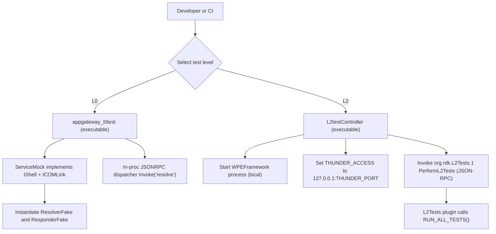

# L0/L1/L2 Testing Design

This document supersedes l1_l2_testing_design.md; use this file going forward.

## Overview

This document describes how the `AppGateway` plugin is tested at three levels: L0 (offline and deterministic), L1 (component/unit testing with shared mocks), and L2 (integration-style tests executed through a Thunder/WPEFramework test plugin). It focuses on what is implemented in this repository today, and it uses concrete code references from the existing L0 test harness and the L2 test controller/plugin.

The key idea across all levels is to keep tests repeatable by controlling the plugin host environment. For L0, this is done by running the plugin in-process with a custom `IShell`/`ICOMLink` mock. For L2, the repository provides a controller that starts a local `WPEFramework` process and invokes `RUN_ALL_TESTS()` through a dedicated Thunder plugin.

## L0 vs L1 vs L2 comparison (AppGateway-specific)

The table below compares the three levels as they are implemented (or intended to be implemented) in this repository. It is written to help you quickly decide which level to use, what you need running on your machine, and what kind of failures each level tends to catch.

| Aspect | L0 (offline / deterministic) | L1 (unit/component with shared mocks) | L2 (integration via Thunder test plugin) |
|---|---|---|---|
| Purpose | L0 is meant to validate AppGateway behavior in-process with deterministic fakes, with an emphasis on lifecycle correctness, JSON-RPC registration, and predictable error-path coverage. In this repo, L0 is the fastest way to prove that “resolve” routing and core return codes work. | L1 is meant to validate component-level behavior using GoogleTest and GoogleMock against the same interfaces used in production, but with mocks supplied by the shared `entservices-testframework`. It is most useful when you want expectation-based testing and richer assertions than L0’s direct return-code checks. | L2 is meant to validate higher-level integration by running GoogleTest suites from inside a Thunder plugin. In this repo, L2 uses a controller that boots a local `WPEFramework` process and then calls a JSON-RPC method (`PerformL2Tests`) on the `org.rdk.L2Tests.1` plugin, which runs `RUN_ALL_TESTS()`. |
| Scope | AppGateway plugin lifecycle (`Initialize()`/`Deinitialize()`), JSON-RPC dispatcher registration for `"resolve"`, and deterministic resolver/responder behaviors via in-proc fakes. This level is explicitly designed to avoid any Thunder daemon, networking, or external services. | Expected to cover internal module interactions with mock expectations, typically within plugin boundaries. In this repo, the “L1 story” is primarily represented by the presence of the shared mocks and the testframework guidance, rather than a documented AppGateway-specific L1 runner. | End-to-end “bring up Thunder + run gtest suites” flow, plus environment orchestration such as controlling plugin autostart. L2 is closer to production execution because tests run through Thunder plugin infrastructure and JSON-RPC wiring. |
| Dependencies (frameworks, mocks) | Uses the AppGateway L0 harness under `app-gateway2/app-gateway/AppGateway/l0test/`. The harness supplies `L0Test::ServiceMock` and deterministic fakes (`ResolverFake`, `ResponderFake`) implemented in `app-gateway2/app-gateway/AppGateway/l0test/ServiceMock.h`. This level does not rely on GoogleTest/GoogleMock. | Uses GoogleTest/GoogleMock and the shared mock/stub inventory under `app-gateway2/app-gateway/L1_L2_Testing/entservices-testframework/Tests/mocks/` (for example, Thunder/COMLink-related mocks under `Tests/mocks/thunder/`). The testframework README explains the multi-repo model where mocks are centralized and per-plugin tests are built as test libraries. | Uses GoogleTest/GoogleMock inside the `L2Tests` Thunder plugin (`app-gateway2/app-gateway/L1_L2_Testing/entservices-testframework/Tests/L2Tests/L2TestsPlugin/L2Tests.cpp`, `L2Tests.h`). The L2 stack also depends on the controller (`Tests/L2Tests/L2testController.cpp`) and may optionally involve additional scaffolding such as Pact provider state tooling (see below). |
| Runtime requirements (daemon/processes) | No daemon is required. Tests run in one process as `appgateway_l0test`. The harness emulates `PluginHost::IShell` and `IShell::ICOMLink` so `IShell::Root<T>()` can return in-proc fakes rather than spawning COM-RPC processes. | Typically no Thunder daemon is required for L1 if tests are truly component-level, but the environment can become more complex depending on what is being mocked. The shared testframework approach is frequently orchestrated through CI workflows and may not have a “single command” local runner within this repository. | Requires launching a `WPEFramework` process. In this repo that is done programmatically by the controller via `popen()`, not manually. The controller exports `THUNDER_ACCESS=127.0.0.1:<THUNDER_PORT>` and then invokes the test plugin over JSON-RPC. For Pact/provider-state-driven L2 runs, an additional Flask process may be used (see provider state service below). |
| Typical inputs / outputs | Typical input is a JSON parameter blob passed to the dispatcher’s `Invoke(..., "resolve", ...)` call; output is a Thunder `Core::hresult` (as a `uint32_t`) plus a response string containing JSON (often `"null"` in the current fakes). | Typical input is C++ test fixtures and mock expectations; output is standard gtest console output (and whatever artifact format your runner config emits). | Typical input is a JSON-RPC call to `org.rdk.L2Tests.1` method `"PerformL2Tests"` with optional `"test_suite_list"` for filter control; output is the gtest status code and a JSON report file `rdkL2TestResults.json` (via `GTEST_OUTPUT="json:$PWD/rdkL2TestResults.json"` as set in the controller). |
| Example scenarios in this repo | AppGateway lifecycle success/failure under missing dependency conditions; registration/unregistration of `"resolve"`; deterministic mapping of methods to error codes such as `"l0.notSupported"` → `Core::ERROR_NOT_SUPPORTED` and `"l0.notAvailable"` → `Core::ERROR_UNAVAILABLE`; responder “transport unavailable” injection via `ResponderFake`. | Using shared mocks (for example COMLink, device settings, IARM, RBUS, etc.) to validate interface contract behavior, call ordering, and error handling without needing the full runtime. The mock inventory in this repo is extensive (see `entservices-testframework/Tests/mocks/`), even when a specific AppGateway L1 suite is not documented here. | “Boot Thunder locally + run all enabled gtest suites” via the L2Tests plugin. The controller also demonstrates a concrete stability measure: it rewrites plugin JSON configs under `./install/etc/WPEFramework/plugins/` to set `"autostart":false` for everything except `L2Tests.json`, reducing the chance of crashes from plugins doing early IARM calls before mocks are ready. |
| Pros | Extremely fast and deterministic. Failures usually point directly to AppGateway logic or JSON boundary issues. This level is well suited to tight development loops and pre-submit checks. | Rich assertion model and expectation-based validation via gtest/gmock. Centralized mocks reduce duplication across repos and can keep platform-interface test seams consistent. | Catches issues that depend on process-level wiring (Thunder startup, plugin activation order, JSON-RPC integration, environment configuration) and is closer to how the system behaves in deployment. |
| Cons | Does not validate the real Thunder runtime environment, plugin activation semantics, or real networking. Because dependencies are faked, it can miss integration failures that only show up when running under `WPEFramework`. | In practice, the centralized testframework model can make local execution less straightforward, because L1 tests may be built as per-repo shared libraries and executed through higher-level orchestration. Developers may need to follow CI-like steps to reproduce locally. | Slower and more environment-sensitive. Failures can be caused by plugin startup ordering, port conflicts, missing runtime assets/config, or incomplete isolation of the local `install/etc/WPEFramework/plugins` environment. |
| Speed / determinism notes | Fastest and most deterministic because no process is spawned and no I/O is required. Tests are repeatable as long as the build output is stable. | Generally fast, but heavier than L0 due to gtest/gmock and broader mock graphs. Determinism depends on thread scheduling and how mocks interact with background worker pools. | Slowest due to process orchestration and potential external scaffolding. Determinism depends on controlling the Thunder environment (including which plugins autostart) and any auxiliary services used by tests. |
| Coverage notes | L0 is well suited to producing high line/branch coverage of AppGateway logic that is reachable in-process. The repo provides explicit L0 coverage commands using `lcov` and `genhtml`. | Coverage collection depends on how the L1 binaries/libraries are built and executed. The shared testframework model can support coverage, but it is not described as a single, AppGateway-local command in this repository. | Coverage is possible if built with coverage flags, but the visible L2 harness is primarily focused on producing gtest JSON output (`rdkL2TestResults.json`). |
| When to use | Use L0 when you are iterating on resolver/responder behavior, error codes, JSON parsing/serialization boundaries, and registration semantics, and you want quick feedback with minimal environment setup. | Use L1 when you need expectation-level verification across interfaces, want gtest fixtures and matchers, and want to leverage the shared mock ecosystem from `entservices-testframework`. | Use L2 when you need to validate the “realistic” execution model (Thunder + plugin + JSON-RPC), when failures only show up under process orchestration, or when verifying suites in the same way CI-like runners invoke them. |
| Example command snippets (build / run / coverage) | Build (repo root): `cmake -G Ninja -S app-gateway2/app-gateway -B build/appgatewayl0test -DCMAKE_BUILD_TYPE=Debug -DCMAKE_PREFIX_PATH=$PWD/dependencies/install -DCMAKE_INSTALL_PREFIX=$PWD/dependencies/install`<br/>Build target: `cmake --build build/appgatewayl0test --target appgateway_l0test -j`<br/>Run: `export LD_LIBRARY_PATH=$PWD/build/appgatewayl0test/AppGateway:$PWD/dependencies/install/lib:$LD_LIBRARY_PATH` then `./build/appgatewayl0test/AppGateway/appgateway_l0test`<br/>Coverage: `lcov -c -o coverage.info -d build/appgatewayl0test` then `genhtml -o coverage coverage.info` (or `bash app-gateway2/app-gateway/scripts/appgateway_l0_coverage.sh build/appgatewayl0test`) | The testframework README describes a CI-like local run pattern using `act` (in an entservices-* repo context): `./bin/act -W .github/workflows/tests-trigger.yml -s GITHUB_TOKEN=<your access token>`. In this repository, the concrete, visible assets are the shared mocks and testframework structure under `app-gateway2/app-gateway/L1_L2_Testing/entservices-testframework/`, rather than an AppGateway-specific L1 runner command. | Run the controller executable built from `Tests/L2Tests/L2testController.cpp`. The controller starts Thunder with a command like: `export GTEST_OUTPUT="json:$PWD/rdkL2TestResults.json"; WPEFramework -c <CMAKE_INSTALL_PREFIX>/../etc/WPEFramework/config.json` and sets `THUNDER_ACCESS` to `127.0.0.1:<THUNDER_PORT>` (default port string is `"9998"`). It then calls JSON-RPC method `PerformL2Tests` on callsign `org.rdk.L2Tests.1`.<br/>Optional filtering: pass suite names as CLI args; the controller builds a gtest filter like `SuiteA*:SuiteB*` and sends it as `"test_suite_list"`. |

## Architecture

### L0 (offline, in-process)

AppGateway L0 tests live under `app-gateway2/app-gateway/AppGateway/l0test/` and build an `appgateway_l0test` executable. This test binary exercises the AppGateway plugin logic entirely in-process, and it avoids starting a Thunder daemon or creating real network connections.

The L0 harness is built around `L0Test::ServiceMock`, which implements:

- `WPEFramework::PluginHost::IShell` so the plugin can call `Initialize()` and `Deinitialize()` normally.
- `WPEFramework::PluginHost::IShell::ICOMLink` so that `IShell::Root<T>()` calls inside the plugin can resolve into deterministic in-process fakes instead of spawning out-of-process COM-RPC components.

In `app-gateway2/app-gateway/AppGateway/l0test/ServiceMock.h`, `ServiceMock::Instantiate(...)` returns the fakes based on call order, which matches the plugin initialization pattern. The first instantiation returns a `ResolverFake` (implementing `Exchange::IAppGatewayResolver`), and the second returns a `ResponderFake` (implementing `Exchange::IAppGatewayResponder`).

### L1 (unit/component tests with centralized mocks)

This repository includes `app-gateway2/app-gateway/L1_L2_Testing/entservices-testframework/`, which documents the broader RDK approach where gtest/gmock-based stubs are centralized in a shared “testframework” to avoid duplication. The README in this folder explains the intended build job split:

- Build mocks into a `TestMock` library.
- Build per-repository test shared libraries.
- Build the testframework executable(s) that link those test libraries.

Within this repo, the most visible, concrete implementations are the L2 controller and L2 test plugin described below. The L0 tests are explicitly not gtest-based, and instead use a minimal custom assertion style.

### L2 (integration-style tests via a Thunder plugin)

L2 tests are orchestrated in two pieces:

- A controller executable: `app-gateway2/app-gateway/L1_L2_Testing/entservices-testframework/Tests/L2Tests/L2testController.cpp`
- A Thunder test plugin: `app-gateway2/app-gateway/L1_L2_Testing/entservices-testframework/Tests/L2Tests/L2TestsPlugin/L2Tests.cpp`

The controller starts a local `WPEFramework` process using `popen()`, sets up the JSON-RPC access point using the `THUNDER_ACCESS` environment variable, and then invokes the L2Tests plugin method `PerformL2Tests` via `JSONRPC::LinkType`.

The L2Tests plugin registers a JSON-RPC method named `PerformL2Tests` and calls `RUN_ALL_TESTS()` to execute the compiled-in gtest suites. It also supports optional filtering via `::testing::GTEST_FLAG(filter)` when the controller provides a `test_suite_list` field in the request parameters.

### End-to-end view



## Mocking

### L0 mocking: deterministic fakes via `ServiceMock`

In L0, mocking is implemented by providing a fake host environment rather than by gmock expectations. `L0Test::ServiceMock` controls “what the plugin sees” when it queries interfaces or tries to instantiate its dependencies.

The key fakes are:

- `L0Test::ResolverFake`, which implements `Exchange::IAppGatewayResolver` and `Exchange::IConfiguration`.
- `L0Test::ResponderFake`, which implements `Exchange::IAppGatewayResponder` and `Exchange::IConfiguration`.

`ResolverFake::Resolve(...)` implements deterministic behavior based on the requested method name:

- If the method is `"l0.notPermitted"`, it returns `Core::ERROR_PRIVILIGED_REQUEST` and a small JSON error object.
- If the method is `"l0.notSupported"`, it returns `Core::ERROR_NOT_SUPPORTED`.
- If the method is `"l0.notAvailable"`, it returns `Core::ERROR_UNAVAILABLE`.
- Otherwise, it returns `Core::ERROR_NONE` and the JSON literal `null`.

`ResponderFake` supports “transport available vs unavailable” behavior via an internal boolean and a helper method `SetTransportEnabled(bool)`. When transport is disabled, responder methods return `Core::ERROR_UNAVAILABLE`, which allows the tests to validate error-path behavior without a real WebSocket connection.

`ServiceMock::Config` allows tests to simulate missing dependencies by controlling whether the resolver and/or responder are provided. `ServiceMock::Config` also supports controlling whether the responder’s “transport” should be considered available at construction time (`responderTransportAvailable`).

### L2 mocking: disabling plugin autostart before starting Thunder

`L2testController.cpp` includes a concrete mitigation for startup ordering and dependency mocking. Before starting Thunder, it scans `./install/etc/WPEFramework/plugins/` and replaces `"autostart":true` with `"autostart":false` for all plugins except `L2Tests.json`. The comment explains why: some plugins perform IARM calls in `Initialize()`, which can crash if the relevant mocks are not ready.

This is part of the L2 orchestration “mocking story”: L2 is still meant to be testable in a controlled environment, but instead of a single in-proc fake host (L0), the environment is controlled by configuring which plugins start and when.

### Optional provider state service (Pact scaffolding)

The L2 directory also contains a provider state service implementation under:

`app-gateway2/app-gateway/L1_L2_Testing/entservices-testframework/Tests/L2Tests/pact/providerStates/providerStateService/`

The `start.py` script starts a Flask app on port `5003`. This kind of service is typically used to establish provider states during contract testing, and it is a separate process from both Thunder and the L2 controller.

## Testing Scenarios

### L0 scenarios (examples based on current tests)

The following scenarios are directly represented by the current L0 tests and harness behavior:

- Plugin lifecycle success. `Initialize()` returns an empty string on success and `Deinitialize()` can be called cleanly afterwards.
- JSON-RPC registration and unregistration. After `Initialize()`, an `IDispatcher` can invoke `"resolve"` successfully; after `Deinitialize()`, invoking `"resolve"` should fail (typically `ERROR_UNKNOWN_METHOD`).
- Error-path coverage without external dependencies. By using `ResolverFake`, L0 tests can validate error returns like `ERROR_NOT_SUPPORTED` or `ERROR_UNAVAILABLE` deterministically.
- Malformed or missing JSON parameters. L0 tests call the dispatcher’s `Invoke(...)` and validate `ERROR_BAD_REQUEST` for invalid inputs (as described in the L0 overview documentation and supported by the l0test test suite structure).
- Missing resolver/responder dependency. If the resolver is not provided, the plugin cannot register the `"resolve"` method, and invoking it returns `ERROR_UNKNOWN_METHOD`.

### L2 scenarios (examples based on current controller + plugin implementation)

At L2, the key scenario is “start Thunder, run gtest suites, collect results”:

- Start the local Thunder process (WPEFramework).
- Set the JSON-RPC access location via `THUNDER_ACCESS` to `127.0.0.1:<THUNDER_PORT>`.
- Invoke the test plugin method `PerformL2Tests` using JSON-RPC.
- Optionally provide a filter string so only certain suites run.
- Collect results from gtest JSON output.

Because the L2Tests plugin supports `test_suite_list`, the controller can run one or more suites by building a filter string like `"SuiteA*:SuiteB*"` and sending it in the JSON-RPC parameters.

## Pros/Cons

### L0

L0 is the fastest and most deterministic test level in this repository. Because it runs entirely in-process, it is suitable for rapid iteration and for validating return codes and registration semantics without worrying about process start/stop or network access.

The main trade-off is that L0 does not test the real runtime environment. It validates AppGateway behavior against deterministic fakes, so it can miss issues that only occur when the real Thunder process is running, when plugins are activated/deactivated, or when process-level configuration and startup ordering come into play.

### L1

The shared-testframework approach (as described in the `entservices-testframework` README) reduces duplication of mocks and makes it easier to keep mock interfaces consistent across many plugins and repositories. It also aligns with typical gtest/gmock workflows, including richer assertions and expectations.

The downside of centralization is that local discovery and execution can be less straightforward. Developers often need to understand how the testframework builds and links per-repo test libraries, and how CI orchestrates the combined build.

### L2

L2 provides an integration-style execution model that is closer to how plugins are exercised in real deployments: it starts a Thunder runtime and runs tests through a Thunder plugin interface. This is particularly valuable for catching issues that depend on runtime configuration, plugin startup ordering, and JSON-RPC integration.

The trade-offs are cost and complexity. L2 runs slower than L0, relies on process orchestration, and requires careful environment isolation (for example, toggling autostart off for other plugins to avoid crashes during initialization).

## Example Code

### L0: building JSON-RPC parameters and calling `resolve`

The L0 test `AppGateway_Init_DeinitTests.cpp` builds a JSON parameter string for `resolve` and invokes it via `PluginHost::IDispatcher`:

```cpp
static std::string ResolveParamsJson(const std::string& method, const std::string& params = "{}")
{
    return std::string("{")
        + "\"requestId\": 1001,"
        + "\"connectionId\": 10,"
        + "\"appId\": \"com.example.test\","
        + "\"origin\": \"org.rdk.AppGateway\","
        + "\"method\": \"" + method + "\","
        + "\"params\": \"" + params + "\""
        + "}";
}
```

It then invokes the registered JSON-RPC method:

```cpp
auto dispatcher = ps.plugin->QueryInterface<IDispatcher>();
std::string jsonResponse;
const std::string paramsJson = ResolveParamsJson("dummy.method", "{}");
const uint32_t rc = dispatcher->Invoke(nullptr, 0, 0, "", "resolve", paramsJson, jsonResponse);
```

### L0: simulating missing resolver/responder

The L0 overview documentation includes a concrete example of disabling both resolver and responder provisioning so that `Initialize()` fails and `"resolve"` is not registered:

```cpp
PluginAndService ps{ L0Test::ServiceMock::Config(false, false) };
const std::string rc = ps.plugin->Initialize(ps.service);
// Later: dispatcher->Invoke(..., "resolve", ...) -> ERROR_UNKNOWN_METHOD
```

This behavior is implemented by `ServiceMock::Instantiate(...)` returning `nullptr` for the expected dependency instantiations.

### L2: invoking the L2Tests plugin and applying a gtest filter

The L2Tests plugin registers `"PerformL2Tests"` and supports a `test_suite_list` parameter:

```cpp
if (parameters.HasLabel("test_suite_list")) {
    const std::string& message = parameters["test_suite_list"].String();
    ::testing::GTEST_FLAG(filter) = message;
}
status = RUN_ALL_TESTS();
```

The controller builds the filter based on CLI arguments and forwards it through JSON-RPC:

```cpp
if (argc > 1) {
    message = std::string(argv[1]) + std::string("*");
    while (arguments < argc) {
        message = (message + std::string(":") + std::string(argv[arguments]) + std::string("*"));
        arguments++;
    }
    params["test_suite_list"] = message;
}
status = L2testobj->PerformL2Tests(params, result);
```

## Artifacts

### L0 artifacts

L0 tests support coverage collection using `lcov` and HTML report generation via `genhtml`. The L0 README describes a common output flow:

- `coverage.info` generated by `lcov -c ...`
- HTML report generated under a `coverage/` folder by `genhtml -o coverage coverage.info`

The L0 test harness also supports an environment variable `APPGATEWAY_RESOLUTIONS_PATH` (read via `getenv()` in the L0 tests) to point the tests at a real resolution JSON file when exercising resolution-loading behavior.

### L2 artifacts

When starting Thunder, `L2testController.cpp` exports:

- `GTEST_OUTPUT="json:$PWD/rdkL2TestResults.json"`

This means the L2 run is expected to emit a gtest JSON report named `rdkL2TestResults.json` in the current working directory of the controller process. This output is useful for CI parsing and for post-processing results outside the Thunder logs.

## References

- [AppGateway l0test README](../app-gateway/AppGateway/l0test/README.md)
- [AppGateway l0test overview](../app-gateway/AppGateway/l0test/docs/l0test-overview.md)
- [L0 ServiceMock and fakes](../app-gateway/AppGateway/l0test/ServiceMock.h)
- [L0 init/deinit test example](../app-gateway/AppGateway/l0test/AppGateway_Init_DeinitTests.cpp)
- [entservices-testframework README](../app-gateway/L1_L2_Testing/entservices-testframework/README.md)
- [L2 test controller](../app-gateway/L1_L2_Testing/entservices-testframework/Tests/L2Tests/L2testController.cpp)
- [L2Tests plugin implementation](../app-gateway/L1_L2_Testing/entservices-testframework/Tests/L2Tests/L2TestsPlugin/L2Tests.cpp)
- [L2Tests plugin header](../app-gateway/L1_L2_Testing/entservices-testframework/Tests/L2Tests/L2TestsPlugin/L2Tests.h)
