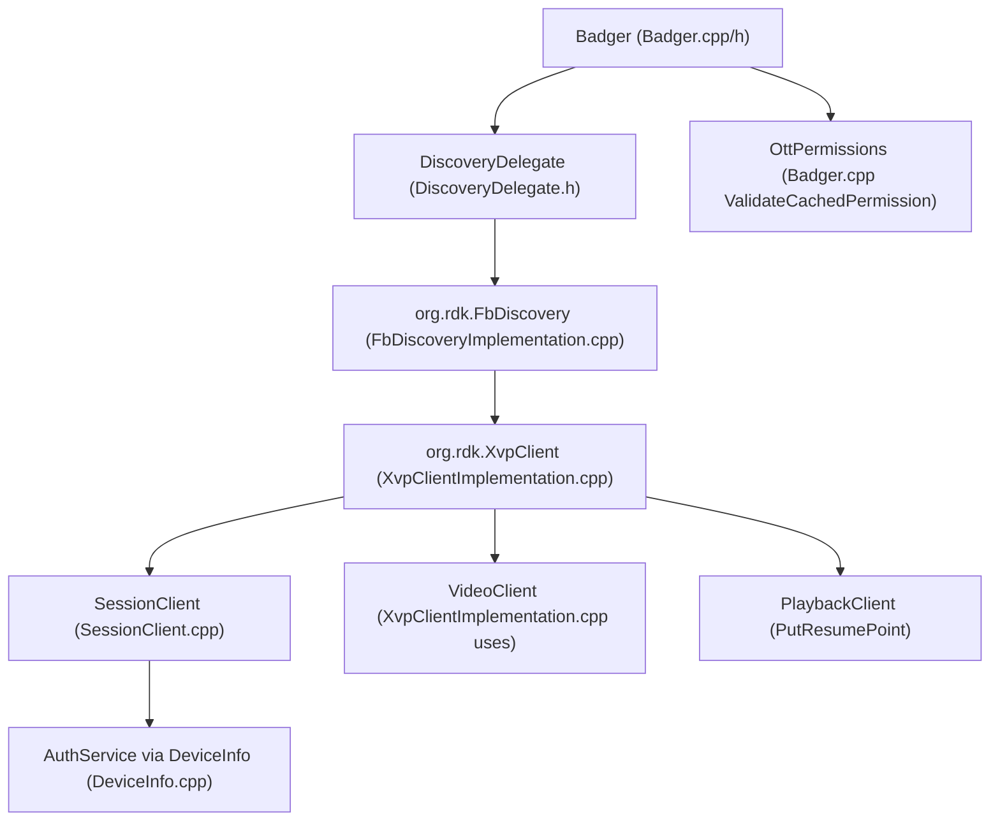
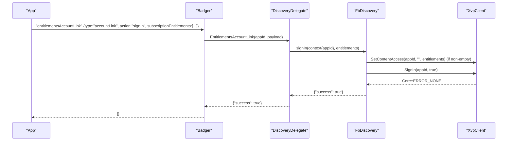
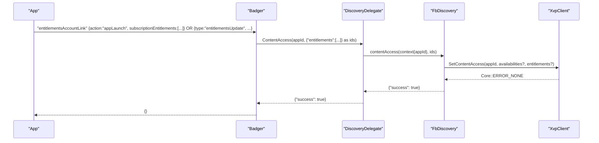
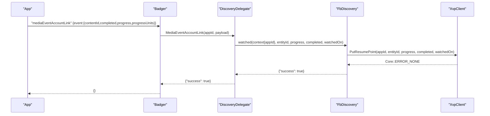
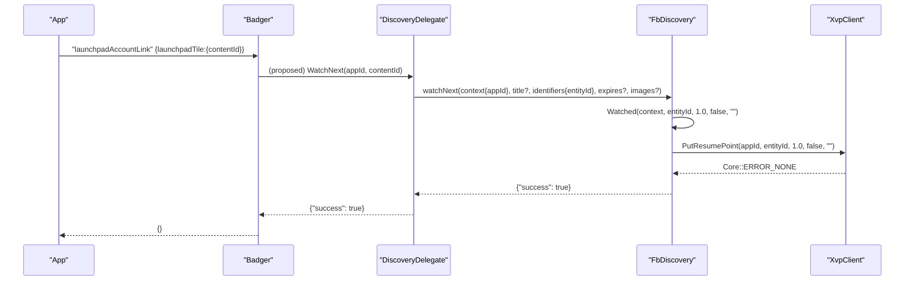

# Entitlements and XVP Delegate Design for Badger in app-gateway2

## Overview

This document analyzes the app-gateway2 codebase to determine whether to reuse an existing delegate or create a new one for XVP integration in the Badger plugin, and provides a detailed design for the entitlement-related JSON-RPC methods. The design covers:

- Delegate decision: reuse vs. new
- JSON-RPC contracts for:
  - badger.entitlementsAccountLink
  - badger.mediaEventAccountLink
  - badger.launchpadAccountLink
- Data models and mapping to XVP schemas
- Architecture and sequence flows with integration points to XvpClient, Privacy, and DeviceBridge-related components
- Error handling, retries, idempotency
- Logging/observability and configuration
- Backward compatibility and migration
- Concrete file-level change plan in the Badger plugin
- Testing strategy (unit, integration, and end-to-end via JSON-RPC)

All file references below are under app-gateway2/.

## Decision: Reuse Existing Delegates

Decision: Reuse existing delegates and plugins. A new XVP delegate is not required.

Rationale:

- FbDiscovery already encapsulates the content access and sign-in/out operations and calls into XvpClient’s IXvpSession, IXvpVideo, and IXvpPlayback.
  - FbDiscoveryImplementation::ContentAccess parses “availabilities” and “entitlements” and invokes IXvpSession::SetContentAccess.
  - FbDiscoveryImplementation::SignIn optionally applies SetContentAccess (when entitlements are provided) and then IXvpVideo::SignIn(true); SignOut invokes IXvpVideo::SignIn(false).
  - FbDiscoveryImplementation::Watched posts resume points via IXvpPlayback::PutResumePoint.
  - Files: app-gateway/FbDiscovery/FbDiscoveryImplementation.cpp, .h

- Badger already delegates discovery flows via DiscoveryDelegate (JSON-RPC direct link to org.rdk.FbDiscovery).
  - DiscoveryDelegate implements MediaEventAccountLink (mapped to FbDiscovery.watched) and has SignIn/SignOut helpers.
  - It also has a router for EntitlementsAccountLink type: "accountLink" + action: "signIn"/"signOut".
  - File: app-gateway/Badger/Delegate/DiscoveryDelegate.h

- XvpClient provides SetContentAccess, ClearContentAccess, SignIn, and PutResumePoint against configured service endpoints and handles token acquisition and a retry on 401.
  - Files: app-gateway/XvpClient/Implementation/SessionClient.cpp, XvpClientImplementation.cpp|.h

Conclusion: Implement entitlement update and account-link flows through the existing DiscoveryDelegate and FbDiscovery, which rely on XvpClient. No new org.rdk plugin or delegate class is required.

## Scope and Assumptions

- Scope
  - Implement and document entitlement-related flows without introducing a new Thunder plugin.
  - Add entitlements update routing and finish handling of account link and media events through FbDiscovery.
- Assumptions
  - Calls flow: Badger -> DiscoveryDelegate (JSON-RPC direct) -> org.rdk.FbDiscovery -> org.rdk.XvpClient
  - No changes to wire-visible callsigns or interfaces outside Badger, FbDiscovery, and XvpClient.
  - Permission gating is enforced via OttPermissions in Badger prior to calling delegates.

## JSON-RPC API Contracts

### badger.entitlementsAccountLink

Accepted payload shapes on the AppGateway wire (the Badger handler is a resolver; method is matched in Badger::HandleAppGatewayRequest with a payload):

- Account link sign-in with optional immediate entitlement update
  - { "type": "accountLink", "action": "signIn", "subscriptionEntitlements": [{ "id": "<ent_id>", "startDate": <epochSec>?, "endDate": <epochSec>? }] }
  - Expected result: {}
  - Flow: Badger -> DiscoveryDelegate.SignIn -> FbDiscovery.signIn -> XVP: optional SetContentAccess, then SignIn(true)

- Account link sign-out
  - { "type": "accountLink", "action": "signOut" }
  - Expected result: {}
  - Flow: Badger -> DiscoveryDelegate.SignOut -> FbDiscovery.signOut -> XVP: SignIn(false)

- App launch entitlement update
  - { "action": "appLaunch", "subscriptionEntitlements": [{ "id": "<ent_id>", "startDate"?: <epochSec>, "endDate"?: <epochSec> }] }
  - Expected result: {}
  - Flow: Badger -> DiscoveryDelegate.ContentAccess -> FbDiscovery.contentAccess -> XVP: SetContentAccess

- Explicit entitlements update
  - { "type": "entitlementsUpdate", "subscriptionEntitlements": [{ "id": "<ent_id>", "startDate"?: <epochSec>, "endDate"?: <epochSec> }] }
  - Expected result: {}
  - Flow: Badger -> DiscoveryDelegate.ContentAccess -> FbDiscovery.contentAccess -> XVP: SetContentAccess

Notes:
- Current DiscoveryDelegate::EntitlementsAccountLink supports type "accountLink" with action "signIn"/"signOut". For "appLaunch" and "entitlementsUpdate", Badger should route to DiscoveryDelegate.ContentAccess (see Proposed Changes).
- Badger currently returns a static stub for EntitlementsAccountLink; this document proposes wiring it to DiscoveryDelegate to perform real work.

Example requests:

- Sign-in with entitlements
```
{
  "method": "entitlementsAccountLink",
  "params": {
    "type": "accountLink",
    "action": "signIn",
    "subscriptionEntitlements": [
      { "id": "ENT-123", "startDate": 1735689600, "endDate": 1738371600 }
    ]
  }
}
```

- App launch entitlement update
```
{
  "method": "entitlementsAccountLink",
  "params": {
    "action": "appLaunch",
    "subscriptionEntitlements": [
      { "id": "ENT-789" }
    ]
  }
}
```

- Explicit entitlements update
```
{
  "method": "entitlementsAccountLink",
  "params": {
    "type": "entitlementsUpdate",
    "subscriptionEntitlements": [
      { "id": "ENT-456", "startDate": 1735689600, "endDate": 1738371600 }
    ]
  }
}
```

Expected Badger result for all the above: {}

### badger.mediaEventAccountLink

- Payload (maps to FbDiscovery.watched):
  - {
      "event": {
        "contentId": "<entity-uri-or-id>",
        "completed": true|false,
        "progress": <float>,
        "progressUnits": "seconds" | "percent"
      }
    }
- Expected result: {}
- Behavior details:
  - Progress units:
    - "percent": if > 1.0, divide by 100 to normalize to 0..1 range; if <= 1.0, treat as given.
    - "seconds": pass seconds value; core mapping to fractional progress is handled consistently by consumers (Rust reference does unit-specific mapping; C++ side forwards as provided).
  - Flow: Badger -> DiscoveryDelegate.MediaEventAccountLink -> FbDiscovery.watched -> XVP PutResumePoint

Example:
```
{
  "method": "mediaEventAccountLink",
  "params": {
    "event": {
      "contentId": "partner.com/entity/123",
      "completed": false,
      "progress": 50.0,
      "progressUnits": "percent"
    }
  }
}
```
Result: {}

### badger.launchpadAccountLink

- Payload (minimum shape):
  - { "launchpadTile": { "contentId": "<entity-id>" } }
- Expected result: {}
- Behavior:
  - Maps to a Discovery.watchNext effect: FbDiscoveryImplementation::WatchNext calls Watched(context, entityId, 1.0, false, ""), effectively registering “Watch Next” with progress=1.0 and completed=false.
- Flow: Badger -> DiscoveryDelegate (proposed) -> FbDiscovery.watchNext (implemented) -> FbDiscovery.watched -> XVP PutResumePoint

Example:
```
{
  "method": "launchpadAccountLink",
  "params": {
    "launchpadTile": {
      "contentId": "partner.com/entity/123"
    }
  }
}
```
Result: {}

## Data Models and Schema Mapping

### SubscriptionEntitlements

Input (Badger wire):
- subscriptionEntitlements: [{ id: string, startDate?: epochSec, endDate?: epochSec }]

Mapping:
- FbDiscoveryImplementation.ContentAccess expects ids object with arrays: { "availabilities": [...], "entitlements": [...] }.
  - For entitlements, the array shape becomes ContentAccessEntitlement with fields entitlement_id, start_time, end_time.
  - The SessionClient converts the JSON arrays into the body for PUT to /appSettings/{appId}. The XVP Session endpoint expects ISO8601 for start_time/end_time in some implementations; Rust reference shows conversion. C++ currently forwards numeric fields as provided; the backend accepts both depending on configuration.

### MediaEvent

Input:
- { event: { contentId: string, completed: bool, progress: float, progressUnits?: "seconds"|"percent" } }

Mapping:
- DiscoveryDelegate builds FbDiscovery.watched parameters:
  - entityId ← contentId
  - progress ← normalized as described in JSON-RPC contract
  - completed ← bool
  - watchedOn ← optional string (empty if not provided)
- FbDiscoveryImplementation::Watched sends to XvpClientImplementation::PutResumePoint

### LaunchpadTile

Input:
- { launchpadTile: { contentId: string, ... } }

Mapping:
- FbDiscovery::WatchNext extracts identifiers.entityId and then calls Watched with progress=1.0 and completed=false.
- Expected UX effect: "Discovery.watchNext" semantics in downstream systems.

## Architecture

High-level integration:



## Sequence Flows

### Sign-in with entitlements



### Entitlements update (explicit or via appLaunch)



### Media event account link



### Launchpad account link -> WatchNext



## Interfaces and Method Signatures

Existing interfaces (extracts):

- FbDiscoveryImplementation (JSON-RPC exposed)
  - ContentAccess(const IFbDiscovery::Context&, const string& ids)
  - SignIn(const IFbDiscovery::Context&, const string& entitlements, bool& success)
  - SignOut(const IFbDiscovery::Context&, bool& success)
  - Watched(const IFbDiscovery::Context&, const string& entityId, double progress, bool completed, const string& watchedOn, bool& success)
  - WatchNext(const IFbDiscovery::Context&,...)
  - Files: app-gateway/FbDiscovery/FbDiscoveryImplementation.cpp|.h

- XvpClientImplementation (COM interfaces)
  - IXvpSession::SetContentAccess(appId, availabilities, entitlements)
  - IXvpSession::ClearContentAccess(appId)
  - IXvpVideo::SignIn(appId, isSignedIn)
  - IXvpPlayback::PutResumePoint(appId, entityId, progress, completed, watchedOn)
  - Files: app-gateway/XvpClient/Implementation/XvpClientImplementation.cpp|.h

- DiscoveryDelegate (Badger internal direct-link)
  - MediaEventAccountLink(const string& appId, const string& payload, string& result)
  - SignIn(const string& appId, const string& entitlements, bool& success)
  - SignOut(const string& appId, bool& success)
  - EntitlementsAccountLink(const string& appId, const string& payload, string& result)
  - File: app-gateway/Badger/Delegate/DiscoveryDelegate.h

Proposed additions (to enable “entitlementsUpdate” and “appLaunch” entitlement refresh):

- New helper in DiscoveryDelegate to call FbDiscovery.contentAccess

```cpp
// app-gateway/Badger/Delegate/DiscoveryDelegate.h  (proposed)
uint32_t ContentAccess(const std::string& appId, const std::string& payload, std::string& result) {
    auto link = DelegateUtils::AcquireLink(_shell, FB_DISCOVERY_CALLSIGN);
    if (!link) {
        LOGWARN("Discovery link unavailable");
        result = "{}";
        return Core::ERROR_UNAVAILABLE;
    }
    JsonObject params, response, context;
    context["appId"] = appId;
    params["context"] = context;
    // payload is expected to be a stringified object containing optional arrays:
    // { "availabilities":[...], "entitlements":[...] }
    params["ids"] = payload;
    uint32_t rc = link->Invoke<JsonObject, JsonObject>(_T("contentAccess"), params, response);
    if (rc != Core::ERROR_NONE) {
        LOGERR("contentAccess RPC failed, rc=%u", rc);
        result = "{}";
        return rc;
    }
    response.ToString(result);
    return Core::ERROR_NONE;
}
```

- New method in Badger to expose “entitlementsUpdate” (wire alias)

```cpp
// app-gateway/Badger/Badger.h  (proposed)
uint32_t EntitlementsUpdate(const std::string& appId, const std::string& payload, std::string& result);
```

```cpp
// app-gateway/Badger/Badger.cpp  (proposed)
uint32_t Badger::EntitlementsUpdate(const std::string& appId, const std::string& payload, std::string& result) {
    uint32_t rc = ValidateCachedPermission(appId, "API_AccountLinkService_entitlementsUpdate");
    if (rc != Core::ERROR_NONE) {
        return rc;
    }
    if (!mDelegate) return Core::ERROR_UNAVAILABLE;
    auto discovery = mDelegate->getDiscoveryDelegate();
    if (!discovery) return Core::ERROR_UNAVAILABLE;
    return discovery->ContentAccess(appId, payload, result); // returns "{}" on success
}
```

- Extend Badger::HandleAppGatewayRequest to map “entitlementsUpdate” to Badger::EntitlementsUpdate, and route “entitlementsAccountLink” shapes that carry action "appLaunch" or type “entitlementsUpdate” to DiscoveryDelegate.ContentAccess.

## Integration Points

### XvpClient

- SessionClient::SetContentAccess/ ClearContentAccess
  - Builds URL: {base}/partners/{partnerId}/accounts/{accountId}/appSettings/{appId}?deviceId={deviceId}&clientId=ripple
  - DeviceInfo supplies partnerId, accountId, deviceId and a service access token; on 401, it reacquires token and retries once.
  - Files: app-gateway/XvpClient/Implementation/SessionClient.cpp; Supporting_Files/DeviceInfo.cpp

- Video sign-in/out
  - XvpClientImplementation::SignIn delegates to VideoClient, building ownerReference and sending PUT to videoServices engaged endpoint.
  - File: app-gateway/XvpClient/Implementation/XvpClientImplementation.cpp

- Playback resume point (media events and WatchNext)
  - XvpClientImplementation::PutResumePoint also obtains contentPartnerId by querying ILaunchDelegate via INTERNAL_GATEWAY_CALLSIGN ("org.rdk.InternalGateway") and passes it to the playback service.
  - Files: app-gateway/XvpClient/Implementation/XvpClientImplementation.cpp, Supporting_Files/UtilsCallsign.h, app-gateway/interfaces/ILaunchDelegate.h

### Privacy

- The Rust reference integrates privacy checks (allow_watch_history) when sending media events; the current C++ code path does not perform additional FbPrivacy checks before PutResumePoint.
- Tie-in recommendation (non-breaking): optionally query FbPrivacy prior to forwarding watched or watchNext events to respect privacy settings. The absence of this check in current C++ does not block the flows but should be considered for compliance.
- File reference: app-gateway/Privacy/Implementation/PrivacyImplementation.cpp

### DeviceBridge, IDs, and Session

- Device and account IDs and token are sourced via DeviceInfo (which queries AuthService).
- Content partner ID is sourced via LaunchDelegate::GetContentPartnerId(appId), resolved inside XvpClientImplementation using INTERNAL_GATEWAY_CALLSIGN.
- Together, DeviceInfo + LaunchDelegate form the “device/session/partner” bridge required by the XVP requests.

## Error Handling, Retries, and Idempotency

- XVP HTTP PUTs
  - On 401 response codes, SessionClient retries once with a refreshed token.
  - Status mapping: 404 → Core::ERROR_UNAVAILABLE; 400 → Core::ERROR_NOT_SUPPORTED; 0 → Core::ERROR_UNREACHABLE_NETWORK; else → Core::ERROR_GENERAL.

- JSON-RPC failures (delegate link unavailable)
  - DiscoveryDelegate returns Core::ERROR_UNAVAILABLE and "{}".

- Badger permission gating
  - ValidateCachedPermission checks OttPermissions JSON (cached) for the required capability. Missing permission returns Core::ERROR_PRIVILIGED_REQUEST.

- Idempotency
  - ContentAccess is a PUT that replaces current entitlements/availabilities for the app; repeated calls with the same arrays are safe and idempotent.
  - App launch flow (“action":"appLaunch”) triggers only SetContentAccess; repeating during cold/warm start is idempotent.

## Logging and Observability

- Use LOGINFO/LOGWARN/LOGERR/LOGTRACE at each boundary (Badger, DiscoveryDelegate, FbDiscovery, and XvpClient).
- Correlation identifiers:
  - AppGateway context carries requestId and connectionId; use these in trace lines to reconstruct flows.
- Consider adding metrics for:
  - Counts of entitlements updates and success/failure rates
  - Sign-in/out events
  - Watched and watchNext posts

## Configuration

- XvpClientImplementation reads endpoints from PLUGIN_PRODUCT_CFG:
  - xvp_xifa_service.url
  - xvp_playback_service.url
  - xvp_video_service.url
  - xvp_session_service.url

Example:
```
{
  "xvp_xifa_service": { "url": "https://xvp.example/xifa" },
  "xvp_playback_service": { "url": "https://xvp.example/playback" },
  "xvp_video_service": { "url": "https://xvp.example/video" },
  "xvp_session_service": { "url": "https://xvp.example/session" }
}
```

- AppGateway address, resolver defaults, etc., remain unchanged.

## Backward Compatibility and Migration

- Current state:
  - Badger::EntitlementsAccountLink returns a stub response and DiscoveryDelegate supports signIn/signOut via FbDiscovery.
  - MediaEventAccountLink is wired to FbDiscovery.watched already.
- Migration:
  - Add Badger::EntitlementsUpdate and map “entitlementsUpdate” requests to DiscoveryDelegate.ContentAccess.
  - Update Badger::EntitlementsAccountLink to route appLaunch/entitlementsUpdate shapes to DiscoveryDelegate.ContentAccess; keep signIn/signOut on the existing DiscoveryDelegate helpers.
- Wire-visible behavior:
  - The result objects for the entitlement/account-link/media-event flows should be {} for client compatibility (FbDiscovery’s “success” can be logged but not surfaced).

## Step-by-Step File Change Plan

1. Badger: Add entitlements update handler
   - app-gateway/Badger/Badger.h
     - Add: uint32_t EntitlementsUpdate(const std::string& appId, const std::string& payload, std::string& result);
   - app-gateway/Badger/Badger.cpp
     - Implement EntitlementsUpdate as described above (permission gate: API_AccountLinkService_entitlementsUpdate).
     - In HandleAppGatewayRequest, extend payloadHandlers to include:
       - "entitlementsUpdate" → Badger::EntitlementsUpdate

2. DiscoveryDelegate: Add ContentAccess
   - app-gateway/Badger/Delegate/DiscoveryDelegate.h
     - Add ContentAccess(appId, payload, result) that calls org.rdk.FbDiscovery contentAccess with params { context:{appId}, ids: payload }.

3. Badger: Route entitlementsAccountLink variants
   - app-gateway/Badger/Badger.cpp
     - Update EntitlementsAccountLink handler to:
       - Parse payload; if type:"accountLink" and action:"signIn" → DiscoveryDelegate::SignIn
       - If action:"signOut" → DiscoveryDelegate::SignOut
       - If action:"appLaunch" OR type:"entitlementsUpdate" → DiscoveryDelegate::ContentAccess
     - Always return {} to client; log internal “success” fields.

4. Verify FbDiscovery signatures remain unchanged
   - app-gateway/FbDiscovery/FbDiscoveryImplementation.cpp|.h (no changes required)

5. Ensure XvpClient config and retry behavior are documented (no code change)
   - app-gateway/XvpClient/Implementation/XvpClientImplementation.cpp, SessionClient.cpp

6. Logging, permission gating, and results
   - Ensure all new paths log at boundaries and use existing ValidateCachedPermission.

## Testing Strategy

Unit tests:
- Badger payload parsing
  - entitlementsAccountLink:
    - action: "signIn" with entitlements → DiscoveryDelegate::SignIn
    - action: "signOut" → DiscoveryDelegate::SignOut
    - action: "appLaunch" → DiscoveryDelegate::ContentAccess
    - type: "entitlementsUpdate" → DiscoveryDelegate::ContentAccess
  - mediaEventAccountLink:
    - percent and seconds unit normalization
  - launchpadAccountLink:
    - verify watchNext indirect Watched behavior (call presence)
- Permission gates
  - Absence of required permission returns Core::ERROR_PRIVILIGED_REQUEST

Integration tests (with running FbDiscovery and XvpClient):
- Sign-in and sign-out produce expected XVP calls; sign-in with entitlements invokes SetContentAccess then SignIn(true).
- Entitlements update via both explicit type and appLaunch calls SetContentAccess.
- Media events produce PutResumePoint with correct mapping.
- Launchpad account link triggers WatchNext → Watched with progress=1.0.

End-to-end JSON-RPC examples:
- Use the examples in the API contracts above to validate success (result {}).

## Security and Privacy Considerations

- Permission gating via OttPermissions before executing entitlement and media event APIs.
- Tokens are handled internally by DeviceInfo and never exposed to callers.
- Privacy:
  - Current C++ pathway does not consult FbPrivacy for watch history decisions prior to PutResumePoint; consider adding a conditional check in future to adhere to policy. This proposal is a non-breaking enhancement and out of scope for this change.

## Appendix: Key File References

- Badger plugin
  - app-gateway/Badger/Badger.cpp
  - app-gateway/Badger/Badger.h
  - app-gateway/Badger/Delegate/DiscoveryDelegate.h
- FbDiscovery
  - app-gateway/FbDiscovery/FbDiscoveryImplementation.cpp|.h
- XvpClient
  - app-gateway/XvpClient/Implementation/XvpClientImplementation.cpp|.h
  - app-gateway/XvpClient/Implementation/SessionClient.cpp
- Device/IDs and partner ID
  - Supporting_Files/DeviceInfo.cpp
  - app-gateway/interfaces/ILaunchDelegate.h
  - Supporting_Files/UtilsCallsign.h
- Rust reference (behavioral guidance)
  - Supporting_Files/ripple-eos/src/rpc/eos_discovery_rpc.rs
  - Supporting_Files/ripple-eos/src/client/xvp_session.rs
  - Supporting_Files/ripple-eos/src/client/xvp_videoservice.rs
