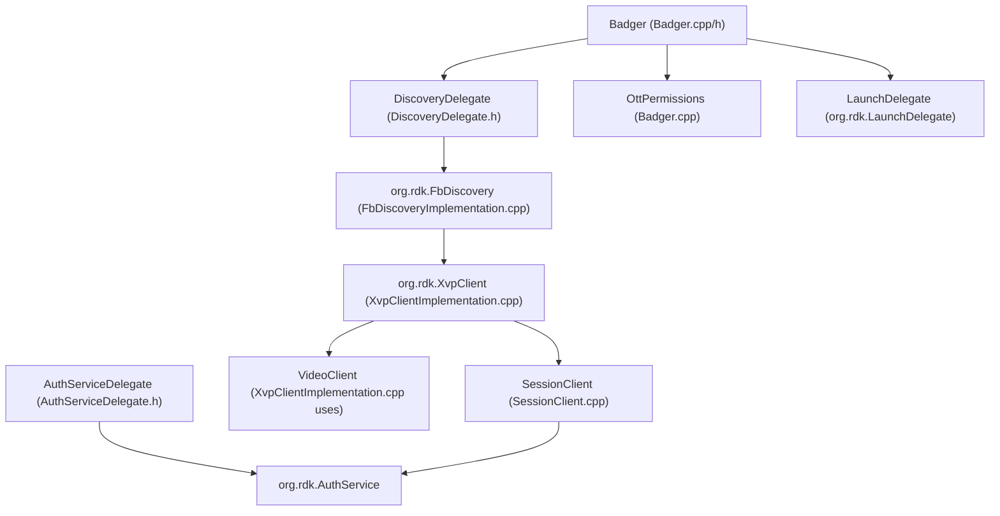
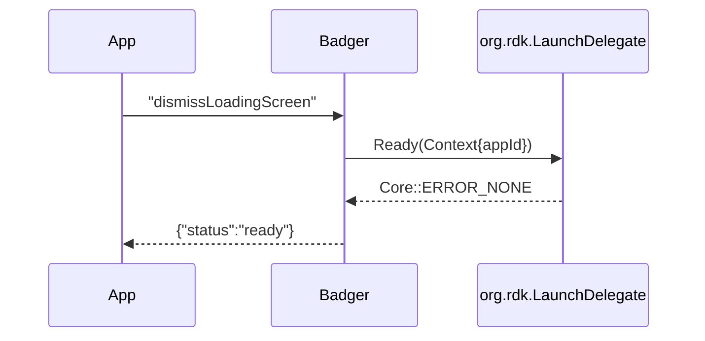
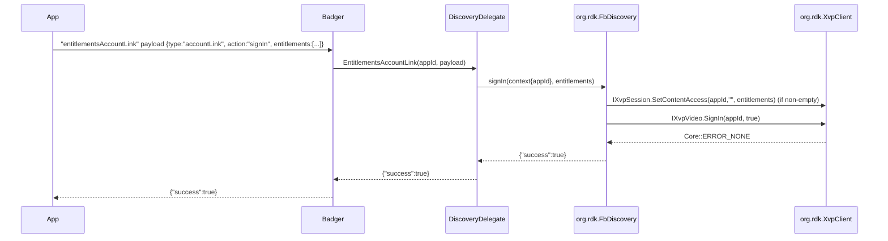
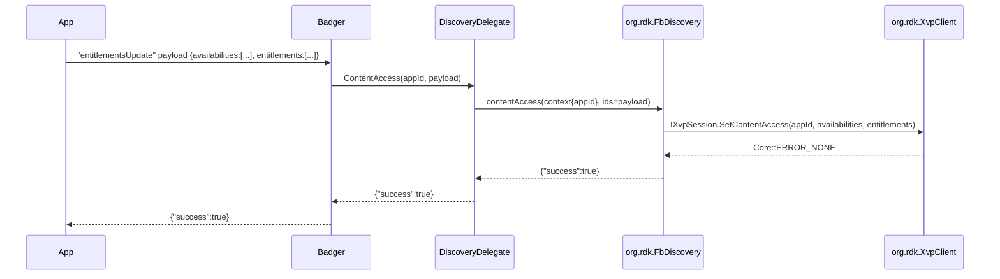

# XVP Entitlements Design for Badger in app-gateway2

## Overview

This document analyzes the app-gateway2 codebase to determine whether an existing XVP delegate can be reused for entitlement flows in the Badger plugin and specifies the design for implementing three flows: appLaunch, entitlementsAccountLink, and entitlementsUpdate. It provides scope and assumptions, a reuse vs. new delegate decision, the end-to-end architecture, detailed method signatures and payloads, data models, sequence flows, integration points, error handling and retries, configuration, security, logging/observability, testing, migration/compatibility, and a step-by-step implementation plan. All references in this document are to files under /home/kavia/workspace/code-generation/app-gateway2.

## Scope and Assumptions

- Scope
  - Implement entitlement-related methods for Badger plugin without introducing a new or.rdk plugin.
  - Cover three flows: appLaunch, entitlementsAccountLink (account link sign-in/out), and entitlementsUpdate (content access refresh with entitlements/availabilities).
- Assumptions
  - We will not add a brand-new Thunder plugin. We will reuse existing components in app-gateway2.
  - We will reuse the existing XvpClient plugin and FbDiscovery plugin’s implementation for entitlements and content access where possible.
  - We will continue using the Badger plugin’s Delegate pattern for integration with other services via JSONRPC direct links.
  - The Discovery and AccountLink integration will occur via existing callsigns:
    - org.rdk.FbDiscovery (JSONRPC)
    - org.rdk.XvpClient (interfaces: IXvpSession, IXvpVideo, IXvpPlayback)
    - org.rdk.AuthService (tokens and IDs)
    - org.rdk.LaunchDelegate (launch/ready/close)
  - The new design should not require breaking changes to public plugin callsigns or wire formats.

## Decision: Delegate Selection (Reuse vs. New)

Decision: Reuse existing delegates and plugins. A new XVP delegate is not required.

Rationale:
- FbDiscovery already implements entitlement and content access operations using XvpClient:
  - FbDiscoveryImplementation::ContentAccess parses “availabilities” and “entitlements” and calls Exchange::IXvpSession::SetContentAccess.
  - FbDiscoveryImplementation::SignIn optionally sets entitlements and calls Exchange::IXvpVideo::SignIn.
  - FbDiscoveryImplementation::ClearContentAccess calls Exchange::IXvpSession::ClearContentAccess.
  - References:
    - app-gateway/FbDiscovery/FbDiscoveryImplementation.cpp
    - app-gateway/XvpClient/Implementation/XvpClientImplementation.cpp|.h
    - app-gateway/XvpClient/Implementation/SessionClient.cpp
- Badger already wraps FbDiscovery via a DiscoveryDelegate using direct JSONRPC:
  - DiscoveryDelegate supports watched (media event), signIn, and signOut via org.rdk.FbDiscovery.
  - Badger::MediaEventAccountLink calls DiscoveryDelegate::MediaEventAccountLink.
  - Badger::EntitlementsAccountLink currently returns a static stub and can be upgraded to call DiscoveryDelegate for signIn/signOut.
  - References:
    - app-gateway/Badger/Delegate/DiscoveryDelegate.h
    - app-gateway/Badger/Badger.cpp|.h
- XvpClient provides SetContentAccess, ClearContentAccess, and SignIn via IXvpSession/IXvpVideo with robust token management and retries:
  - SessionClient::SetContentAccess and ClearContentAccess PUT to XVP endpoints, handle token renewal on 401, and map HTTP status codes to Core::hresult.
  - References:
    - app-gateway/XvpClient/Implementation/SessionClient.cpp
    - app-gateway/XvpClient/Implementation/XvpClientImplementation.cpp|.h

Conclusion: Implement entitlementsUpdate by reusing DiscoveryDelegate to invoke FbDiscovery’s ContentAccess. Implement entitlementsAccountLink by routing to DiscoveryDelegate’s SignIn/SignOut. No new XVP delegate is necessary.

## Architecture Overview

The entitlement pathway should reuse these components:

- Badger plugin:
  - Routes app gateway requests and performs permission checks.
  - Delegates Discovery/AccountLink functionality to DiscoveryDelegate (which calls org.rdk.FbDiscovery).
  - References:
    - Badger: app-gateway/Badger/Badger.cpp|.h
    - DelegateHandler: app-gateway/Badger/Delegate/DelegateHandler.h
    - DiscoveryDelegate: app-gateway/Badger/Delegate/DiscoveryDelegate.h

- FbDiscovery plugin:
  - Implements IFbDiscovery, exposing SignIn, SignOut, ContentAccess, and Watched flows.
  - Internally uses org.rdk.XvpClient interfaces (IXvpSession, IXvpVideo, IXvpPlayback).
  - References:
    - app-gateway/FbDiscovery/FbDiscoveryImplementation.cpp
    - app-gateway/FbDiscovery/FbDiscovery.h

- XvpClient plugin:
  - Provides IXvpSession::SetContentAccess/ClearContentAccess, IXvpVideo::SignIn, IXvpPlayback::PutResumePoint.
  - Handles service URLs from configuration and token retrieval via DeviceInfo.
  - References:
    - app-gateway/XvpClient/Implementation/XvpClientImplementation.cpp|.h
    - app-gateway/XvpClient/Implementation/SessionClient.cpp

Mermaid: high-level architecture


## Interfaces and Method Signatures for Entitlement Methods

This section documents relevant interfaces and proposed signatures to complete the flows.

### Existing XvpClient interfaces

- XvpClientImplementation (implements Exchange::IXvpSession and IXvpVideo):
  - SetContentAccess(appId, availabilities, entitlements)
  - ClearContentAccess(appId)
  - SignIn(appId, isSignedIn)
  - References:
    - app-gateway/XvpClient/Implementation/XvpClientImplementation.h

- SessionClient (HTTP PUT with token acquisition and retry):
  - SetContentAccess(const string& appId, const string& availabilities, const string& entitlements)
  - ClearContentAccess(const string& appId)

### Existing FbDiscovery interfaces

- FbDiscoveryImplementation:
  - ContentAccess(Context, idsJson) → parses “availabilities” and “entitlements” arrays and calls IXvpSession::SetContentAccess.
  - SignIn(Context, entitlements, success) → optionally SetContentAccess then IXvpVideo::SignIn(true).
  - SignOut(Context, success) → IXvpVideo::SignIn(false).
  - Watched(Context, entityId, progress, completed, watchedOn, success) → IXvpPlayback::PutResumePoint.
  - References:
    - app-gateway/FbDiscovery/FbDiscoveryImplementation.cpp|.h

### Existing Badger DiscoveryDelegate interfaces

- DiscoveryDelegate (JSONRPC direct link to org.rdk.FbDiscovery):
  - MediaEventAccountLink(appId, payloadJson, resultJson) → invokes “watched”.
  - SignIn(appId, entitlements, success) → invokes “signIn”.
  - SignOut(appId, success) → invokes “signOut”.
  - EntitlementsAccountLink(appId, payloadJson, resultJson) → routes accountLink signIn/signOut to the above.
  - References:
    - app-gateway/Badger/Delegate/DiscoveryDelegate.h

### Proposed additions

- DiscoveryDelegate: add ContentAccess to call FbDiscovery “contentAccess”
```cpp
// app-gateway/Badger/Delegate/DiscoveryDelegate.h  (proposed addition)
uint32_t ContentAccess(const std::string& appId, const std::string& payload, std::string& result) {
    auto link = DelegateUtils::AcquireLink(_shell, FB_DISCOVERY_CALLSIGN);
    if (!link) {
        LOGWARN("Discovery link unavailable");
        result = "{}";
        return Core::ERROR_UNAVAILABLE;
    }

    JsonObject params;
    JsonObject response;
    JsonObject context;
    context["appId"] = appId;
    params["context"] = context;

    // FbDiscoveryImplementation::ContentAccess expects "ids" string with arrays inside
    params["ids"] = payload; // payload should contain {"availabilities":[...], "entitlements":[...]}

    uint32_t rc = link->Invoke<JsonObject, JsonObject>(_T("contentAccess"), params, response);
    if (rc != Core::ERROR_NONE) {
        LOGERR("contentAccess RPC failed, rc=%u", rc);
        result = "{}";
        return rc;
    }
    response.ToString(result);
    return Core::ERROR_NONE;
}
```

- Badger: new handler method and payload mapping for entitlementsUpdate
```cpp
// app-gateway/Badger/Badger.h (proposed addition)
uint32_t EntitlementsUpdate(const std::string& appId, const std::string& payload, std::string& result);
```

```cpp
// app-gateway/Badger/Badger.cpp (proposed addition)
uint32_t Badger::EntitlementsUpdate(const std::string& appId, const std::string& payload, std::string& result) {
    // Permission gate (proposed; adjust to your registry):
    // API_AccountLinkService_entitlementsUpdate
    uint32_t rc = ValidateCachedPermission(appId, "API_AccountLinkService_entitlementsUpdate");
    if (rc != Core::ERROR_NONE) {
        return rc;
    }
    if (!mDelegate) return Core::ERROR_UNAVAILABLE;
    auto discovery = mDelegate->getDiscoveryDelegate();
    if (!discovery) return Core::ERROR_UNAVAILABLE;

    // payload: {"availabilities":[...], "entitlements":[...]}
    uint32_t res = discovery->ContentAccess(appId, payload, result);
    if (res != Core::ERROR_NONE) {
        LOGERR("DiscoveryDelegate::ContentAccess failed");
    }
    return res;
}
```

- Badger::HandleAppGatewayRequest: add mapping for “entitlementsUpdate”
```cpp
// app-gateway/Badger/Badger.cpp (proposed addition in payloadHandlers map)
{ "entitlementsUpdate", [this](const std::string& appId, const std::string& p, std::string& r) {
    return EntitlementsUpdate(appId, p, r);
}},
```

Notes:
- Method names in JSONRPC (“contentAccess”) match the implementation name in FbDiscovery (ContentAccess). This is consistent with existing calls (“watched”, “signIn”, “signOut”) used in DiscoveryDelegate.
- Do not introduce a new org.rdk.* plugin; reuse org.rdk.FbDiscovery which already routes to XvpClient.

## Data Models

### Entitlements and Availabilities payloads

- For entitlementsAccountLink (accountLink):
  - When action == "signIn":
    - payload can include an “entitlements” JSON array (optional). If provided and non-empty, FbDiscoveryImplementation::SignIn invokes SetContentAccess with entitlements prior to SignIn(true).
  - When action == "signOut":
    - no arrays required; SignIn(false) is invoked.
  - Reference: app-gateway/Badger/Delegate/DiscoveryDelegate.h (EntitlementsAccountLink routes signIn/signOut)

- For entitlementsUpdate:
  - payload JSON object:
    - availabilities: JSON array (optional)
    - entitlements: JSON array (optional)
  - This payload is placed under the “ids” field for FbDiscovery.contentAccess:
    - params: { context: {appId}, ids: "<stringified JSON with arrays>" }
  - Reference: app-gateway/FbDiscovery/FbDiscoveryImplementation.cpp::ContentAccess

### Device and account identifiers used by XVP

- SessionClient builds URLs with:
  - partnerId, accountId, deviceId, clientId (“ripple”)
  - Path: /partners/{partnerId}/accounts/{accountId}/appSettings/{appId}?deviceId={deviceId}&clientId={clientId}
- Values obtained via DeviceInfo (AuthService calls, tokens).
- Reference: app-gateway/XvpClient/Implementation/SessionClient.cpp

## Control and Sequence Flows

### appLaunch

At app launch, Badger may need to mark the app “ready” via LaunchDelegate (not strictly entitlement, but a related flow).



References:
- app-gateway/Badger/Badger.cpp::DismissLoadingScreen

### entitlementsAccountLink (signIn / signOut)



SignOut is similar but calls IXvpVideo.SignIn(appId, false). References:
- app-gateway/Badger/Delegate/DiscoveryDelegate.h::SignIn/SignOut/EntitlementsAccountLink
- app-gateway/FbDiscovery/FbDiscoveryImplementation.cpp

### entitlementsUpdate (content access refresh)



References:
- app-gateway/FbDiscovery/FbDiscoveryImplementation.cpp::ContentAccess
- app-gateway/XvpClient/Implementation/SessionClient.cpp

## Integration Points

- Ripple EOS (reference implementation/tests of discovery and entitlements logic exist in Supporting_Files/ripple-eos):
  - Supporting_Files/ripple-eos/src/client/xvp_session.rs (builds URLs, manages content access)
  - Supporting_Files/ripple-eos/src/rpc/eos_discovery_rpc.rs (Discovery RPC methods incl. signIn, content access)
  - The C++ side mirrors core behavior via XvpClient and FbDiscovery.
- AccountLink and Discovery:
  - org.rdk.FbDiscovery is the gateway for signIn/signOut/contentAccess and abstracts XVP calls.
  - Badger routes to FbDiscovery through DiscoveryDelegate with JSONRPC direct link.

## Error Handling and Retries

- SessionClient::ProcessPut (SetContentAccess, ClearContentAccess):
  - Retrieves token via DeviceInfo; on HTTP 401, reacquires token and retries once.
  - Status code mapping:
    - 404 → Core::ERROR_UNAVAILABLE
    - 400 → Core::ERROR_NOT_SUPPORTED
    - 0 → Core::ERROR_UNREACHABLE_NETWORK
    - else → Core::ERROR_GENERAL
- DiscoveryDelegate methods return Core::ERROR_UNAVAILABLE if links are not available; Badger should relay errors or return fallback as needed.
- Badger’s permission checks via OttPermissions are enforced before invoking delegates. Reference: Badger.cpp::ValidateCachedPermission.

## Configuration and Environment Variables

- AppGateway server socket (Node wrapper in this container):
  - APPGATEWAY_SOCKET_ADDRESS=0.0.0.0:3473
- Default resolver config:
  - DEFAULT_CONFIG_PATH=/etc/app-gateway/resolution.base.json
- XvpClient service URLs:
  - XvpClientImplementation reads PLUGIN_PRODUCT_CFG for JSON with:
    - xvp_xifa_service.url
    - xvp_playback_service.url
    - xvp_video_service.url
    - xvp_session_service.url
  - Reference: app-gateway/XvpClient/Implementation/XvpClientImplementation.cpp

Example XvpClient config JSON (illustrative):
```json
{
  "xvp_xifa_service": { "url": "https://xvp.example/xifa" },
  "xvp_playback_service": { "url": "https://xvp.example/playback" },
  "xvp_video_service": { "url": "https://xvp.example/video" },
  "xvp_session_service": { "url": "https://xvp.example/session" }
}
```

## Security Considerations

- Permission gating:
  - Badger validates permissions via OttPermissions before servicing requests (ValidateCachedPermission).
  - Existing permission examples:
    - "API_AccountLinkService_mediaEventAccountLink" for mediaEventAccountLink.
  - For entitlements flows:
    - entitlementsAccountLink: gate with a corresponding “API_AccountLinkService_entitlementsAccountLink”.
    - entitlementsUpdate: gate with “API_AccountLinkService_entitlementsUpdate”.
- Token security:
  - XvpClient obtains service access tokens through DeviceInfo and org.rdk.AuthService, does not expose tokens beyond internal use.
- Input validation:
  - Parse payloads defensively. Treat missing/invalid arrays as empty. Avoid crashes when arrays are absent or malformed.
- Callsign isolation:
  - Ensure JSONRPC calls are only to expected callsigns (org.rdk.FbDiscovery). Fail closed if unavailable.

## Logging and Observability

- Use UtilsLogging macros (LOGINFO/LOGWARN/LOGERR/LOGTRACE) consistently in Badger, DiscoveryDelegate, and FbDiscovery to aid tracing.
- Log method calls with appId, presence of arrays, and high-level status (avoid logging tokens or PII).
- Emit metrics via MetricsDelegate (optional) for success/failure counts of entitlement updates and account link operations.

## Testing Strategy

- Unit tests:
  - Validate Badger payload mapping for entitlementsUpdate and entitlementsAccountLink:
    - Payload parsing (missing/empty entitlements/availabilities).
    - Permission gates enforced with stubbed OttPermissions.
  - DiscoveryDelegate: mock JSONRPC link, verify method names (“contentAccess”, “signIn”, “signOut”) and params schema.
- Integration tests:
  - With org.rdk.FbDiscovery and org.rdk.XvpClient running, verify:
    - entitlementsAccountLink signIn with non-empty entitlements updates XVP and signs in.
    - signOut sets sign-in false.
    - entitlementsUpdate applies SetContentAccess availabilities/entitlements and returns success.
- Contract tests (optional reference):
  - Supporting_Files/ripple-eos/tests/appsanity_discovery_pacts.rs provides Pact-style tests for content access in the Rust reference; use as behavioral reference.

## Migration and Compatibility

- Current behavior:
  - Badger::EntitlementsAccountLink returns a static stub response.
- After migration:
  - Badger::EntitlementsAccountLink routes to DiscoveryDelegate::EntitlementsAccountLink to call FbDiscovery signIn/signOut and, if supplied, entitlements informs SetContentAccess.
  - New Badger::EntitlementsUpdate calls DiscoveryDelegate::ContentAccess with availabilities/entitlements arrays.
- Compatibility:
  - Method names on the Badger side remain as currently exposed over the app gateway. Only internal routing changes.
  - If org.rdk.FbDiscovery or org.rdk.XvpClient are unavailable, methods fail gracefully with Core::ERROR_UNAVAILABLE and safe response defaults.
  - No new or.rdk plugin introduced.

## Step-by-Step Implementation Plan

1. Implement entitlementsUpdate in Badger
   - Add method:
     - uint32_t EntitlementsUpdate(const std::string& appId, const std::string& payload, std::string& result);
   - Register payload handler mapping in Badger::HandleAppGatewayRequest:
     - "entitlementsUpdate" → EntitlementsUpdate
   - Permission check in EntitlementsUpdate using OttPermissions, e.g. "API_AccountLinkService_entitlementsUpdate".
   - Files:
     - app-gateway/Badger/Badger.h
     - app-gateway/Badger/Badger.cpp

2. Extend DiscoveryDelegate with ContentAccess
   - Add ContentAccess(appId, payload, result) calling org.rdk.FbDiscovery method "contentAccess" with:
     - params: { context: { appId }, ids: payload }
   - Files:
     - app-gateway/Badger/Delegate/DiscoveryDelegate.h

3. Wire up EntitlementsAccountLink to real flows
   - In Badger::EntitlementsAccountLink, parse payload for type "accountLink" and action "signIn" or "signOut".
   - Call DiscoveryDelegate::SignIn(entitlements)/SignOut().
   - Remove the current static stub; return FbDiscovery’s success value.
   - Files:
     - app-gateway/Badger/Badger.cpp

4. Validate FbDiscovery behavior
   - Confirm FbDiscoveryImplementation::ContentAccess parses “availabilities” and “entitlements”.
   - Confirm SignIn and SignOut calls are as expected.
   - Files:
     - app-gateway/FbDiscovery/FbDiscoveryImplementation.cpp

5. Confirm XvpClient configuration and network paths
   - Ensure PLUGIN_PRODUCT_CFG config contains xvp_*_service URLs for session/video.
   - Files:
     - app-gateway/XvpClient/Implementation/XvpClientImplementation.cpp
     - app-gateway/XvpClient/Module.h (macro presence)

6. Error handling and logging
   - Propagate Core::hresult from DiscoveryDelegate and FbDiscovery methods back to Badger.
   - Use LOGINFO/LOGERR for tracing at each boundary.

7. Testing
   - Unit-test Badger methods for payloads and permission checks (mock OttPermissions).
   - Unit-test DiscoveryDelegate JSONRPC calls using mock links.
   - Optional integration with FbDiscovery/XvpClient if test harness available.

## Appendix: Reference File Paths

- Badger plugin:
  - app-gateway/Badger/Badger.cpp
  - app-gateway/Badger/Badger.h
  - app-gateway/Badger/Delegate/DelegateHandler.h
  - app-gateway/Badger/Delegate/DiscoveryDelegate.h
  - app-gateway/Badger/Delegate/AuthServiceDelegate.h

- FbDiscovery plugin:
  - app-gateway/FbDiscovery/FbDiscoveryImplementation.cpp
  - app-gateway/FbDiscovery/FbDiscovery.h

- XvpClient plugin:
  - app-gateway/XvpClient/Implementation/XvpClientImplementation.cpp
  - app-gateway/XvpClient/Implementation/XvpClientImplementation.h
  - app-gateway/XvpClient/Implementation/SessionClient.cpp
  - app-gateway/XvpClient/Module.h

- Interfaces:
  - app-gateway/interfaces/IAppGateway.h
