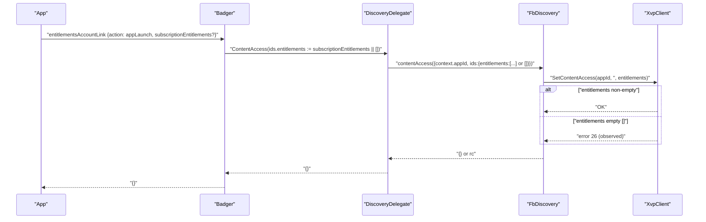
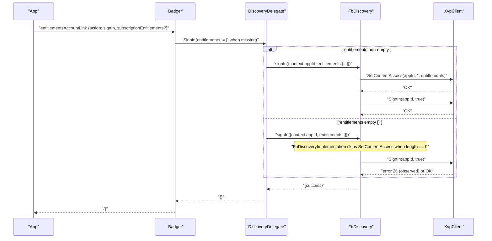
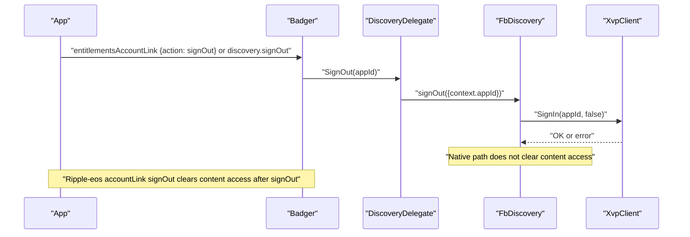
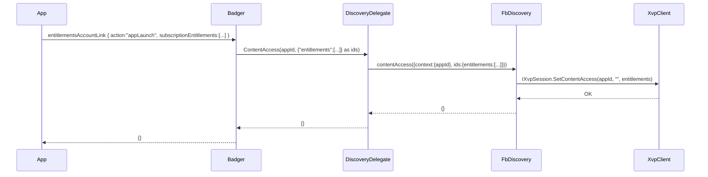
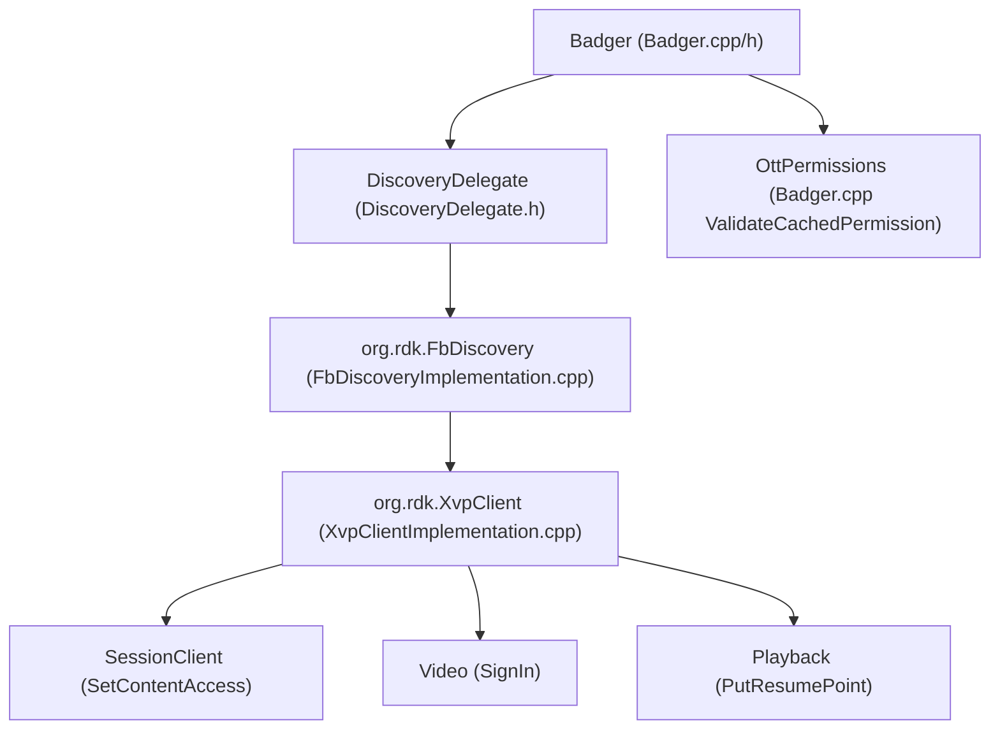

# Entitlements and XVP Delegate Design for Badger in app-gateway2

## Overview

This document analyzes the app-gateway2 codebase to determine whether to reuse an existing delegate or create a new one for XVP integration in the Badger plugin, and provides a detailed design for entitlement-related JSON-RPC methods. It also includes an updated runtime reconciliation between the ripple-eos (Rust) helpers and the native DiscoveryDelegate/FbDiscovery implementation, based on observed logs.

- Delegate decision: reuse vs. new
- JSON-RPC contracts for:
  - badger.entitlementsAccountLink
  - badger.mediaEventAccountLink
  - badger.launchpadAccountLink
- Data models and mapping to XVP schemas
- Architecture and sequence flows with integration points to XvpClient, Privacy, and DeviceBridge-related components
- Error handling, retries, idempotency
- Logging/observability and configuration
- Backward compatibility and migration
- Concrete file-level change plan in the Badger plugin
- Testing strategy (unit, integration, and end-to-end via JSON-RPC)
- New: runtime behavior of appLaunch/signIn/signOut when entitlements are present vs. missing, and error 26 callouts

All file references below are under app-gateway2/.

## Change Summary (this update)

Wired new routing paths from Badger to FbDiscovery (which calls XvpClient) and aligned return shapes for the affected JSON-RPC methods:

- app-gateway/Badger/Delegate/DiscoveryDelegate.h
  - Added PUBLIC_INTERFACE helpers: ContentAccess(appId, idsPayload), WatchNext(appId, contentId), Watched(appId, entityId, progress, completed, watchedOn)
  - Updated MediaEventAccountLink to:
    - event.completed true → FbDiscovery.watchNext (maps to Watched with progress=1.0)
    - event.completed false → FbDiscovery.watched with progress passed through (no normalization)
  - SignIn always includes an entitlements array in the payload; if none is provided it becomes an empty list.
  - All the above return {} on success.

- app-gateway/Badger/Badger.cpp
  - entitlementsAccountLink:
    - action:"appLaunch" → DiscoveryDelegate.ContentAccess (maps subscriptionEntitlements → ids.entitlements); returns {}
    - type:"entitlementsUpdate" → DiscoveryDelegate.ContentAccess; returns {}
    - action:"signIn" → DiscoveryDelegate.SignIn (passes entitlements array if present; otherwise normalizes to []); returns {}
    - action:"signOut" → DiscoveryDelegate.SignOut; returns {}
  - launchpadAccountLink now accepts payload and routes launchpadTile.contentId → DiscoveryDelegate.WatchNext; returns {}
  - HandleAppGatewayRequest updated to treat launchpadAccountLink as a payload method

- app-gateway/Badger/Badger.h
  - LaunchpadAccountLink signature updated to accept payload (for launchpadTile.contentId)

- Note: XvpClient has no dedicated appLaunch endpoint; we use FbDiscovery.contentAccess (SetContentAccess via IXvpSession) to implement appLaunch behavior.

These changes do not alter unrelated behavior.

## Current status

- XvpClient:
  - There is no dedicated “appLaunch” API.
  - XvpClient supports SetContentAccess(appId, availabilities, entitlements) via IXvpSession.
  - SignIn/SignOut is supported via IXvpVideo::SignIn (VideoClient::SignIn PUT to videoServices engaged URL).
  - Media progress (“watched”/resume points) is supported via IXvpPlayback::PutResumePoint.
- Badger::EntitlementsAccountLink:
  - appLaunch and entitlementsUpdate route to FbDiscovery.contentAccess; signIn routes to FbDiscovery.signIn; signOut routes to FbDiscovery.signOut.
- DiscoveryDelegate::MediaEventAccountLink:
  - Supports event.completed routing (watchNext when true; watched when false), passing progress values as-is.
- FbDiscoveryImplementation:
  - ContentAccess calls XvpSession::SetContentAccess. SignIn will invoke XvpSession::SetContentAccess only when the entitlements array length is greater than zero, and it always calls VideoClient::SignIn(context.appId, true).

Conclusion:
- appLaunch and entitlementsUpdate call FbDiscovery.contentAccess even when entitlements are missing, because Badger builds ids.entitlements to an empty array.
- signIn routes to FbDiscovery.signIn. An entitlements array is always included in the JSON params (empty when not provided), but FbDiscoveryImplementation::SignIn only calls SetContentAccess for non-empty entitlements before calling XVP sign-in.
- mediaEventAccountLink and launchpadAccountLink are wired to FbDiscovery (watched/watchNext).
- All affected methods return {} on success.

## Runtime behavior: badger.entitlementsAccountLink (appLaunch, signIn, signOut)

### Overview

Observed logs show that, in the native path, missing entitlements are normalized to an empty array in the JSON payload. As a result, appLaunch will still send a contentAccess call containing "entitlements": [], and signIn will still include "entitlements": [] in the request body. This aligns with the DiscoveryDelegate implementation where empty lists are explicitly serialized when the caller did not provide entitlements.

### Key findings from logs

- When no entitlements are provided, the native path normalizes to {"entitlements": []}.
- appLaunch:
  - Badger builds ids.entitlements from subscriptionEntitlements and passes it to DiscoveryDelegate.ContentAccess; if not present, this becomes an empty array.
  - FbDiscovery.contentAccess forwards to XvpSession::SetContentAccess. This can fail downstream; logs included cases with rc=26.
- signIn:
  - DiscoveryDelegate.SignIn always includes entitlements: [] when the caller does not specify entitlements.
  - FbDiscoveryImplementation::SignIn only calls SetContentAccess if the entitlements array has at least one entry; it still proceeds to VideoClient::SignIn (engaged URL PUT). In the provided logs, this failed with rc=26 due to a URL issue or downstream rejection.
- signOut:
  - Native discovery.signOut calls XVP VideoClient::SignIn(appId, false). Unlike the ripple-eos accountLink signOut, the native discovery.signOut does not clear content access unless explicitly requested via a separate clearContentAccess call.

### Behavior by action

- appLaunch:
  - No entitlements provided:
    - Badger builds ids.entitlements as an empty array.
    - DiscoveryDelegate.ContentAccess calls FbDiscovery.contentAccess with ids.entitlements = [].
    - FbDiscoveryImplementation.ContentAccess calls XvpSession::SetContentAccess with entitlements: [].
    - This is not a no-op; the downstream call can fail (e.g., rc=26).
  - With entitlements provided:
    - Entries are mapped and forwarded to SetContentAccess; optional start/end timestamps are normalized to ISO8601 Z if present.

- signIn:
  - No entitlements provided:
    - DiscoveryDelegate.SignIn includes entitlements: [] in params.
    - FbDiscoveryImplementation::SignIn will skip SetContentAccess because the length is zero, and proceeds to VideoClient::SignIn (engaged URL PUT).
    - In logs, this failed with rc=26 due to a bad or missing URL or downstream rejection.
  - With entitlements provided (non-empty array):
    - FbDiscoveryImplementation::SignIn first calls SetContentAccess with the provided entitlements and then invokes VideoClient::SignIn.
    - On success, the platform may emit discovery.onSignIn via the ripple-eos path; native Badger does not emit app events here.

- signOut:
  - Native discovery.signOut:
    - Performs sign-out by calling VideoClient::SignIn(appId, false).
    - Does not clear content access automatically.
  - Ripple-eos accountLink signOut path:
    - Performs sign-out and clears content access via DiscoveryService::clear_content_access.

### Ripple-eos (Rust) helper vs native DiscoveryDelegate/FbDiscovery

- ripple-eos (rust) helpers:
  - signIn: only calls content access if entitlements are Some(..). If None, it proceeds to signIn without content-access.
  - signOut: the accountLink signOut path first toggles sign-in state and then clears content access.
  - appLaunch: treated as entitlements update (content access).
- native pathway:
  - DiscoveryDelegate normalizes to empty arrays:
    - signIn always includes "entitlements": [] in the JSON params. FbDiscoveryImplementation::SignIn does not call SetContentAccess for empty arrays.
    - appLaunch always constructs ids.entitlements (empty array if not provided) and calls contentAccess.
  - signOut only toggles sign-in state; it does not clear content access unless explicitly requested.

### Observed errors

- error 26 observed on downstream calls in two patterns:
  - contentAccess with ids {"entitlements": []}: XVP SetContentAccess returned rc=26 in logs.
  - signIn engaged URL call: VideoClient::SignIn PUT failed with rc=26; separate logs indicated curl_easy_perform failed due to a bad/illegal format or missing URL.
- Code locations relevant to URL construction and PUT semantics:
  - XvpClient SessionClient::SetContentAccess constructs PUT to: {base}/partners/{partnerId}/accounts/{accountId}/appSettings/{appId}?deviceId={deviceId}&clientId={clientId}
  - XvpClient VideoClient::SignIn constructs PUT to: {base}/partners/{partnerId}/accounts/{accountId}/videoServices/xrn:xvp:application:{appId}/engaged?ownerReference=xrn:xcal:subscriber:{scope}:{id}&clientId={clientId}
  - If any of base URL, partnerId, accountId, deviceId, or appId is missing or malformed, curl may report URL format errors or downstream rc values.

### Recommendations

- If “empty entitlements” should be a true no-op:
  - Add a guard in Badger before calling DiscoveryDelegate.ContentAccess to skip contentAccess when subscriptionEntitlements is missing or empty, if policy allows.
- Alternatively:
  - Ensure XVP services tolerate entitlements: [] as a valid idempotent refresh, or require clients to always pass entitlements when invoking appLaunch/signIn.
- Investigate engaged URL construction in VideoClient::SignIn and service tokens:
  - Confirm base URL presence and correctness.
  - Validate partner/account/device IDs and clientId.
  - Check token validity and scope.
- If parity with ripple-eos signOut is required:
  - Add an explicit FbDiscovery.clearContentAccess call in the signOut pathway, or expose a composite “accountLink signOut” that mirrors the eos behavior.

### Sequence diagrams (concise)

appLaunch (entitlements present vs. missing)

signIn (entitlements present vs. missing)

signOut (native vs. ripple-eos accountLink variant)

### Answers to direct questions

- Does eos_discovery_rpc.rs just return true with no operation when entitlements are missing?
  - Partially. In Rust, signIn calls content access only if entitlements are Some(..); otherwise it proceeds to sign-in. In your native runtime, SignIn JSON always includes an entitlements array, but FbDiscoveryImplementation::SignIn skips SetContentAccess when the array is empty and still calls XVP sign-in.
- Is it the same in DiscoveryDelegate.h?
  - No. DiscoveryDelegate explicitly serializes entitlements to an array (empty if missing) for SignIn and builds ids.entitlements (empty if missing) for ContentAccess. appLaunch and entitlementsUpdate therefore always invoke contentAccess; SignIn always attempts sign-in and includes entitlements: [] in the request body.
- Sign-in/sign-out with and without entitlements:
  - Sign-in: with entitlements → SetContentAccess then SignIn; without entitlements → skip SetContentAccess, but still attempt SignIn with entitlements: [] in the JSON.  
  - Sign-out: native discovery.signOut toggles sign-in state only; it does not clear content access unless invoked separately. ripple-eos accountLink signOut toggles sign-in and clears content access.

## How appLaunch maps to XVP

- appLaunch is an account-link signal that triggers a refresh of the app’s content access on startup (idempotent).
- Implementation mapping:
  - Map appLaunch to FbDiscovery.contentAccess.
  - FbDiscovery.contentAccess calls IXvpSession::SetContentAccess(appId, availabilities, entitlements).
  - No sign-in/out is implied by appLaunch; it is purely a content access refresh.
  - The payload forwarded includes subscription entitlements (and optionally availabilities) as provided by the client; when absent, this becomes an empty array.

## To enable appLaunch (routing steps)

- Update Badger::EntitlementsAccountLink routing:
  - If type:"accountLink" and action:"signIn" → DiscoveryDelegate.SignIn
  - If type:"accountLink" and action:"signOut" → DiscoveryDelegate.SignOut
  - If action:"appLaunch" OR type:"entitlementsUpdate" → DiscoveryDelegate.ContentAccess (forward entitlements/availabilities)
- Implement DiscoveryDelegate.ContentAccess(appId, idsPayload) to invoke org.rdk.FbDiscovery.contentAccess with:
  - { context:{ appId }, ids: payload }
  - payload carries entitlements and/or availabilities in the “ids” field, preserving the client-provided arrays (empty if missing).
- FbDiscoveryImplementation remains the bridge to XVP.

## Comparison with ripple-eos (parity gaps)

- appLaunch:
  - ripple-eos treats appLaunch as an entitlements update (SetContentAccess).
  - Native path matches via FbDiscovery.contentAccess, always materializing ids.entitlements (possibly empty).
- signIn/signOut:
  - ripple-eos emits discovery.onSignIn/onSignOut and clears content access on accountLink signOut.
  - Native signOut does not clear content access; parity requires an explicit clearContentAccess call.
- Media events:
  - ripple-eos can normalize progressUnits; native passes values as-is.
- Privacy/data governance:
  - ripple-eos integrates explicit privacy/data governance decisions for watched events; not part of the native path here.

## Sequence: appLaunch flow (reference)

## JSON-RPC API Contracts

### badger.entitlementsAccountLink

- Account link sign-in with optional immediate entitlement update
  - { "type": "accountLink", "action": "signIn", "subscriptionEntitlements": [ { "id": "<ent_id>", "startDate"?: <epochSec>, "endDate"?: <epochSec> } ] }
  - Result: {}
  - Flow: Badger → DiscoveryDelegate.SignIn → FbDiscovery.signIn → XVP: optional SetContentAccess, then SignIn(true)

- Account link sign-out
  - { "type": "accountLink", "action": "signOut" }
  - Result: {}
  - Flow: Badger → DiscoveryDelegate.SignOut → FbDiscovery.signOut → XVP: SignIn(false) (no automatic clearContentAccess)

- App launch entitlement update
  - { "action": "appLaunch", "subscriptionEntitlements": [ { "id": "<ent_id>", "startDate"?: <epochSec>, "endDate"?: <epochSec> } ] }
  - Result: {}
  - Flow: Badger → DiscoveryDelegate.ContentAccess → FbDiscovery.contentAccess → XVP: SetContentAccess

- Explicit entitlements update
  - { "type": "entitlementsUpdate", "subscriptionEntitlements": [ { "id": "<ent_id>", "startDate"?: <epochSec>, "endDate"?: <epochSec> } ] }
  - Result: {}
  - Flow: Badger → DiscoveryDelegate.ContentAccess → FbDiscovery.contentAccess → XVP: SetContentAccess

### badger.mediaEventAccountLink

- Payload:
  - { "event": { "contentId": "<entity-uri-or-id>", "completed": true|false, "progress"?: <float>, "progressUnits"?: "seconds" | "percent" } }
- Result: {}
- Behavior:
  - completed true → DiscoveryDelegate.WatchNext (calls FbDiscovery.watchNext; maps to Watched with progress=1.0)
  - completed false → DiscoveryDelegate routes to FbDiscovery.watched with progress passed as-is (no normalization)
  - No errors on missing optional fields; returns {}.

### badger.launchpadAccountLink

- Payload:
  - { "launchpadTile": { "contentId": "<entity-id>" } }
- Result: {}
- Behavior:
  - Maps launchpadTile.contentId → DiscoveryDelegate.WatchNext (FbDiscovery.watchNext → Watched with progress=1.0).

## Architecture

High-level integration:

## Error Handling, Retries, and Idempotency

- XvpClient retries on 401 for PUTs.
- appLaunch/contentAccess with entitlements: [] is not a no-op; downstream can reject or return rc=26.
- VideoClient::SignIn relies on the engaged URL; malformed URLs or missing identifiers can cause curl errors.
- Idempotent intent:
  - contentAccess with the same state should be idempotent on the server side; confirm expectations with the XVP service team.

## Logging and Observability

- LOGINFO/WARN/ERR at each boundary (DiscoveryDelegate, FbDiscoveryImplementation, SessionClient, VideoClient).
- Add targeted logs around URL construction and payloads to catch malformed input prior to PUT.

## Configuration

- XvpClient endpoints via product config (unchanged). Ensure partner/account/device/client identifiers are resolvable at runtime.

## Backward Compatibility and Migration

- SignOut in the native path does not clear content access. If parity with the ripple-eos accountLink signOut behavior is required, add an explicit clearContentAccess call.
- Newly wired methods return {} as specified.

## Testing Strategy

- Validate that:
  - entitlementsAccountLink: appLaunch and entitlementsUpdate → FbDiscovery.contentAccess; result {}.
  - entitlementsAccountLink: signIn → FbDiscovery.signIn; with non-empty entitlements: SetContentAccess then SignIn; with empty entitlements: skip SetContentAccess and still attempt SignIn.
  - mediaEventAccountLink: event.completed true → watchNext; else → watched; result {}.
  - launchpadAccountLink: watchNext; result {}.
- Negative tests:
  - Empty entitlements arrays for contentAccess and engaged URL; confirm rc behaviors (e.g., 26), and verify logging.

## Interfaces and Method Signatures

- FbDiscoveryImplementation (JSON-RPC exposed)
  - ContentAccess(const IFbDiscovery::Context&, const string& ids)
  - SignIn(const IFbDiscovery::Context&, const string& entitlements, bool& success)
  - SignOut(const IFbDiscovery::Context&, bool& success)
  - Watched(const IFbDiscovery::Context&, const string& entityId, double progress, bool completed, const string& watchedOn, bool& success)
  - WatchNext(...) → internally calls Watched with progress=1.0
- DiscoveryDelegate (Badger internal)
  - NEW: ContentAccess(appId, idsPayload)
  - NEW: WatchNext(appId, contentId)
  - NEW: Watched(appId, entityId, progress, completed, watchedOn)
  - UPDATED: MediaEventAccountLink parses event payload and routes to watchNext/watched
  - SignIn/SignOut unchanged
- Badger
  - entitlementsAccountLink now routes appLaunch/type:entitlementsUpdate/signIn as described; returns {}
  - launchpadAccountLink moved to payload method; routes to WatchNext; returns {}
  - mediaEventAccountLink unchanged signature; returns {}

## Integration Points

- XvpClient:
  - SetContentAccess (no dedicated appLaunch); called via FbDiscovery.contentAccess
  - SignIn/SignOut via IXvpVideo::SignIn
  - PutResumePoint via IXvpPlayback

## Error Handling, Retries, and Idempotency

- XvpClient retries on 401 for PUTs
- DiscoveryDelegate returns {} on success; unavailable links/logging handled
- Idempotent ContentAccess PUTs

## Logging and Observability

- LOGINFO/WARN/ERR maintained at each boundary

## Configuration

- XvpClient endpoints via product config (unchanged)

## Backward Compatibility and Migration

- SignOut in entitlementsAccountLink left unchanged per requirements
- Newly wired methods return {} as specified

## Testing Strategy

- Validate that:
  - entitlementsAccountLink: appLaunch and entitlementsUpdate → FbDiscovery.contentAccess; result {}
  - entitlementsAccountLink: signIn → FbDiscovery.signIn; result {}
  - mediaEventAccountLink: event.completed true → watchNext; else → watched; result {}
  - launchpadAccountLink: watchNext; result {}
- No unrelated behavior changed
