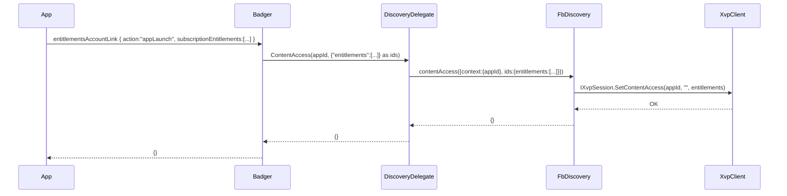
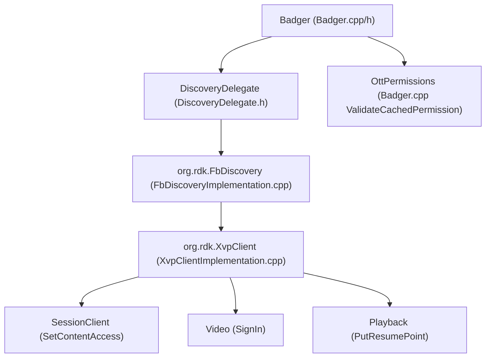

# Entitlements and XVP Delegate Design for Badger in app-gateway2

## Overview

This document analyzes the app-gateway2 codebase to determine whether to reuse an existing delegate or create a new one for XVP integration in the Badger plugin, and provides a detailed design for the entitlement-related JSON-RPC methods. The design covers:

- Delegate decision: reuse vs. new
- JSON-RPC contracts for:
  - badger.entitlementsAccountLink
  - badger.mediaEventAccountLink
  - badger.launchpadAccountLink
- Data models and mapping to XVP schemas
- Architecture and sequence flows with integration points to XvpClient, Privacy, and DeviceBridge-related components
- Error handling, retries, idempotency
- Logging/observability and configuration
- Backward compatibility and migration
- Concrete file-level change plan in the Badger plugin
- Testing strategy (unit, integration, and end-to-end via JSON-RPC)

All file references below are under app-gateway2/.

## Change Summary (this update)

Wired new routing paths from Badger to FbDiscovery (which calls XvpClient) and aligned return shapes for the affected JSON-RPC methods:

- app-gateway/Badger/Delegate/DiscoveryDelegate.h
  - Added PUBLIC_INTERFACE helpers: ContentAccess(appId, idsPayload), WatchNext(appId, contentId), Watched(appId, entityId, progress, completed, watchedOn)
  - Updated MediaEventAccountLink to:
    - event.completed true → FbDiscovery.watchNext (maps to Watched with progress=1.0)
    - event.completed false → FbDiscovery.watched with progress passed through (no normalization)
  - All above return {} on success as required

- app-gateway/Badger/Badger.cpp
  - entitlementsAccountLink:
    - action:"appLaunch" → DiscoveryDelegate.ContentAccess (maps subscriptionEntitlements → ids.entitlements); returns {}
    - type:"entitlementsUpdate" → DiscoveryDelegate.ContentAccess; returns {}
    - action:"signIn" → DiscoveryDelegate.SignIn (passes entitlements if present); returns {}
    - action:"signOut" path left unchanged
  - launchpadAccountLink now accepts payload and routes launchpadTile.contentId → DiscoveryDelegate.WatchNext; returns {}
  - HandleAppGatewayRequest updated to treat launchpadAccountLink as a payload method

- app-gateway/Badger/Badger.h
  - LaunchpadAccountLink signature updated to accept payload (for launchpadTile.contentId)

- Note: XvpClient has no dedicated appLaunch endpoint; we use FbDiscovery.contentAccess (SetContentAccess via IXvpSession) to implement appLaunch behavior.

These changes do not alter unrelated behavior.

## Current status

- XvpClient:
  - There is no dedicated “appLaunch” API.
  - XvpClient supports SetContentAccess(appId, availabilities, entitlements) via IXvpSession.
  - SignIn/SignOut is supported via IXvpVideo::SignIn.
  - Media progress (“watched”/resume points) is supported via IXvpPlayback::PutResumePoint.
- Badger::EntitlementsAccountLink:
  - Previously returned a static stub. Now routes appLaunch and entitlementsUpdate to FbDiscovery.contentAccess; signIn routes to FbDiscovery.signIn; signOut unchanged.
- DiscoveryDelegate::MediaEventAccountLink:
  - Updated to support event.completed routing (watchNext when true; watched when false), passing progress values as-is.
- FbDiscoveryImplementation::ContentAccess:
  - Exists and calls XvpClient::SetContentAccess, passing entitlements/availabilities to XVP.

Conclusion:
- appLaunch and entitlementsUpdate now use FbDiscovery.contentAccess.
- signIn routes to FbDiscovery.signIn (with optional entitlements).
- mediaEventAccountLink and launchpadAccountLink are wired to FbDiscovery (watched/watchNext).
- All affected methods return {} on success.

## How appLaunch maps to XVP

- appLaunch is an account-link signal that triggers a refresh of the app’s content access on startup (idempotent).
- Implementation mapping:
  - Map appLaunch to FbDiscovery.contentAccess.
  - FbDiscovery.contentAccess calls IXvpSession::SetContentAccess(appId, availabilities, entitlements).
  - No sign-in/out is implied by appLaunch; it is purely a content access refresh.
  - The payload forwarded includes subscription entitlements (and optionally availabilities) as provided by the client.

## To enable appLaunch (routing steps)

- Update Badger::EntitlementsAccountLink routing:
  - If type:"accountLink" and action:"signIn" → DiscoveryDelegate.SignIn
  - If type:"accountLink" and action:"signOut" → unchanged
  - If action:"appLaunch" OR type:"entitlementsUpdate" → DiscoveryDelegate.ContentAccess (forward entitlements/availabilities)
- Implement DiscoveryDelegate.ContentAccess(appId, idsPayload) to invoke org.rdk.FbDiscovery.contentAccess with:
  - { context:{ appId }, ids: payload }
  - payload carries entitlements and/or availabilities in the “ids” field, preserving the client-provided arrays.
- FbDiscoveryImplementation unchanged (already parses ids and calls XvpClient::SetContentAccess).

## Comparison with ripple-eos (parity gaps)

- appLaunch:
  - ripple-eos treats appLaunch as an entitlements update (SetContentAccess).
  - We matched this via FbDiscovery.contentAccess.
- signIn/signOut:
  - ripple-eos emits discovery.onSignIn/onSignOut; not added here.
- Media events:
  - ripple-eos normalizes progressUnits; our implementation passes values as-is (no normalization).
- Privacy/data governance:
  - ripple-eos integrates explicit privacy; not included here.

## Sequence: appLaunch flow (mermaid)

## JSON-RPC API Contracts

### badger.entitlementsAccountLink

- Account link sign-in with optional immediate entitlement update
  - { "type": "accountLink", "action": "signIn", "subscriptionEntitlements": [ { "id": "<ent_id>", "startDate"?: <epochSec>, "endDate"?: <epochSec> } ] }
  - Result: {}
  - Flow: Badger → DiscoveryDelegate.SignIn → FbDiscovery.signIn → XVP: optional SetContentAccess, then SignIn(true)

- Account link sign-out (unchanged)
  - { "type": "accountLink", "action": "signOut" }
  - Result: existing behavior (unchanged here) 

- App launch entitlement update
  - { "action": "appLaunch", "subscriptionEntitlements": [ { "id": "<ent_id>", "startDate"?: <epochSec>, "endDate"?: <epochSec> } ] }
  - Result: {}
  - Flow: Badger → DiscoveryDelegate.ContentAccess → FbDiscovery.contentAccess → XVP: SetContentAccess

- Explicit entitlements update
  - { "type": "entitlementsUpdate", "subscriptionEntitlements": [ { "id": "<ent_id>", "startDate"?: <epochSec>, "endDate"?: <epochSec> } ] }
  - Result: {}
  - Flow: Badger → DiscoveryDelegate.ContentAccess → FbDiscovery.contentAccess → XVP: SetContentAccess

### badger.mediaEventAccountLink

- Payload:
  - { "event": { "contentId": "<entity-uri-or-id>", "completed": true|false, "progress"?: <float>, "progressUnits"?: "seconds" | "percent" } }
- Result: {}
- Behavior:
  - completed true → DiscoveryDelegate.WatchNext (calls FbDiscovery.watchNext; maps to Watched with progress=1.0)
  - completed false → DiscoveryDelegate routes to FbDiscovery.watched with progress passed as-is (no normalization)
  - No errors on missing optional fields; returns {}.

### badger.launchpadAccountLink

- Payload:
  - { "launchpadTile": { "contentId": "<entity-id>" } }
- Result: {}
- Behavior:
  - Maps launchpadTile.contentId → DiscoveryDelegate.WatchNext (FbDiscovery.watchNext → Watched with progress=1.0).

## Architecture

High-level integration:

## Sequence Flows

See sections above for detailed flows.

## Interfaces and Method Signatures

- FbDiscoveryImplementation (JSON-RPC exposed)
  - ContentAccess(const IFbDiscovery::Context&, const string& ids)
  - SignIn(const IFbDiscovery::Context&, const string& entitlements, bool& success)
  - SignOut(const IFbDiscovery::Context&, bool& success)
  - Watched(const IFbDiscovery::Context&, const string& entityId, double progress, bool completed, const string& watchedOn, bool& success)
  - WatchNext(...) → internally calls Watched with progress=1.0
- DiscoveryDelegate (Badger internal)
  - NEW: ContentAccess(appId, idsPayload)
  - NEW: WatchNext(appId, contentId)
  - NEW: Watched(appId, entityId, progress, completed, watchedOn)
  - UPDATED: MediaEventAccountLink parses event payload and routes to watchNext/watched
  - SignIn/SignOut unchanged
- Badger
  - entitlementsAccountLink now routes appLaunch/type:entitlementsUpdate/signIn as described; returns {}
  - launchpadAccountLink moved to payload method; routes to WatchNext; returns {}
  - mediaEventAccountLink unchanged signature; returns {}

## Integration Points

- XvpClient:
  - SetContentAccess (no dedicated appLaunch); called via FbDiscovery.contentAccess
  - SignIn/SignOut via IXvpVideo::SignIn
  - PutResumePoint via IXvpPlayback

## Error Handling, Retries, and Idempotency

- XvpClient retries on 401 for PUTs
- DiscoveryDelegate returns {} on success; unavailable links/logging handled
- Idempotent ContentAccess PUTs

## Logging and Observability

- LOGINFO/WARN/ERR maintained at each boundary

## Configuration

- XvpClient endpoints via product config (unchanged)

## Backward Compatibility and Migration

- SignOut in entitlementsAccountLink left unchanged per requirements
- Newly wired methods return {} as specified

## Testing Strategy

- Validate that:
  - entitlementsAccountLink: appLaunch and entitlementsUpdate → FbDiscovery.contentAccess; result {}
  - entitlementsAccountLink: signIn → FbDiscovery.signIn; result {}
  - mediaEventAccountLink: event.completed true → watchNext; else → watched; result {}
  - launchpadAccountLink: watchNext; result {}
- No unrelated behavior changed
