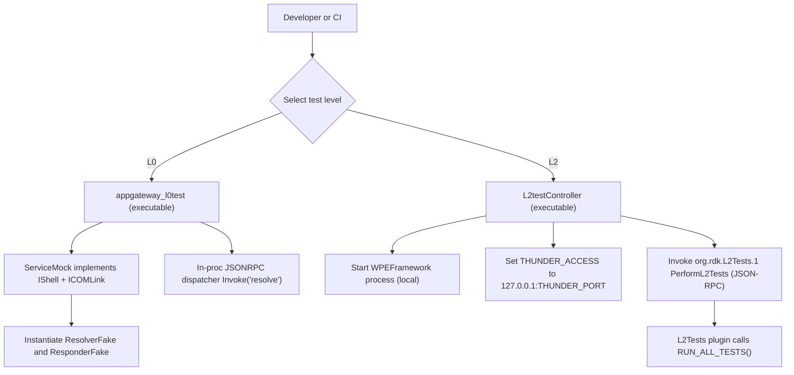

# AppGateway L0/L1/L2 Testing Design

## Overview

This document describes how the `AppGateway` plugin is tested at three levels: L0 (offline and deterministic), L1 (component/unit testing with shared mocks), and L2 (integration-style tests executed through a Thunder/WPEFramework test plugin). It focuses on what is implemented in this repository today, and it uses concrete code references from the existing L0 test harness and the L2 test controller/plugin.

The key idea across all levels is to keep tests repeatable by controlling the plugin host environment. For L0, this is done by running the plugin in-process with a custom `IShell`/`ICOMLink` mock. For L2, the repository provides a controller that starts a local `WPEFramework` process and invokes `RUN_ALL_TESTS()` through a dedicated Thunder plugin.

## Architecture

### L0 (offline, in-process)

AppGateway L0 tests live under `app-gateway2/app-gateway/AppGateway/l0test/` and build an `appgateway_l0test` executable. This test binary exercises the AppGateway plugin logic entirely in-process, and it avoids starting a Thunder daemon or creating real network connections.

The L0 harness is built around `L0Test::ServiceMock`, which implements:

- `WPEFramework::PluginHost::IShell` so the plugin can call `Initialize()` and `Deinitialize()` normally.
- `WPEFramework::PluginHost::IShell::ICOMLink` so that `IShell::Root<T>()` calls inside the plugin can resolve into deterministic in-process fakes instead of spawning out-of-process COM-RPC components.

In `app-gateway2/app-gateway/AppGateway/l0test/ServiceMock.h`, `ServiceMock::Instantiate(...)` returns the fakes based on call order, which matches the plugin initialization pattern. The first instantiation returns a `ResolverFake` (implementing `Exchange::IAppGatewayResolver`), and the second returns a `ResponderFake` (implementing `Exchange::IAppGatewayResponder`).

### L1 (unit/component tests with centralized mocks)

This repository includes `app-gateway2/app-gateway/L1_L2_Testing/entservices-testframework/`, which documents the broader RDK approach where gtest/gmock-based stubs are centralized in a shared “testframework” to avoid duplication. The README in this folder explains the intended build job split:

- Build mocks into a `TestMock` library.
- Build per-repository test shared libraries.
- Build the testframework executable(s) that link those test libraries.

Within this repo, the most visible, concrete implementations are the L2 controller and L2 test plugin described below. The L0 tests are explicitly not gtest-based, and instead use a minimal custom assertion style.

### L2 (integration-style tests via a Thunder plugin)

L2 tests are orchestrated in two pieces:

- A controller executable: `app-gateway2/app-gateway/L1_L2_Testing/entservices-testframework/Tests/L2Tests/L2testController.cpp`
- A Thunder test plugin: `app-gateway2/app-gateway/L1_L2_Testing/entservices-testframework/Tests/L2Tests/L2TestsPlugin/L2Tests.cpp`

The controller starts a local `WPEFramework` process using `popen()`, sets up the JSON-RPC access point using the `THUNDER_ACCESS` environment variable, and then invokes the L2Tests plugin method `PerformL2Tests` via `JSONRPC::LinkType`.

The L2Tests plugin registers a JSON-RPC method named `PerformL2Tests` and calls `RUN_ALL_TESTS()` to execute the compiled-in gtest suites. It also supports optional filtering via `::testing::GTEST_FLAG(filter)` when the controller provides a `test_suite_list` field in the request parameters.

### End-to-end view



## Mocking

### L0 mocking: deterministic fakes via `ServiceMock`

In L0, mocking is implemented by providing a fake host environment rather than by gmock expectations. `L0Test::ServiceMock` controls “what the plugin sees” when it queries interfaces or tries to instantiate its dependencies.

The key fakes are:

- `L0Test::ResolverFake`, which implements `Exchange::IAppGatewayResolver` and `Exchange::IConfiguration`.
- `L0Test::ResponderFake`, which implements `Exchange::IAppGatewayResponder` and `Exchange::IConfiguration`.

`ResolverFake::Resolve(...)` implements deterministic behavior based on the requested method name:

- If the method is `"l0.notPermitted"`, it returns `Core::ERROR_PRIVILIGED_REQUEST` and a small JSON error object.
- If the method is `"l0.notSupported"`, it returns `Core::ERROR_NOT_SUPPORTED`.
- If the method is `"l0.notAvailable"`, it returns `Core::ERROR_UNAVAILABLE`.
- Otherwise, it returns `Core::ERROR_NONE` and the JSON literal `null`.

`ResponderFake` supports “transport available vs unavailable” behavior via an internal boolean and a helper method `SetTransportEnabled(bool)`. When transport is disabled, responder methods return `Core::ERROR_UNAVAILABLE`, which allows the tests to validate error-path behavior without a real WebSocket connection.

`ServiceMock::Config` allows tests to simulate missing dependencies by controlling whether the resolver and/or responder are provided.

### L2 mocking: disabling plugin autostart before starting Thunder

`L2testController.cpp` includes a concrete mitigation for startup ordering and dependency mocking. Before starting Thunder, it scans `./install/etc/WPEFramework/plugins/` and replaces `"autostart":true` with `"autostart":false` for all plugins except `L2Tests.json`. The comment explains why: some plugins perform IARM calls in `Initialize()`, which can crash if the relevant mocks are not ready.

This is part of the L2 orchestration “mocking story”: L2 is still meant to be testable in a controlled environment, but instead of a single in-proc fake host (L0), the environment is controlled by configuring which plugins start and when.

## Testing Scenarios

### L0 scenarios (examples based on current tests)

The following scenarios are directly represented by the current L0 tests and harness behavior:

- Plugin lifecycle success. `Initialize()` returns an empty string on success and `Deinitialize()` can be called cleanly afterwards.
- JSON-RPC registration and unregistration. After `Initialize()`, an `IDispatcher` can invoke `"resolve"` successfully; after `Deinitialize()`, invoking `"resolve"` should fail (typically `ERROR_UNKNOWN_METHOD`).
- Error-path coverage without external dependencies. By using `ResolverFake`, L0 tests can validate error returns like `ERROR_NOT_SUPPORTED` or `ERROR_UNAVAILABLE` deterministically.
- Malformed or missing JSON parameters. L0 tests call the dispatcher’s `Invoke(...)` and validate `ERROR_BAD_REQUEST` for invalid inputs (as described in the L0 overview documentation and supported by the l0test test suite structure).
- Missing resolver/responder dependency. If the resolver is not provided, the plugin cannot register the `"resolve"` method, and invoking it returns `ERROR_UNKNOWN_METHOD`.

### L2 scenarios (examples based on current controller + plugin implementation)

At L2, the key scenario is “start Thunder, run gtest suites, collect results”:

- Start the local Thunder process (WPEFramework).
- Set the JSON-RPC access location via `THUNDER_ACCESS` to `127.0.0.1:<THUNDER_PORT>`.
- Invoke the test plugin method `PerformL2Tests` using JSON-RPC.
- Optionally provide a filter string so only certain suites run.
- Collect results from gtest JSON output.

Because the L2Tests plugin supports `test_suite_list`, the controller can run one or more suites by building a filter string like `"SuiteA*:SuiteB*"` and sending it in the JSON-RPC parameters.

## Pros/Cons

### L0

L0 is the fastest and most deterministic test level in this repository. Because it runs entirely in-process, it is suitable for rapid iteration and for validating return codes and registration semantics without worrying about process start/stop or network access.

The main trade-off is that L0 does not test the real runtime environment. It validates AppGateway behavior against deterministic fakes, so it can miss issues that only occur when the real Thunder process is running, when plugins are activated/deactivated, or when process-level configuration and startup ordering come into play.

### L1

The shared-testframework approach (as described in the `entservices-testframework` README) reduces duplication of mocks and makes it easier to keep mock interfaces consistent across many plugins and repositories. It also aligns with typical gtest/gmock workflows, including richer assertions and expectations.

The downside of centralization is that local discovery and execution can be less straightforward. Developers often need to understand how the testframework builds and links per-repo test libraries, and how CI orchestrates the combined build.

### L2

L2 provides an integration-style execution model that is closer to how plugins are exercised in real deployments: it starts a Thunder runtime and runs tests through a Thunder plugin interface. This is particularly valuable for catching issues that depend on runtime configuration, plugin startup ordering, and JSON-RPC integration.

The trade-offs are cost and complexity. L2 runs slower than L0, relies on process orchestration, and requires careful environment isolation (for example, toggling autostart off for other plugins to avoid crashes during initialization).

## Example Code

### L0: building JSON-RPC parameters and calling `resolve`

The L0 test `AppGateway_Init_DeinitTests.cpp` builds a JSON parameter string for `resolve` and invokes it via `PluginHost::IDispatcher`:

```cpp
static std::string ResolveParamsJson(const std::string& method, const std::string& params = "{}")
{
    return std::string("{")
        + "\"requestId\": 1001,"
        + "\"connectionId\": 10,"
        + "\"appId\": \"com.example.test\","
        + "\"origin\": \"org.rdk.AppGateway\","
        + "\"method\": \"" + method + "\","
        + "\"params\": \"" + params + "\""
        + "}";
}
```

It then invokes the registered JSON-RPC method:

```cpp
auto dispatcher = ps.plugin->QueryInterface<IDispatcher>();
std::string jsonResponse;
const std::string paramsJson = ResolveParamsJson("dummy.method", "{}");
const uint32_t rc = dispatcher->Invoke(nullptr, 0, 0, "", "resolve", paramsJson, jsonResponse);
```

### L0: simulating missing resolver/responder

The L0 overview documentation includes a concrete example of disabling both resolver and responder provisioning so that `Initialize()` fails and `"resolve"` is not registered:

```cpp
PluginAndService ps{ L0Test::ServiceMock::Config(false, false) };
const std::string rc = ps.plugin->Initialize(ps.service);
// Later: dispatcher->Invoke(..., "resolve", ...) -> ERROR_UNKNOWN_METHOD
```

This behavior is implemented by `ServiceMock::Instantiate(...)` returning `nullptr` for the expected dependency instantiations.

### L2: invoking the L2Tests plugin and applying a gtest filter

The L2Tests plugin registers `"PerformL2Tests"` and supports a `test_suite_list` parameter:

```cpp
if (parameters.HasLabel("test_suite_list")) {
    const std::string& message = parameters["test_suite_list"].String();
    ::testing::GTEST_FLAG(filter) = message;
}
status = RUN_ALL_TESTS();
```

The controller builds the filter based on CLI arguments and forwards it through JSON-RPC:

```cpp
if (argc > 1) {
    message = std::string(argv[1]) + std::string("*");
    while (arguments < argc) {
        message = (message + std::string(":") + std::string(argv[arguments]) + std::string("*"));
        arguments++;
    }
    params["test_suite_list"] = message;
}
status = L2testobj->PerformL2Tests(params, result);
```

## Artifacts

### L0 artifacts

L0 tests support coverage collection using `lcov` and HTML report generation via `genhtml`. The L0 README describes a common output flow:

- `coverage.info` generated by `lcov -c ...`
- HTML report generated under a `coverage/` folder by `genhtml -o coverage coverage.info`

The L0 test harness also supports an environment variable `APPGATEWAY_RESOLUTIONS_PATH` (read via `getenv()` in the L0 tests) to point the tests at a real resolution JSON file when exercising resolution-loading behavior.

### L2 artifacts

When starting Thunder, `L2testController.cpp` exports:

- `GTEST_OUTPUT="json:$PWD/rdkL2TestResults.json"`

This means the L2 run is expected to emit a gtest JSON report named `rdkL2TestResults.json` in the current working directory of the controller process. This output is useful for CI parsing and for post-processing results outside the Thunder logs.

## References

- [AppGateway l0test README](../app-gateway/AppGateway/l0test/README.md)
- [AppGateway l0test overview](../app-gateway/AppGateway/l0test/docs/l0test-overview.md)
- [L0 ServiceMock and fakes](../app-gateway/AppGateway/l0test/ServiceMock.h)
- [L0 init/deinit test example](../app-gateway/AppGateway/l0test/AppGateway_Init_DeinitTests.cpp)
- [entservices-testframework README](../app-gateway/L1_L2_Testing/entservices-testframework/README.md)
- [L2 test controller](../app-gateway/L1_L2_Testing/entservices-testframework/Tests/L2Tests/L2testController.cpp)
- [L2Tests plugin implementation](../app-gateway/L1_L2_Testing/entservices-testframework/Tests/L2Tests/L2TestsPlugin/L2Tests.cpp)
- [L2Tests plugin header](../app-gateway/L1_L2_Testing/entservices-testframework/Tests/L2Tests/L2TestsPlugin/L2Tests.h)
