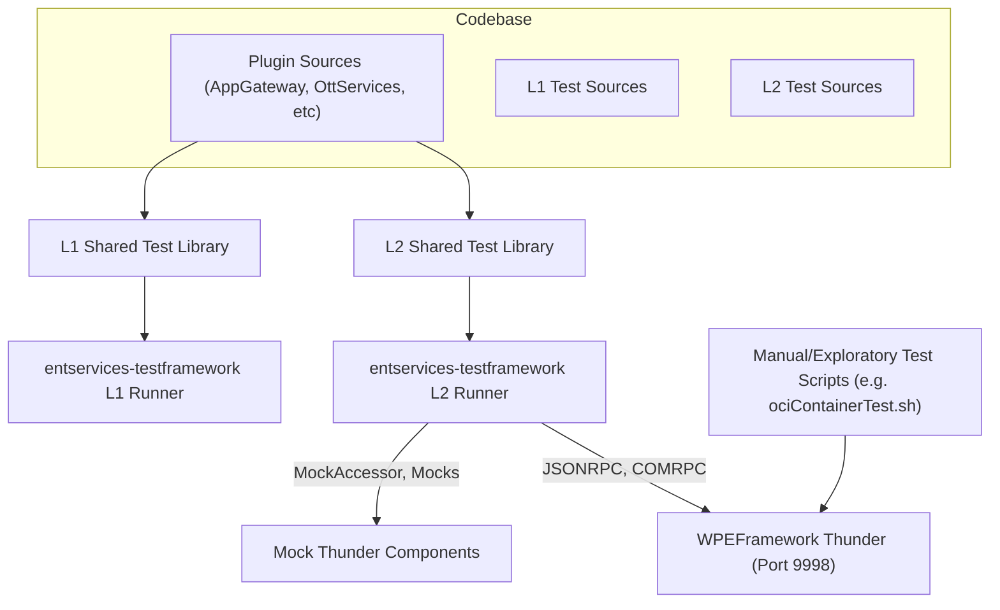
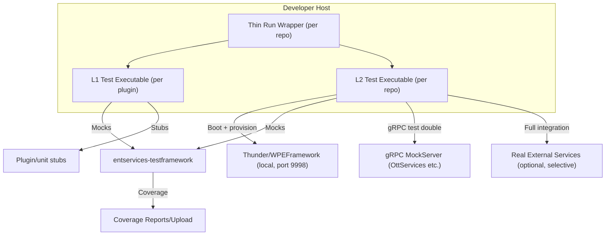
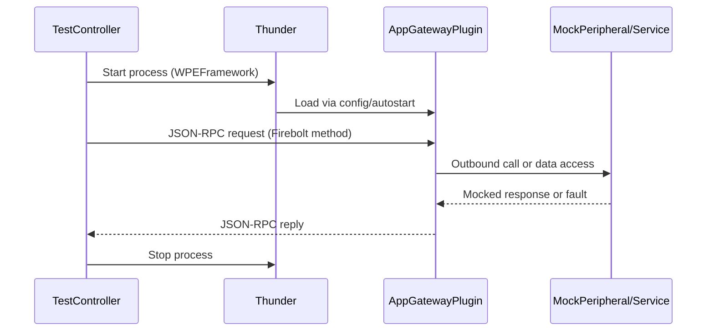

# L1 and L2 Testing Design for Thunder Plugins and App-Gateway2

## Introduction

This document details the present approach and a proposed improved strategy for L1 (unit/component) and L2 (integration/system) testing within the codebases covered by Thunder-712, entservices-infra-712, and app-gateway2— with a special focus on Thunder plugins such as OttServices, AppGateway, and similar. It discusses relevant ADRs, includes visual sequence and block diagrams, and provides actionable recommendations for comprehensive test coverage, especially targeting the needs of modern Thunder plugin development.

---

## 1. Current L1 and L2 Testing Approach

### 1.1 Overall Testing Architecture

- **L1 tests** (unit/component): Each plugin or module provides its unit tests (C++ files), residing under respective directories like `Tests/L1Tests/` or `app-gateway/tests/`.
    - These tests focus on isolated logic, mock dependencies, and method/contract validation.
    - Tests are built as shared libraries, then linked and executed via runners in a centralized test harness—`entservices-testframework`.

- **L2 tests** (integration/system): Higher-level tests in `Tests/L2Tests/`, `entservices-testframework/Tests/L2Tests/`, or similar, that:
    - Exercise real or mocked inter-plugin flows (often via Thunder/WPEFramework RPC).
    - Start WPEFramework/Thunder, load plugins dynamically (startup .jsons, dynamic activation).
    - Use mocks and scaffolding libraries provided centrally.
    - Are orchestrated by tools such as `L2testController` to start the Thunder process, configure plugins, and run parameterized test flows.

- **CI/CD**: GitHub workflows or similar (referenced in documentation but often defined externally) drive orchestration across repositories, building test libraries, and executing/aggregating results in a top-level test runner build.

#### Current Visual Overview

### 1.2 Test Example Coverage

- **entservices-infra-712:** See ADR and README for details. L1 tests include user, USB, resource manager, etc.—each component has its tests, extensively using GoogleTest/Mock.
- **AppGateway (app-gateway2):** Unit tests cover internal data structures and helpers (ResolutionStore, RequestRouter, etc.). L2 tests are orchestrated through Thunder JSON-RPC flows and plugin composition.
- **OttServices:** Has isolated tests around permission cache/file, token retrieval, and gRPC permission client logic.

**Note:** Major mocks (device, shell, proxy, permissions clients, etc.) reside centrally to avoid duplication.

### 1.3 Limitations and Gaps

- L1/L2 test discoveries are split across repos; CI orchestration for aggregating and running is not always locally discoverable.
- No uniform way to locally execute all L2 flows without testframework.
- Test coverage for new plugins (e.g., OttServices, AppGateway) sometimes lags behind their evolving feature set (esp. gRPC, JSONRPC flows, and error boundary cases).
- Plugin startup/autostart behavior complicates L2 isolation (see controller utilities for mass autostart disabling).
---

## 2. Proposed Improved L1/L2 Testing Approach

### 2.1 Unified, Traceable Test Flows

- **Unified Test Runner:** Provide a thin CLI or script in each plugin/repo that invokes the entservices-testframework runners for both L1 and L2 and aggregates results, minimizing the barrier to local runs.
- **Test Registration by Convention:** All Thunder plugins (including new ones such as OttServices, AppGateway) must register a minimal set of L1 and L2 tests as part of their CMake build—no new plugin merges without these present.
- **Mock Discovery:** Automatically discover and register needed mocks for new interfaces, to prevent test failures due to missing stubs.
- **API Contract Tests for JSONRPC:** All plugins must include contract-level integration tests (using 
Pact or equivalent) for *each* JSONRPC method (with positive, negative, and edge cases).
- **gRPC/External Service Integration:** For plugins involving gRPC/external endpoints (e.g., OttServices):
    - Use locally-run mock servers (as seen in Rust/ripple-eos tests and OTT permission service pact tests) for L2 integration.
    - Orchestrate start/stop and test mocks via L2testController or equivalent in all new test additions.

### 2.2 Improved Visibility and Documentation 

- Each repository's CI should publish human-friendly coverage and test pass/fail reports.
- Each plugin subfolder should include a `TEST_GUIDE.md` summarizing its L1/L2 coverage, current gaps, and how to extend.
- Enhance ADRs for all new plugins, embedding architectural diagrams and explicit test strategies (see below for template/structure).

### 2.3 Recommendations for Thunder Plugins and New Extensions

- **AppGateway:** Extend integration test coverage to all registered Firebolt methods; Simulate broken/missing plugin scenarios via the test controller (L2).
- **OttServices:** Add contract and mocking for permission failures, token expiry, service timeouts, error boundary cases. Simulate real-world gRPC service downtime and permission changes via in-process mocks for L2.
- **All Plugins:** Must provide at least:
    - L1: Logic path coverage, mock use of external dependencies, and direct API assertions.
    - L2: RPC, JSON-RPC, gRPC integration, failover, and recovery flows.
    - Manual test scripts for edge cases not practical to automate.
- **Test Automation for Start/Stop/Recovery:** Automated tests for Thunder plugin load/unload, autostart on/off, and OOP remote deactivation, using orchestrators.

---

## 3. ADRs: Architecture Decision Records

### ADR: Centralized Shared Mocks and Out-of-Repo Test Runners

**Context:** Supporting multiple plugins across many repos with evolving interfaces (incl. Thunder plugins, gRPC services).

**Decision:** Shared test mocks and runners are centralized (entservices-testframework), not duplicated in each page/plugin repo. Plugins supply only test logic and integration scripts.

**Alternatives:**
- Duplication of mocks (rejected due to maintenance burden).
- Standalone in-repo runners (limited cross-repo integration).

**Consequences:**
- Streamlined maintenance, but higher entry barrier for single-repo/local execution.
- Central dependency on testframework for all test orchestration.

---

### ADR: Mandatory L1/L2 Hooks for All New Thunder Plugins

**Context:** With plugins such as OttServices, AppGateway, and future Thunder extensions, testing must evolve to match complexity, including new RPCs, JSONRPCs, and integration points.

**Decision:** All plugins must declare and export minimal L1 and L2 test entrypoints and provide stubs/mocks for all new external/cross-service integrations. New feature branches/migrations must pass full L1/L2 with mocks and non-mocks before review/acceptance.

**Alternatives:**
- Selective/manual test extension for new features (risks coverage gaps).
- Restrict all L2 testing to synthetic/mock; run real integrations through staging only (reduces real-world safety).

**Consequences:**
- Higher immediate investment per new plugin, but much more robust release integration and test reliability.
- More visible coverage reporting.

---

## 4. Block and Sequence Diagrams

### Block Diagram: Improved Test Execution Flow

### Sequence Diagram: L2 Test on AppGateway Plugin

---

## 5. Recommendations for Advancing L1/L2 Test Coverage

### For OttServices, AppGateway, and Similar Thunder Plugins

#### L1 (Unit/Component) Testing:

- Isolate all business logic from RPC bindings; ensure pure logic classes can be tested with simple mocks.
- For OttServices: Thoroughly test permission cache, token retrieval, gRPC fallback behaviors—validate all error cases in the PermissionsClient and TokenClient logic.
- For AppGateway: Validate all resolver logic, overlay/merging, and any platform delegation or request routing code.

#### L2 (Integration/System) Testing:

- Expand tests to simulate both local (mock) and real (process-bound) Thunder plugin interaction:
    - Use L2testController utility for robust process orchestration, plugin startup/teardown, and dynamic test selection.
    - For OttServices: Use gRPC mocks or contract-pact flows to validate JSONRPC and permission methods across connectivity, network, and service-unavailable scenarios.
    - For AppGateway: Explicitly add tests covering double-resolution, request router fallbacks, plugin callsign mismatches, and configuration reloads.

#### Cross-repo/System Recommendations:

- Document plugin and test interdependencies clearly; provide version compatibility matrix in CI logs.
- Maintain central mocks and test assets up to date with all new feature introductions.
- Automate checks for required test entrypoints and coverage reports on all plugin merges.

---

## 6. Next Steps and High Impact Actions

- Publish usage documentation and local test runner scripts (or wrappers) in each plugin repo for single-command L1/L2 runs.
- Encourage contract testing for every new RPC/JSON_RPC method in Thunder plugins, using tools like Pact (e.g. `ripple-eos/tests` patterns) with stubs/mocks.
- Establish automated CI jobs to run all L1 and L2 tests, aggregate/pass/fail, and report coverage for both isolated logic (L1) and full-system integration (L2).
- Incrementally improve L2 coverage for Thunder plugin edge cases (autostart, fail/restart, network fault, etc.)—especially as plugins like OttServices expand their integration footprint.
- Require that all new Thunder plugin features be accompanied by corresponding new L1 and L2 test logic in their merges.

---

## 7. References

- [entservices-infra-712/docs/adr/20251215-adr-l1-l2-testing-entservices-infra-712.md](../../entservices-infra-712/docs/adr/20251215-adr-l1-l2-testing-entservices-infra-712.md)
- [app-gateway2/app-gateway/L1_L2_Testing/entservices-testframework/README.md](../app-gateway2/app-gateway/L1_L2_Testing/entservices-testframework/README.md)
- OttServices: `OttServices.h`, `OttServicesImplementation.h`, `PermissionsClient.h`, tests in `tests/`
- AppGateway: `ResolutionStore.h`, `RequestRouter.h`, `tests/test_appgateway.cpp`
- Test orchestrators: `L2testController.h`, `L2testController.cpp`
- Ripple-eos: Pact-based test implementations for advanced L2 scenarios

---

**This document should serve as an evolving centerpoint for L1/L2 testing design and readiness across current and future Thunder plugins and the broader enterprise codebase.**

